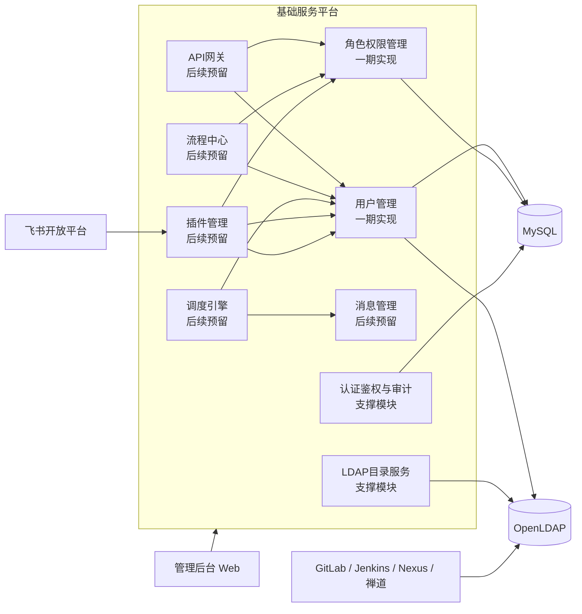
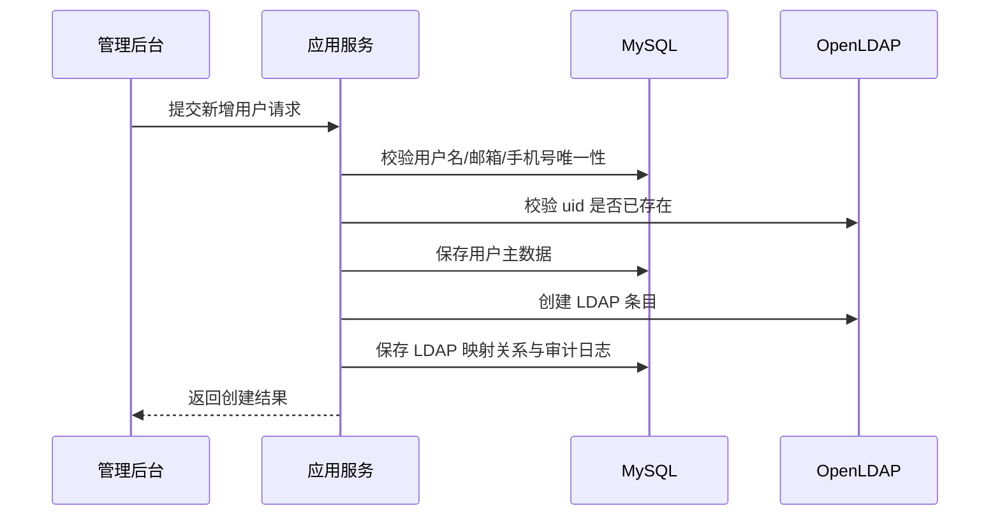
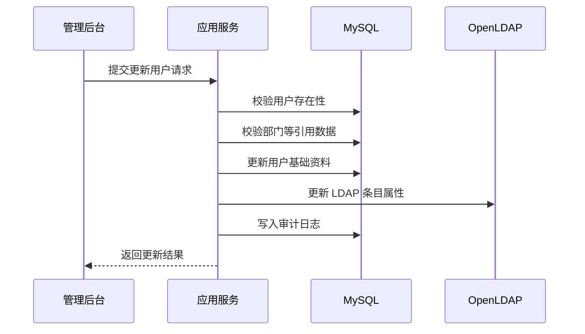
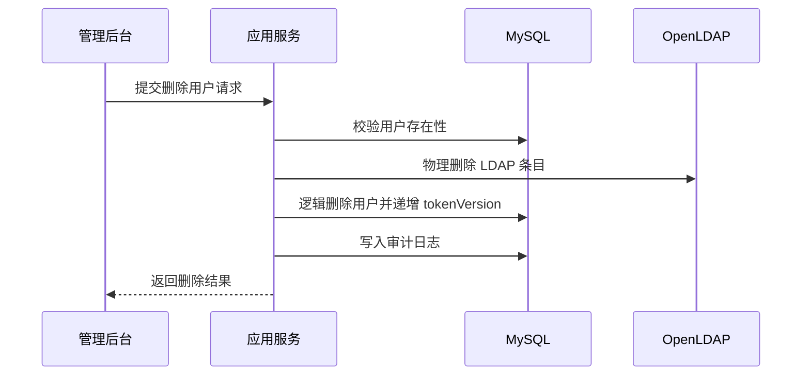
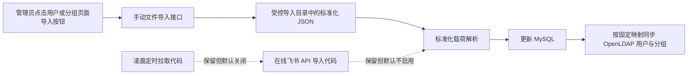

# 企业统一身份与LDAP管理平台项目设计文档

## 1. 文档概述

### 1.1 文档目标

本文档用于定义企业统一身份与 LDAP 管理平台的整体设计方案。平台部署于公司内网，目标是在 OpenLDAP 管理能力基础上，逐步支持以下能力：

- 对 OpenLDAP 用户、组织及目录结构进行统一管理
- 集成从外网导入内网的飞书组织架构和员工数据
- 支持手动或自动同步组织架构与员工信息到平台
- 通过 LDAP 为 GitLab 等公司内网第三方系统提供统一认证能力
- 在当前阶段优先交付用户管理模块和角色权限管理模块

### 1.2 范围说明

本文档现已结合所提供的“基础服务层红色框”架构图进行修订。根据图示，基础服务层中与本项目直接相关的目标模块包括：

- 用户管理
- 角色权限管理
- API 网关
- 消息管理
- 流程中心
- 调度引擎
- 插件管理

当前一期建设范围仅包含：

- 用户管理模块
- 角色权限管理模块
- OpenLDAP 基础连接与用户目录写入能力
- 平台自身的 JWT 登录认证与 Casbin 授权控制

后续预留范围包含：

- API 网关模块
- 消息管理模块
- 流程中心模块
- 调度引擎模块
- 插件管理模块
- 飞书数据导入与同步模块
- 组织架构管理模块
- 第三方应用接入模块

说明：

- 架构图中的 `租户管理`、`运营数据`、`组件管理`、`环境管理`、`元数据管理` 属于相邻基础能力，不作为本次一期交付范围。
- 本文会对红框模块给出整体设计边界，但只对“用户管理”和“角色权限管理”展开到一期可落地深度。

### 1.3 设计原则

- 内网优先：所有核心服务部署在公司内网，不依赖运行时公网访问
- 单体优先、边界清晰：一期采用模块化单体架构，降低部署与运维复杂度，为后续服务拆分预留边界
- LDAP 与业务库职责分离：LDAP 负责统一身份目录与第三方认证，关系型数据库负责平台业务数据与权限数据
- 配置化与可扩展：对 LDAP、飞书导入、定时同步、第三方接入全部采用配置化设计
- 规范优先：遵循阿里巴巴 Java 项目开发规范，保证命名、分层、事务、日志、异常、测试的一致性

## 2. 项目目标与建设边界

### 2.1 业务目标

平台的长期业务目标如下：

1. 建立统一的企业身份目录中心
2. 将 OpenLDAP 作为内网第三方平台统一认证的数据源
3. 将飞书中的组织架构与员工主数据导入到内网并完成统一管理
4. 通过角色权限模型对平台后台管理能力进行细粒度控制

### 2.2 一期目标

一期聚焦“先把人和权限管起来”，交付以下内容：

- 平台管理员登录、登出、令牌续期
- 用户新增、编辑、查询、禁用、启用、重置密码
- 用户、部门与分组信息由 MySQL 向 LDAP 单向投影
- 角色管理、菜单授权、用户角色分配
- 基于 Casbin 的接口级授权与基于角色菜单的菜单树渲染
- 为后续 API 网关、消息管理、调度引擎、流程中心、插件管理预留清晰的领域边界与扩展接口
- 审计日志、基础单元测试、集成测试

### 2.3 非目标

以下能力不在一期实现范围内，但需要在架构上预留：

- 飞书 API 直连采集
- 组织架构全量同步
- 租户管理能力正式启用
- 数据权限模型正式启用
- 菜单多语言、菜单多租户隔离、菜单版本发布
- 按钮级资源模型与按钮权限管理
- API 网关统一路由与流控
- 消息中心统一事件投递
- 流程审批与编排引擎
- 插件市场与插件生命周期管理
- 单点登录协议网关，例如 OIDC、SAML、CAS Server
- 自助门户、审批流、消息通知中心

## 3. 总体技术方案

### 3.1 技术栈

| 层次 | 技术选型 | 用途说明 |
| --- | --- | --- |
| 语言与运行时 | Java 17 | LTS 版本，满足长期维护需求 |
| 核心框架 | Spring Boot 3.x | 统一应用启动、自动装配、配置管理 |
| LDAP 集成 | Spring LDAP | 负责 LDAP 查询、绑定、写入、修改 |
| 安全认证 | Spring Security + JWT | 平台后台登录认证与接口访问控制 |
| 鉴权引擎 | Casbin | 基于 RBAC 模型完成资源权限判定 |
| ORM | MyBatis-Plus | 业务数据库 CRUD、分页、条件构造 |
| 简化编码 | Lombok | 减少模板代码 |
| 数据库 | MySQL 8.0 | 存储平台业务数据、权限数据、任务日志 |
| 目录服务 | OpenLDAP 2.x | 企业身份目录、第三方 LDAP 认证数据源 |
| 接口文档 | springdoc-openapi | 自动生成 OpenAPI 文档 |
| 数据迁移 | Flyway | 版本化数据库脚本管理 |
| 测试 | JUnit 5、Mockito、Spring Boot Test、Testcontainers | 单元测试与集成测试 |
| 构建 | Maven | 统一依赖管理与多模块构建 |

说明：

- 一期建议引入 Spring Security，负责 JWT 过滤器、登录会话上下文与接口访问拦截。
- Casbin 负责“是否有权访问资源”，Spring Security 负责“你是谁以及请求是否合法”。
- 原型阶段可使用 H2 内存库快速联调，并通过 `MODE=MySQL` 保持 SQL 语义尽量贴近 MySQL；测试与生产目标数据库仍应以 MySQL 8.0 为准。

### 3.2 架构形态选择

一期采用“模块化单体”而非微服务，原因如下：

- 当前核心业务边界清晰，但体量不大，单体更适合快速落地
- LDAP、权限、用户管理之间事务一致性要求较高
- 公司内网项目通常更看重稳定性、可控性和低运维成本
- 后续可以按模块边界逐步拆分为独立服务

### 3.3 总体逻辑架构



说明：

- 一期交付的核心是 `用户管理 + 角色权限管理 + LDAP 目录服务 + 认证鉴权`。
- API 网关、消息管理、流程中心、调度引擎、插件管理全部建立在身份、权限和审计能力之上。
- 平台自身的管理登录基于 JWT，不走第三方平台 LDAP 认证链路。
- GitLab 等第三方系统直接对接 OpenLDAP，从而减少平台在运行时认证链路中的单点风险。
- 飞书能力按“外网采集 + 内网导入 + 插件适配”的方式预留，适应内外网隔离环境。

## 4. 分层与模块设计

### 4.1 分层设计

参考阿里巴巴 Java 项目规范，采用清晰的四层结构：

- `interfaces`：接口层，负责 REST API、参数校验、VO 转换、统一返回
- `application`：应用层，负责编排用例、事务控制、权限入口、任务触发
- `domain`：领域层，负责核心实体、领域服务、仓储接口、业务规则
- `infrastructure`：基础设施层，负责 MyBatis-Plus、Spring LDAP、JWT、Casbin、调度器、审计日志等技术实现

推荐基础包结构如下：

```text
com.company.idm
├─ boot
├─ common
│  ├─ api
│  ├─ enums
│  ├─ exception
│  ├─ model
│  └─ util
├─ interfaces
│  ├─ auth
│  ├─ user
│  ├─ role
│  └─ permission
├─ application
│  ├─ auth
│  ├─ user
│  ├─ rbac
│  ├─ gateway
│  ├─ message
│  ├─ workflow
│  ├─ plugin
│  └─ sync
├─ domain
│  ├─ auth
│  ├─ user
│  ├─ rbac
│  ├─ ldap
│  ├─ gateway
│  ├─ message
│  ├─ workflow
│  ├─ plugin
│  └─ sync
└─ infrastructure
   ├─ config
   ├─ persistence
   ├─ ldap
   ├─ security
   ├─ gateway
   ├─ message
   ├─ workflow
   ├─ plugin
   ├─ casbin
   ├─ schedule
   └─ audit
```

### 4.2 Maven 工程建议

原型阶段建议优先采用“单 Maven 工程 + 分层包结构”，而不是将 `common`、`domain`、`application`、`interfaces`、`infrastructure` 全部拆成独立 Maven 模块。

推荐结构如下：

```text
corp-idm-platform
├─ pom.xml
├─ docs
└─ src
   ├─ main
   │  ├─ java
   │  │  └─ com.company.idm
   │  │     ├─ boot
   │  │     ├─ common
   │  │     ├─ domain
   │  │     ├─ application
   │  │     ├─ interfaces
   │  │     └─ infrastructure
   │  └─ resources
   └─ test
      └─ java
```

说明：

- 一期与原型阶段以快速落地、便于调试为主，单模块更适合当前体量。
- `domain`、`application`、`interfaces`、`infrastructure` 通过包边界分层，而不是依赖 Maven 模块边界。
- 当后续团队规模、构建时长或发布边界变复杂时，再考虑按稳定边界拆成多模块。
- 不建议一期上来就做微服务拆分，否则会把主要精力浪费在服务治理与部署编排上。

### 4.3 基础服务层模块划分

| 模块 | 当前状态 | 说明 |
| --- | --- | --- |
| 认证鉴权模块 | 一期实现 | 平台登录、JWT、Casbin 授权 |
| 用户管理模块 | 一期实现 | 用户增删改查、启停用、密码重置、LDAP 映射 |
| 角色权限管理模块 | 一期实现 | 角色、菜单、用户角色绑定、资源授权与权限等级控制 |
| LDAP 目录服务模块 | 一期实现 | LDAP 查询、写入、更新、密码修改 |
| 审计日志模块 | 一期实现简版 | 记录登录、用户变更、角色变更、权限变更 |
| API 网关模块 | 后续预留 | 统一 API 接入、鉴权透传、接口治理、限流与审计接入 |
| 消息管理模块 | 后续预留 | 领域事件投递、异步通知、重试队列、任务解耦 |
| 流程中心模块 | 后续预留 | 高风险操作审批、变更编排、流程回调 |
| 调度引擎模块 | 后续预留 | 自动同步、补偿重试、定时扫描、策略刷新 |
| 插件管理模块 | 后续预留 | 飞书导入插件、第三方平台适配器、扩展点管理 |
| 组织架构模块 | 一期实现简版 | 部门树、部门 CRUD、外部部门 ID 与 LDAP DN 映射 |
| 飞书同步模块 | 后续预留 | 全量导入、增量导入、任务调度、差异比对 |
| 第三方应用接入模块 | 后续预留 | GitLab 等接入参数管理与联调信息留档 |

补充说明：

- 图中红框模块是基础服务层的重点建设对象，当前原型已落地 `用户管理`、`角色权限管理`，并补充实现了支撑用户与 LDAP 映射的 `组织架构模块` 简版能力。
- 图中的 `租户管理`、`运营数据`、`组件管理`、`环境管理`、`元数据管理` 可视为平台级相邻模块，当前系统通过接口或数据边界兼容，但不在本次详细设计与实施范围内。

### 4.4 红框模块依赖关系

从基础服务层视角，建议按如下依赖关系理解各模块边界：

1. 用户管理是身份主数据入口，负责账号、LDAP 映射和员工主数据承载。
2. 角色权限管理建立在用户之上，负责平台内部资源授权，不替代 OpenLDAP 对第三方系统的认证职责。
3. API 网关后续消费认证和权限能力，为门户化接入、统一 API 出入口和接口治理提供能力。
4. 消息管理与调度引擎用于把飞书同步、LDAP 补偿、权限刷新等异步事务从主业务流程中解耦出来。
5. 流程中心用于承载高风险变更审批，例如管理员角色授予、核心账号禁用、批量导入确认。
6. 插件管理用于适配飞书、GitLab、Jenkins 等外部系统或数据源，使基础服务层保持可扩展而非硬编码集成。

## 5. 核心业务设计

### 5.1 核心实体

一期核心实体建议如下：

- 用户 `User`
- 部门 `Department`
- LDAP 账户映射 `LdapAccount`
- 角色 `Role`
- 菜单 `Menu`
- 权限 `Permission`
- 用户角色关系 `UserRole`
- 角色菜单关系 `RoleMenu`
- 角色权限关系 `RolePermission`
- 审计日志 `AuditLog`

后续预留实体：

- 同步任务 `SyncJob`
- 同步批次 `SyncBatch`
- 第三方应用 `Application`
- API 路由 `ApiRoute`
- 事件消息 `EventMessage`
- 调度任务 `ScheduleJob`
- 流程定义 `WorkflowDefinition`
- 流程实例 `WorkflowInstance`
- 插件定义 `PluginDefinition`

### 5.2 用户主数据归属原则

为避免“LDAP 和数据库哪个是真实来源”长期失控，建议采用以下原则：

- 平台业务属性以 MySQL 为主存储
- LDAP 目录属性以 OpenLDAP 为主存储
- 用户核心身份数据在平台中维护，并同步写入 LDAP
- LDAP 只保存第三方认证所需的最小必要身份属性

建议同步的数据边界：

- MySQL 保存：账号状态、展示信息、手机号、邮箱、员工编号、角色关系、审计信息、来源标记
- LDAP 保存：用户名、显示名、邮箱、手机号、员工编号、部门编码、密码散列值、启用状态

当前阶段同步原则补充：

- MySQL 是主数据源，LDAP 是目录投影
- 当前仅支持 **MySQL -> LDAP** 单向同步
- 不支持 LDAP 回写 MySQL
- 当前仅对接飞书导入场景，因此采用固定映射规则，不引入动态字段映射引擎

#### 5.2.1 部门主数据与组织架构设计

部门模块当前不仅承担“用户合法部门引用”“前端部门树渲染”“LDAP group 同步源”三个职责，还需要同时承载：

- 业务组织架构的树形主数据
- 飞书部门 `external_id` 的落库映射
- 当前 LDAP group `ldap_dn` 的持久化映射

部门模块职责边界建议如下：

- MySQL 中的 `Department` 是组织架构与同步映射的主数据源
- LDAP 中的 group 是第三方系统登录授权目录的组织投影
- 飞书部门 ID 只作为外部来源定位键，不替代内部 `dept_code`

#### 5.2.2 部门模型设计

部门实体建议包含以下核心字段：

- `dept_code`：内部稳定业务编码，创建后不允许修改
- `dept_name`：部门名称
- `parent_dept_code`：父部门编码，根部门为空
- `ancestor_path`：祖先路径，例如 `/D001/D001002`
- `dept_level`：组织层级深度
- `source_type`：`MANUAL`、`FEISHU`
- `external_id`：飞书部门外部主键
- `ldap_dn`：当前 LDAP group 的真实 DN
- `status`：启停状态

字段职责说明：

- `dept_code` 用于平台内部业务引用、用户归属和稳定主键定位
- `external_id` 用于飞书导入场景下的幂等更新和映射追踪
- `ldap_dn` 用于记录当前 LDAP 节点位置，支撑节点重命名后的回写
- `ancestor_path` 与 `dept_level` 用于部门树查询、层级渲染和防循环校验

#### 5.2.3 部门 CRUD 规则

部门管理建议提供：

- 部门树查询
- 部门详情查询
- 部门创建
- 部门更新
- 部门删除

业务规则如下：

1. `dept_code` 全局唯一，创建后不允许修改
2. 非根部门的 `parent_dept_code` 必须存在
3. 部门不能挂到自身或自身下级节点之下
4. 部门移动时需同步更新本节点及全部子孙节点的 `ancestor_path` 与 `dept_level`
5. 删除部门前必须校验无子部门、无有效用户引用
   - “有效用户引用”指：
     - `deleted=0`
     - `employmentStatus != RESIGNED`
     - 主部门等于目标部门，或兼职部门列表包含目标部门
   - 已离职保留用户的历史部门引用不阻止删除
6. 用户侧引用部门时，只允许选择启用中的部门
7. `external_id` 与 `source_type` 作为来源识别字段，不在普通编辑接口中修改

#### 5.2.4 部门与 LDAP group 映射规则

部门同步到 LDAP 时，建议采用“稳定编码 + 可变名称”的组合模型：

- `dept_code` 固定映射到 LDAP group 的业务标识属性，例如 `businessCategory`
- `dept_name` 固定映射到 LDAP group 的 `description`
- LDAP group 的 RDN 建议采用 `cn=${dept_code}_${dept_name}`
- `ldap_dn` 作为当前目录节点位置回写到 `sys_department`

因此，当部门名称变更时：

1. 需要先根据旧 `ldap_dn` 或业务标识定位原 LDAP group
2. 通过 LDAP `rename / modifyDN` 重命名节点
3. 获取新的 DN
4. 回写 `sys_department.ldap_dn`

这样可以保留 group 成员关系，避免采用“删旧建新”带来的成员丢失风险。

#### 5.2.5 部门与飞书导入映射规则

当前仅考虑飞书导入场景，因此映射规则固定化：

- 飞书部门 ID -> `sys_department.external_id`
- 飞书父部门 ID -> 解析为 `parent_dept_code`
- 当前 LDAP DN -> `sys_department.ldap_dn`

导入策略建议：

- 以 `external_id` 作为飞书部门幂等更新主键
- 以 `dept_code` 作为平台内部稳定业务编码
- 以 `ldap_dn` 作为 LDAP 节点重命名后的结果映射

#### 5.2.6 当前原型落地说明

当前原型已实现以下部门管理能力：

- 部门树查询
- 部门详情查询
- 部门创建
- 部门更新
- 部门删除
- 部门层级路径 `ancestor_path` 与层级深度 `dept_level` 维护
- 部门名称变更时 LDAP group 节点重命名与 `ldap_dn` 回写
- 删除部门前对子部门与用户引用关系校验
- 用户流程首次补建 LDAP group 时对部门 `ldap_dn` 回写补偿

### 5.3 用户管理模块设计

#### 5.3.1 功能范围

- 用户列表查询
- 用户详情查询
- 按用户名、姓名、手机号、邮箱、状态筛选
- 用户新增
- 用户编辑
- 用户禁用 / 启用
- 用户删除逻辑控制
- 用户本人修改密码
- 用户密码重置
- 用户角色分配
- 同步到 LDAP
- 从 LDAP 回读校验

#### 5.3.2 业务规则

1. 用户名全局唯一，建议与 LDAP `uid` 一致
2. 邮箱、手机号可配置是否唯一，默认唯一
3. 禁用用户后，平台 JWT 登录失效，LDAP 账户同步设置为不可用
4. 删除用户时，在 LDAP 中执行物理删除，在 MySQL 中执行逻辑删除，以便员工再次入职时可恢复业务数据
   - 删除用户时需同步清理 `sys_user_role` 角色关系，避免角色仍被已删除用户占用
5. 密码不落库，不保存明文，不记录日志
6. 当前密码策略按业务要求执行最小限制：长度不少于 6 位，允许弱口令，允许纯数字口令
7. 用户修改本人密码时必须校验旧密码，新旧密码不能相同，且修改成功后需使历史 token 失效
8. 管理员重置用户密码时，当前阶段统一重置为 `123456`，且不启用首次登录强制改密逻辑
9. 用户创建成功后，必须保证 MySQL 与 LDAP 至少最终一致

#### 5.3.3 用户创建流程



一致性策略建议：

- 优先本地事务保存业务数据，再调用 LDAP 创建条目
- 若 LDAP 创建失败，则将用户状态标记为“待同步”，由补偿任务重试
- 不建议将 LDAP 操作纳入分布式事务，一期采用“本地事务 + 补偿重试”更稳妥

#### 5.3.4 用户更新流程



说明：

- 用户更新接口仅维护基础资料，不修改 `username`、`source_type`、`external_id`、`token_version` 等身份主键属性。
- 用户资料更新后，LDAP 同步更新 `cn`、`mail`、`mobile`、`employeeNumber`、`departmentNumber` 等字段。

#### 5.3.5 用户删除流程



说明：

- 删除后平台侧通过 `deleted=1` 标记逻辑删除，并同步将用户视为不可登录。
- 再次入职时可基于 MySQL 中的历史业务数据进行恢复或重建。

#### 5.3.6 密码管理设计

密码管理区分“本人修改密码”和“管理员重置密码”两类场景。

本人修改密码规则：

- 当前登录用户发起
- 必须校验旧密码
- 新旧密码不能相同
- 两次新密码必须一致
- 修改成功后递增 `token_version`，使旧 token 失效

管理员重置密码规则：

- 仅拥有 `SUPER_ADMIN` 或 `ADMIN` 角色的管理用户允许执行
- 当前阶段固定重置密码为 `123456`
- 不开启首次登录强制改密
- 重置成功后递增 `token_version`

密码校验规则：

- 密码不能为空
- 密码长度至少 6 位
- 不要求大写字母、小写字母、数字、特殊字符的复杂度组合

#### 5.3.7 当前原型落地说明

当前原型已实现以下用户管理能力：

- 用户列表查询
- 用户新增
- 用户编辑
- 用户状态更新
- 用户删除
- 用户本人修改密码
- 管理员重置密码
- 与 LDAP 的创建、更新、启停、删除、改密联动

### 5.4 角色权限管理模块设计

#### 5.4.1 模型选择

平台当前采用“用户-角色-菜单”作为主关系模型，并以 `permission_level` 作为对象级操作边界控制字段：

- 用户 `User`
- 角色 `Role`
- 菜单 `Menu`
- 用户与角色关系 `UserRole`
- 角色与菜单关系 `RoleMenu`
- 接口权限 `Permission`（用于 Casbin 的运行时接口鉴权）

当前阶段设计约束如下：

- 系统初始化自动生成三个默认角色：`SUPER_ADMIN`、`ADMIN`、`NORMAL_USER`
- `SUPER_ADMIN.permission_level = 1`
- `ADMIN.permission_level = 2`
- `NORMAL_USER.permission_level = 3`
- 第三方导入用户默认绑定 `NORMAL_USER`
- 当前允许创建、更新、删除自定义角色，并在创建和更新角色时手动指定 `permission_level`
- 菜单授权默认绑定给 `SUPER_ADMIN` 与 `ADMIN`
- `NORMAL_USER` 默认不绑定任何后台管理菜单，仅保留查看个人信息、修改本人密码等基础功能接口

多角色用户的权限计算规则：

- 用户生效权限等级 = 其所拥有角色中最小的 `permission_level`
- 用户可见菜单 = 其所有角色绑定菜单的并集

对象级权限控制规则：

- 对用户基础信息修改：仅允许修改 `permission_level` 低于自己的用户
- 对密码重置、状态控制、删除等敏感操作：仅管理员允许执行
- 对角色、菜单授权等后台高风险操作：通过接口准入 + `permission_level` 规则双重控制

#### 5.4.2 Casbin 模型建议

模型可采用标准 RBAC 变体：

```text
[request_definition]
r = sub, obj, act

[policy_definition]
p = sub, obj, act

[role_definition]
g = _, _

[policy_effect]
e = some(where (p.eft == allow))

[matchers]
m = g(r.sub, p.sub) && r.obj == p.obj && r.act == p.act
```

说明：

- `sub` 表示角色编码
- `obj` 表示资源标识，例如 `/api/v1/users`
- `act` 表示动作，例如 `GET`、`POST`、`EXPORT`
- 用户与角色的归属关系可映射为 Casbin 中的 `g` 规则
- Casbin 在当前方案中主要负责接口级准入，而不是代替 `permission_level` 做对象级操作判断

#### 5.4.3 权限数据维护策略

推荐采用“双层模型”：

- 业务展示层使用 `sys_role`、`sys_menu`、`sys_user_role`、`sys_role_menu`
- 运行授权层使用 Casbin 策略数据进行快速判定

权限变更时的处理流程：

1. 更新角色、菜单或用户角色关系
2. 角色菜单关系用于前端菜单树渲染
3. 角色与接口权限关系用于刷新 Casbin 策略
4. 权限等级规则服务负责“谁能改谁”的业务判断
5. 记录审计日志

这样可以兼顾：

- 管理界面的可维护性
- Casbin 的高效运行时判定
- 基于 `permission_level` 的对象级控制
- 后续支持自定义角色、多角色扩展或更细粒度数据权限模型

#### 5.4.4 角色管理规则

当前角色管理规则如下：

- 角色支持创建、更新、删除
- `role_code` 全局唯一，创建后不允许修改
- 创建、更新角色时允许手动设置 `permission_level`
- 系统初始化内置角色 `SUPER_ADMIN`、`ADMIN` 与 `NORMAL_USER`
- 新创建的自定义角色默认授予 `AUTH_ME`（查看当前用户）接口权限，避免用户绑定该角色后无法完成登录态初始化
- 当角色 `permission_level` 为 `1` 或 `2` 时，系统自动授予全部菜单和全部接口权限
- 删除用户时同步清理 `sys_user_role` 关系，因此角色删除前的“是否仍被用户绑定”校验只统计未删除用户
- 删除角色前必须校验是否仍被用户绑定
- 被用户绑定的角色不允许直接删除

#### 5.4.5 菜单授权规则

菜单授权用于前端菜单树渲染，不直接承担对象级权限判断。

当前规则如下：

- `SUPER_ADMIN` 与 `ADMIN` 默认绑定全部菜单
- `NORMAL_USER` 默认不绑定后台管理菜单
- 自定义角色菜单由管理员手工绑定
- 角色绑定叶子菜单时，系统自动补齐祖先目录菜单，确保前端可稳定渲染菜单树
- 菜单可预留 `min_permission_level` 字段，用于限制低等级角色绑定高风险菜单

#### 5.4.6 菜单管理规则

当前菜单管理规则如下：

- 菜单节点当前仅支持 `CATALOG`、`MENU` 两种类型
- 菜单 CRUD 范围为：树查询、详情、创建、更新、删除，不提供菜单启停接口
- 当前不做菜单多语言、多租户隔离、菜单版本发布、按钮资源管理
- `menu_code` 全局唯一，创建后不允许修改
- 创建、更新、删除菜单仅允许管理员执行
- `parent_id = 0` 表示根节点；非根节点父菜单必须存在且必须为 `CATALOG`
- 菜单不允许挂载到自身或自身下级节点之下
- `MENU` 类型必须提供前端组件路径；`CATALOG` 类型若未显式指定组件，默认使用 `Layout`
- 新建菜单后系统自动将该菜单绑定到满足 `min_permission_level` 条件的内置管理角色，确保超级管理员与管理员菜单树始终与权限模型一致
- 删除菜单前必须校验无子菜单；删除成功后自动清理 `sys_role_menu` 关系
- 若菜单已绑定给低权限角色，则不允许将 `min_permission_level` 收紧到与现有绑定冲突的范围

#### 5.4.7 当前原型落地说明

当前原型已实现以下角色权限管理能力：

- 角色列表
- 角色详情
- 角色已绑定菜单查询
- 角色已授权权限查询
- 角色创建
- 角色更新
- 角色状态更新
- 角色删除
- 角色菜单绑定
- 角色权限授权
- 用户分配角色
- 菜单详情
- 菜单创建
- 菜单更新
- 菜单删除
- 全量菜单树查询
- 当前用户菜单树查询
- 基于 `permission_level` 的基础对象操作规则服务

当前仍仅停留在菜单预留层、后端未完成交付的系统级菜单包括：

- `API_MANAGEMENT / 接口管理`
  - 当前仅作为菜单主数据中的预留节点存在
  - 尚未形成对应的后端控制器、应用服务和接口治理能力
- `LOG_MANAGEMENT / 日志管理`
  - 当前仅作为目录节点存在
  - 其中 `OPERATION_LOG / 操作日志` 尚未交付独立的日志查询、筛选、详情查看后端接口
  - 现阶段系统已有审计日志落库能力，但还没有形成独立的“操作日志管理模块”

### 5.5 LDAP 目录服务设计

#### 5.5.1 LDAP 目录树建议

以企业内网域 `dc=corp,dc=local` 为例：

```text
dc=corp,dc=local
├─ ou=people
│  ├─ uid=zhangsan
│  └─ uid=lisi
├─ ou=groups
│  ├─ cn=gitlab-users
│  └─ cn=ops-users
└─ ou=departments    # 后续预留
   ├─ ou=研发中心
   └─ ou=运维部
```

#### 5.5.2 用户条目建议

建议使用以下对象类：

- `top`
- `person`
- `organizationalPerson`
- `inetOrgPerson`

示例：

```ldif
dn: uid=zhangsan,ou=people,dc=corp,dc=local
objectClass: top
objectClass: person
objectClass: organizationalPerson
objectClass: inetOrgPerson
uid: zhangsan
cn: 张三
sn: 张
mail: zhangsan@corp.local
mobile: 13800000000
employeeNumber: E10001
departmentNumber: D001
userPassword: {SSHA}******
```

#### 5.5.3 LDAP 集成接口职责

`LdapDirectoryService` 建议提供如下能力：

- `createUser`
- `updateUser`
- `deleteUser`
- `disableUser`
- `enableUser`
- `resetPassword`
- `findByUid`
- `findByEmployeeNumber`
- `existsByUid`

#### 5.5.4 LDAP 分组同步设计

当前阶段 LDAP 不作为业务权限中心，而是作为第三方系统认证目录。

从 MySQL 单向同步到 LDAP 的数据主要包括：

- 用户基础数据
- 部门 / 分组数据
- 用户与分组的关联关系

职责边界如下：

- MySQL：管理项目业务，承载用户、角色、菜单、部门等业务主数据
- LDAP：管理第三方系统登录目录，承载用户目录与分组目录

当前阶段固定映射规则如下：

用户基础字段映射：

| MySQL 字段 | LDAP 属性 | 说明 |
| --- | --- | --- |
| `username` | `uid` | 登录账号 |
| `real_name` | `cn` | 显示姓名 |
| `real_name` | `sn` | 简化姓氏属性 |
| `email` | `mail` | 邮箱 |
| `mobile` | `mobile` | 手机号 |
| `employee_no` | `employeeNumber` | 员工编号 |
| `dept_code` | `departmentNumber` | 主部门编码 |
| `status` | `employeeType` | 目录启停状态 |
| 密码输入值 | `userPassword` | 登录密码 |

部门 / 分组映射：

- MySQL 中的 `Department.deptCode` 固定映射为 LDAP group 的业务标识属性，例如 `businessCategory`
- `Department.deptName` 固定映射为 LDAP group 的 `description`
- `Department.ldapDn` 保存当前 LDAP group 的真实 DN
- LDAP group 的 `cn` 建议采用 `${deptCode}_${deptName}`
- 当前 group 目录放在 `ou=groups`

建议组条目示例：

```ldif
dn: cn=D001_研发中心,ou=groups,dc=corp,dc=local
objectClass: top
objectClass: groupOfNames
cn: D001_研发中心
businessCategory: D001
description: 研发中心
member: uid=zhangsan,ou=people,dc=corp,dc=local
```

部门名称变更时的处理规则：

- 若 `dept_name` 发生变化，则 LDAP group 的 RDN 也会变化
- 更新流程中应执行 LDAP 节点重命名，而不是删除后重建
- 重命名成功后，需要将新的 DN 回写到 `sys_department.ldap_dn`

当前原型实现说明：

- 已实现用户基础数据同步到 LDAP 用户条目
- 已实现部门 group 创建、更新、删除
- 已实现按部门编码将用户同步加入 LDAP group
- 已实现用户部门变更时更新 LDAP group 成员关系
- 已实现删除用户前先移出所有 LDAP group，再删除 LDAP 用户条目
- 已实现部门名称变更时 LDAP group 节点重命名并更新 `ldap_dn`
- 当前尚未实现 LDAP -> MySQL 回写
- 当前尚未将业务角色或菜单权限直接同步为 LDAP 组权限模型

建议服务拆分：

- `LdapDirectoryService`：负责用户条目增删改查、启停、改密
- `LdapGroupService`：负责分组条目与成员关系同步

#### 5.5.5 第三方认证方式

GitLab 等系统直接配置 LDAP 参数连接 OpenLDAP：

- Host
- Port
- Base DN
- Bind DN
- User Filter
- UID Attribute
- Encryption Mode

平台只负责维护 LDAP 数据，不进入第三方系统的登录鉴权链路。该设计可以显著降低平台宕机对第三方登录的影响。

当前统一账号平台能力边界说明：

- 第二期目标为“统一身份认证”，而非“单点登录 SSO”
- 用户在本项目、GitLab 等第三方系统中使用同一套账号密码
- 第三方系统直接基于 LDAP 做登录校验
- 用户访问第三方系统时仍需要再次输入密码，不提供免密跳转或登录态透传

#### 5.5.6 第三方系统 LDAP 通用接入框架

为了支持 GitLab、Jenkins、Nexus、禅道等多个内网系统复用同一套身份源，建议采用“目录契约 + 应用模板 + 联调预检”的通用接入框架，而不是为每个系统分别编写一次性接入方案。

框架目标如下：

- 第三方系统运行时直接连接 OpenLDAP，平台不进入运行时认证链路
- 本项目内部目录标识继续使用 `username(uid)`，第三方系统登录输入字段改为 `employeeNumber`
- 准入范围统一为“所有启用用户可登录”
- 当前阶段只解决 LDAP 登录认证，不将 LDAP group 作为第三方系统统一授权来源
- 将接入能力沉淀为参数模板、联调清单、验收清单和回滚手册

目录契约建议固定如下：

- `baseDn`：沿用平台统一 LDAP 根，例如 `dc=corp,dc=local`
- `userBase`：固定为 `ou=people,<baseDn>`
- `groupBase`：固定为 `ou=groups,<baseDn>`，本阶段只预留，不参与第三方授权
- 登录字段：第三方系统统一改为 `employeeNumber`
- 标准用户过滤器：`(&(objectClass=inetOrgPerson)(employeeNumber={login})(employeeType=ENABLED))`

标准属性映射建议如下：

- 登录名：`employeeNumber`
- 显示名：`cn`
- 姓名补位：`sn`
- 邮箱：`mail`
- 手机：`mobile`
- 工号：`employeeNumber`（作为第三方系统登录输入字段）
- 部门编码：`departmentNumber`
- 启停状态：`employeeType`

说明：

- 第三方系统不得自行改为邮箱、工号或手机号作为登录标识
- 启用/禁用建议统一通过 `employeeType` 语义表达
- 由于当前平台禁用用户时不会删除 LDAP 条目，因此第三方系统必须显式使用包含 `employeeType=ENABLED` 的过滤器，否则禁用用户可能仍可登录

应用模板层建议按产品输出薄适配模板：

- GitLab：以配置文件模板为主，支持首登自动创建本地用户，授权仍在 GitLab 本地维护
- Jenkins：以后台字段映射模板为主，显式约束用户搜索过滤器，避免退化为仅按 `uid` 查人
- Nexus：以 LDAP Realm 配置模板为主，补充缓存策略和失败回退说明
- 禅道：先提供占位模板与联调字段表，具体字段以目标版本官方手册为准

统一授权边界如下：

- LDAP 只负责认证
- 第三方系统本地权限体系负责授权
- 平台不代理项目权限、角色权限或菜单权限到第三方系统

联调预检建议固定为五个阶段：

1. 目录预检：检查 LDAP 连通性、TLS、Bind 账号、`ou=people` 搜索、启用/禁用用户过滤效果
2. 模板预填：由平台输出标准模板，现场只替换环境参数
3. 认证联调：至少验证启用用户、禁用用户、错误密码、不存在用户四类账号
4. 边界验证：验证缓存延迟、配置错误报错路径、平台不在认证链路时第三方系统是否仍可登录
5. 上线验收：记录模板版本、最终生效过滤器、测试结果、缓存结论和回滚步骤

建议交付物如下：

- 第三方系统 LDAP 参数模板
- 联调记录单
- 验收清单
- 回滚手册
- 常见问题库

建议实施顺序如下：

1. 先以 GitLab 作为首个标准接入样板，沉淀可复用模板
2. 再推广到 Jenkins 和 Nexus，验证 UI 配置型系统的适配方式
3. 最后补齐禅道模板，并基于目标版本文档完成字段封板
4. 每接入一个系统，都必须保留最终生效配置的脱敏快照和验收记录

安全红线如下：

- Bind 账号必须是只读账号，不能复用 LDAP 管理员账号
- Bind 密码不得写入仓库、文档正文或截图
- 不允许跳过“禁用用户不可登录”的验收项
- 不允许将 LDAP 认证成功直接等价为业务授权成功

当前代码落地说明如下：

- 新增 `ThirdPartyLdapIntegrationApplicationService`，将“统一目录契约 + 系统模板 + 联调预检”沉淀为可复用应用服务，而不是仅保留在文档层
- 新增接口 `GET /api/v1/ldap/framework`，用于输出当前环境下的标准契约，包括 `baseDn`、`userBase`、`groupBase`、`uid` 登录字段和统一过滤器
- 新增接口 `GET /api/v1/ldap/templates/{systemCode}`，当前支持 `gitlab`、`jenkins`、`nexus`、`zentao` 四类模板；模板会基于 `app.ldap.*` 自动生成连接参数，但 `bind_password` 只返回占位符 `${LDAP_BIND_PASSWORD}`，不暴露真实密钥
- 新增接口 `POST /api/v1/ldap/precheck`，要求至少提供一个启用用户样本，可选提供禁用用户样本；接口会校验统一过滤器是否能够命中启用用户、拦截禁用用户，并在 `spring` 模式下补充真实 LDAP 目录可访问性检查
- `local/stub` 模式下，预检逻辑会复用现有 `LdapDirectoryService` 内存目录快照完成联调演练，保证本地开发阶段也能提前暴露模板和状态规则问题
- 新增数据库迁移 `V10__third_party_ldap_framework.sql`，将框架查询、模板查询和预检执行纳入 Casbin 权限体系，确保该能力默认只向管理员开放
- 该阶段仍然坚持“平台不进入第三方系统运行时认证链路”的边界，接口只负责生成模板、输出标准和做接入前校验，不托管第三方系统自身配置

当前真实联调已完成说明如下：

- 已使用真实 `dev` 环境完成一轮 GitLab LDAP 联调，联调对象包括：
  - GitLab：`corp-idm-gitlab-test`
  - OpenLDAP：`corp-idm-realtest-openldap`
  - MySQL：`corp-idm-realtest-mysql`
- 已验证平台 `/api/v1/ldap/framework`、`/api/v1/ldap/templates/gitlab`、`/api/v1/ldap/precheck` 在真实 `spring` 模式下可用
- 已验证 GitLab 容器内 `gitlab-rake gitlab:ldap:check` 成功
- 已验证启用样本用户可登录 GitLab
- 已验证禁用样本用户不可登录 GitLab
- 已验证错误密码登录被拦截
- 已验证不存在用户登录被拦截
- 已验证 GitLab 本地 `root` 账号标准登录仍可用，可作为回滚入口
- 已验证 LDAP 首登自动创建 GitLab 本地用户
- 已验证禁用用户后，GitLab 新会话能够立即回到登录页，本轮联调未观察到明显缓存延迟问题
- 已根据真实联调结果修正 GitLab 模板输出逻辑：
  - 平台统一目录契约 `framework.userFilter` 继续保留标准表达
  - GitLab 模板的 `user_filter` 调整为仅输出附加约束 `(&(objectClass=inetOrgPerson)(employeeType=ENABLED))`
  - 明确 GitLab 会自动追加 `uid=%{username}`，后台 `user_filter` 不应重复填写 `uid={login}`
- 已对本轮联调创建的测试账号完成项目系统、LDAP、GitLab 三侧清理，避免残留联调脏数据

该通用接入框架的核心价值，不是新增一层认证系统，而是把“第三方系统直接接 LDAP”的能力标准化，确保不同系统在同一身份源下保持一致的登录字段、启用规则、联调流程和验收口径。

### 5.6 飞书数据集成设计（后续预留）

第二期飞书导入能力在代码层同时保留两条链路：

- 在线导入链路：后端直接调用飞书开放平台 API 拉取数据
- 手动文件导入链路：管理员根据飞书数据文档路径导入标准化 JSON 文件

当前阶段对外只开放“手动文件导入”能力；在线导入与凌晨自动拉取代码继续保留，但默认不作为前端入口，且定时任务默认关闭，方便后续恢复。

#### 5.6.1 逻辑流程



#### 5.6.2 导入模式

- 手动文件导入：管理员在“用户管理页”或“分组管理页”点击导入按钮，传入飞书标准化数据文档路径，由后端从受控目录读取文件并执行导入
- 在线导入：后端直接调用飞书开放平台 API 拉取数据并执行导入；当前代码保留，但默认不作为前端入口
- 自动导入：系统定时任务自动调用飞书开放平台 API 拉取数据；当前代码保留，但默认关闭

#### 5.6.3 同步策略

- 支持全量同步与增量同步
- 支持失败重试和批次追踪
- 支持导入幂等，避免重复包重复执行

#### 5.6.4 定时导入与对账策略

当前阶段：

- 凌晨自动拉取飞书 API 的调度代码保留
- 默认配置下关闭 `app.sync.schedule.feishu.enabled`
- 仅保留手动文件导入作为实际对外能力

后续若重新开启凌晨自动导入，建议执行顺序固定为：

1. 先执行飞书在线导入
2. 按既定固定映射规则完成 MySQL 与 LDAP 双写
3. 双写完成后，再执行 MySQL 与 LDAP 的差异对账
4. 对账任务输出缺失数据、字段差异、关系差异清单，并执行补写或修复

建议职责划分：

- 飞书同步任务：负责把外部数据导入到平台主数据，并完成当次 LDAP 写入
- LDAP 对账任务：负责扫描 MySQL 与 LDAP 之间的最终一致性差异，不负责外部采集

这种顺序可以避免在飞书导入前先做对账，导致无意义的差异噪音。

#### 5.6.5 一期预留要求

一期即使不实现飞书同步，也建议预留以下表和接口边界：

- 数据来源字段 `source_type`
- 外部系统主键字段 `external_id`
- 同步状态字段 `sync_status`
- 同步任务与批次日志表
- 固定映射规则由代码维护，后续如接入更多第三方来源再考虑映射配置化

#### 5.6.6 飞书部门导入设计

飞书部门导入建议在现有同步框架内实现，而不是绕开 `SyncBatch / SyncJob / SyncDiff` 单独开发。

当前部门导入同时保留两种数据来源：

- 在线导入：飞书开放平台 API
- 手动导入：受控目录中的标准化 JSON 文件

前端入口约束如下：

- 不单独提供飞书同步页面
- 仅在“用户管理页”和“分组管理页”上提供导入按钮
- 当前页面按钮默认走“按文档路径手动导入”
- 在线导入接口保留，但前端默认不接入
- 当前不做预览确认

当前阶段推荐的飞书部门标准化字段如下：

- `externalId`
- `departmentCode`
- `departmentName`
- `parentExternalId`
- `status`
- `orderNo`

核心业务规则如下：

1. `externalId` 作为飞书部门幂等更新主键
2. `departmentCode` 作为平台内部稳定部门编码，创建后不允许随 `externalId` 映射变化
3. `parentExternalId` 用于构建部门树，可引用同批次父部门或数据库中已存在父部门
4. 导入前必须校验：
   - `externalId` 不重复
   - `departmentCode` 不重复
   - 父节点存在
   - 不存在循环引用
5. 导入执行时必须维护：
   - `parent_dept_code`
   - `ancestor_path`
   - `dept_level`
6. 导入执行后必须完成部门到 LDAP group 的双写
7. 若部门名称变化，则 LDAP group 节点重命名，并回写最新 `ldap_dn`

当前原型已落地说明：

- 已落地 `FeishuDepartmentImportService`
- 已支持直接调用飞书开放平台 API 拉取部门数据
- 已支持按文档路径读取部门标准化 JSON 文件
- 已支持部门树构建、幂等更新和 LDAP group 同步
- 已支持通过文件导入接口触发部门手动导入
- 在线同步接口与定时任务代码仍保留，但默认不作为当前对外功能

#### 5.6.7 飞书用户导入设计

飞书用户导入同样基于统一同步框架实现，并遵循“主部门导入、默认角色绑定、LDAP 用户双写”的原则。

当前阶段用户模型仅维护一个主部门字段 `dept_code`，因此：

- 系统支持完整部门树导入，包括多个平级部门和上下级部门
- 但单个用户当前只保存一个主部门
- 若飞书返回多部门信息，则当前阶段仅取主部门写入 `sys_user.dept_code`

推荐的飞书用户标准化字段如下：

- `externalId`
- `username`
- `realName`
- `email`
- `mobile`
- `employeeNo`
- `mainDepartmentExternalId`
- `status`
- `orderNo`

核心业务规则如下：

1. `externalId` 作为飞书用户幂等更新主键
2. `username` 作为平台登录名，不允许在导入中被 `externalId` 映射为其他已有账号
3. `employeeNo` 作为辅助冲突校验字段
4. 用户导入必须建立在部门导入之后，`mainDepartmentExternalId` 必须能映射到部门
   - 对于“用户文件导入”场景，如果 `mainDepartmentExternalId` 无法映射到当前系统中已导入的部门主数据，后端必须直接拒绝执行，并返回明确提示：`请先更新部门文件后再导入用户文件`
   - 该约束只作用于手动文件导入链路，不影响在线飞书同步链路先拉部门、再拉用户的内部编排
5. `preview` 只做解析、校验和差异计算，不落业务数据
6. `execute` 时需要完成：
   - MySQL 用户主数据落库
   - LDAP 用户条目创建或更新
   - 用户与部门 group 的成员关系同步
   - 新增用户默认绑定 `NORMAL_USER`
7. 对已有用户：
   - 不覆盖已有角色
   - 仅在当前无任何角色时补绑定 `NORMAL_USER`
8. 当前阶段为导入用户设置固定初始密码 `123456`，不启用首次登录强制改密

当前原型已落地说明：

- 已落地 `FeishuUserImportService`
- 已支持直接调用飞书开放平台 API 拉取用户数据
- 已支持按文档路径读取用户标准化 JSON 文件
- 已支持 `externalId` 幂等定位、`username / employeeNo` 冲突校验
- 已支持主部门映射、LDAP 用户双写和部门 group 成员关系同步
- 已支持新增飞书用户默认绑定 `NORMAL_USER`
- 已支持通过文件导入接口触发用户手动导入
- 已支持在部门文件未导入或未更新时，对用户文件导入返回明确前置提示
- 在线同步接口与定时任务代码仍保留，但默认不作为当前对外功能

#### 5.6.8 同步公共模型与触发框架设计

为同时支撑飞书导入、LDAP 双写补偿和 MySQL 与 LDAP 对账，建议采用统一同步模型：

- 同步批次 `SyncBatch`
- 同步任务 `SyncJob`
- 同步差异 `SyncDiff`

模型职责如下：

- `SyncBatch`：描述一次导入、对账或重试的执行批次
- `SyncJob`：描述批次中的具体执行步骤，例如部门导入、用户导入、部门对账、用户对账
- `SyncDiff`：描述预览差异或对账扫描结果，用于后续修复或回溯
  当前同步框架仍保留差异模型，但不再向前端提供飞书导入预览交互

触发模式支持两类：

- `MANUAL`：管理员手工触发，适用于首次初始化、紧急同步和人工重试
- `SCHEDULED`：系统定时触发，适用于凌晨低峰的静默维护

设计原则：

- 手工触发和定时触发共用同一套应用服务编排
- 先把同步逻辑做成可手工执行，再接入定时任务
- 同类型同步批次同一时刻仅允许一个 `RUNNING`
- 差异扫描与执行修复使用同一套计算逻辑

当前原型已落地说明：

- 已落地 `sys_sync_batch`、`sys_sync_job`、`sys_sync_diff`
- 已落地同步应用服务 `SyncApplicationService`
- 已落地手工触发接口
- 已落地轻量定时触发器 `SyncScheduleLauncher`
- 已落地基础 LDAP 对账处理器，当前覆盖部门与用户维度
- 已落地飞书导入公共处理器框架，其中“飞书部门导入”和“飞书用户导入”均已实现在线导入与手动文件导入
- 当前 `SyncScheduleLauncher` 中的飞书自动拉取代码默认关闭，仅保留对账定时任务的可配置能力

#### 5.6.9 MySQL 与 LDAP 对账补偿设计

MySQL 与 LDAP 对账补偿建议采用“**MySQL 为主数据源，LDAP 为目录投影**”的设计原则：

- MySQL 负责用户、部门、角色和组织关系主数据
- LDAP 负责第三方系统登录所需的目录与分组投影
- 对账负责发现差异
- 补偿负责在可控范围内自动修复差异

建议将对账拆分为三个维度：

1. 部门维度

- MySQL 有部门，LDAP group 缺失
- LDAP group 存在，但 `ldapDn` 不一致
- LDAP group 存在，但名称与 `deptName` 不一致
- LDAP 中存在 MySQL 未维护的孤儿 group

2. 用户维度

- MySQL 有用户，LDAP 用户缺失
- LDAP 用户存在，但 `ldapDn` 不一致
- 用户字段不一致：
  - `realName`
  - `email`
  - `mobile`
  - `employeeNo`
  - `deptCode`
- 用户状态不一致：
  - MySQL 启用 / 禁用 与 LDAP `employeeType` 不一致
- LDAP 中存在 MySQL 未维护的孤儿用户

3. 成员关系维度

- 用户未加入主部门对应 LDAP group
- 用户残留在旧部门 group
- LDAP group 成员关系与 MySQL `deptCode` 不一致

差异类型建议至少包括：

- `MISSING_IN_MYSQL`
- `MISSING_IN_LDAP`
- `FIELD_MISMATCH`
- `RELATION_MISMATCH`
- `STATUS_MISMATCH`
- `DN_MISMATCH`

补偿策略建议分级：

- 自动补偿：
  - LDAP 用户缺失
  - LDAP group 缺失
  - 字段不一致
  - 状态不一致
  - `ldapDn` 不一致
  - 成员关系不一致

- 仅记录不自动修复：
  - LDAP 中存在而 MySQL 中不存在的孤儿用户
  - LDAP 中存在而 MySQL 中不存在的孤儿 group

这种策略可以降低误删 LDAP 条目的风险。

当前原型已落地说明：

- 已落地 `LdapReconcileDepartmentHandler`
- 已落地 `LdapReconcileUserHandler`
- 已落地 `LdapReconcileMembershipHandler`
- 已支持手工触发与定时触发两种方式
- 已支持部门、用户、成员关系三层顺序对账
- 已支持缺失补建、字段修正、状态修正、成员关系修正
- 已对 LDAP 孤儿用户 / 孤儿 group 进行记录，但当前默认不自动删除

### 5.7 API 网关模块设计（后续预留）

根据基础服务层架构图，API 网关是后续统一门户与统一 API 接入的重要入口，但不建议在一期与身份管理核心强耦合。

建议职责如下：

- 对内提供统一 API 接入入口
- 对接平台 JWT 与权限上下文，完成身份透传
- 提供接口级限流、黑白名单、审计埋点
- 对外暴露统一的插件接入入口和回调入口

设计约束如下：

- API 网关不代理 GitLab 等系统的 LDAP 认证行为
- API 网关应独立部署或独立模块化，避免与用户管理主流程相互影响
- 一期先统一接口规范、错误码、鉴权头和 traceId 传递协议，为后续网关接入做好准备

### 5.8 消息管理与调度引擎设计（后续预留）

在基础服务层中，`消息管理` 与 `调度引擎` 应共同承担异步解耦和补偿执行职责。

典型事件包括：

- `USER_CREATED`
- `USER_STATUS_CHANGED`
- `ROLE_PERMISSION_CHANGED`
- `LDAP_SYNC_RETRY`
- `FEISHU_IMPORT_EXECUTE`

典型调度任务包括：

- 飞书离线包扫描任务
- LDAP 同步失败补偿任务
- Casbin 策略刷新任务
- 长时间未处理流程实例提醒任务

一期预留建议：

- 在数据库中预留 Outbox 或事件消息表
- 将用户同步、角色策略刷新封装为可异步化的应用服务命令
- 统一任务状态机，例如 `INIT`、`RUNNING`、`SUCCESS`、`FAIL`、`RETRY`

### 5.9 流程中心设计（后续预留）

流程中心主要用于控制高风险或跨角色协作的变更动作，避免后续把审批逻辑散落在用户管理和权限管理代码中。

适用场景建议：

- 超级管理员角色授予
- 核心账号禁用
- 批量导入员工信息确认
- 第三方应用接入审批

设计原则：

- 流程中心只编排，不直接承载身份主数据
- 流程节点动作最终仍由用户管理、角色权限管理等业务应用服务执行
- 流程实例必须具备审计追踪、回调重试和幂等处理能力

### 5.10 插件管理设计（后续预留）

插件管理是图中红框模块与飞书集成、第三方平台接入之间的关键桥梁，建议采用“平台核心稳定、适配逻辑插件化”的策略。

建议插件类型如下：

- 数据导入插件，例如飞书组织与员工数据导入
- 应用适配插件，例如 GitLab、Jenkins、Nexus 接入说明与参数模板
- 回调处理插件，例如外部事件回传处理

建议预留能力如下：

- 插件注册、启停、版本管理
- 插件配置项管理
- 插件权限隔离与审计
- 插件回调入口与异常隔离

## 6. 数据库设计

### 6.1 MySQL 表设计建议

#### 6.1.1 用户表 `sys_user`

核心字段建议如下：

| 字段 | 类型 | 说明 |
| --- | --- | --- |
| id | bigint | 主键 |
| username | varchar(64) | 用户名，唯一 |
| real_name | varchar(64) | 真实姓名 |
| email | varchar(128) | 邮箱 |
| mobile | varchar(32) | 手机号 |
| employee_no | varchar(64) | 员工编号 |
| dept_code | varchar(64) | 部门编码，后续对接组织树 |
| status | tinyint | 1 启用，0 禁用 |
| source_type | varchar(32) | MANUAL、FEISHU |
| external_id | varchar(128) | 外部系统唯一标识 |
| ldap_dn | varchar(256) | LDAP 条目 DN |
| token_version | int | token 版本号，用于使历史 token 失效 |
| remark | varchar(256) | 备注 |
| deleted | tinyint | 逻辑删除标记 |
| creator | varchar(64) | 创建人 |
| modifier | varchar(64) | 修改人 |
| gmt_create | datetime | 创建时间 |
| gmt_modified | datetime | 修改时间 |

#### 6.1.2 部门表 `sys_department`

| 字段 | 类型 | 说明 |
| --- | --- | --- |
| id | bigint | 主键 |
| dept_code | varchar(64) | 部门编码，平台内部稳定业务主键 |
| dept_name | varchar(128) | 部门名称 |
| parent_dept_code | varchar(64) | 父部门编码 |
| ancestor_path | varchar(512) | 祖先路径，例如 `/D001/D001002` |
| dept_level | int | 部门层级深度 |
| source_type | varchar(32) | MANUAL、FEISHU |
| external_id | varchar(128) | 飞书部门外部 ID |
| ldap_dn | varchar(512) | 当前 LDAP group DN |
| status | tinyint | 1 启用，0 禁用 |
| gmt_create | datetime | 创建时间 |
| gmt_modified | datetime | 修改时间 |

说明：

- `dept_code` 用于平台内部主键定位，不随组织树调整而变化
- `external_id` 用于飞书导入幂等更新
- `ldap_dn` 用于保存 LDAP 节点重命名后的最新目录位置
- `ancestor_path` 与 `dept_level` 用于部门树快速查询、层级渲染和防循环校验

#### 6.1.3 角色表 `sys_role`

| 字段 | 类型 | 说明 |
| --- | --- | --- |
| id | bigint | 主键 |
| role_code | varchar(64) | 角色编码，唯一 |
| role_name | varchar(64) | 角色名称 |
| permission_level | int | 权限等级，最小为 1，数值越小权限越高 |
| built_in | tinyint | 是否系统内置角色 |
| status | tinyint | 状态 |
| remark | varchar(256) | 备注 |
| creator | varchar(64) | 创建人 |
| modifier | varchar(64) | 修改人 |
| gmt_create | datetime | 创建时间 |
| gmt_modified | datetime | 修改时间 |

#### 6.1.4 菜单表 `sys_menu`

| 字段 | 类型 | 说明 |
| --- | --- | --- |
| id | bigint | 主键 |
| menu_code | varchar(64) | 菜单编码，唯一 |
| menu_name | varchar(128) | 菜单名称 |
| parent_id | bigint | 父菜单 ID |
| menu_type | varchar(32) | CATALOG、MENU |
| path | varchar(256) | 前端路由路径 |
| component | varchar(256) | 前端组件路径 |
| icon | varchar(64) | 图标 |
| sort_no | int | 排序 |
| status | tinyint | 预留字段，当前固定为 1，不开放菜单启停管理 |
| visible | tinyint | 预留字段，当前固定为 1，不开放独立菜单显隐管理 |
| min_permission_level | int | 允许绑定该菜单的最低角色等级 |
| remark | varchar(256) | 备注 |
| gmt_create | datetime | 创建时间 |
| gmt_modified | datetime | 修改时间 |

说明：

- 当前菜单模型仅覆盖 `CATALOG` 与 `MENU` 两类节点，满足后台菜单树渲染需求
- 按钮、多语言、多租户菜单隔离、菜单版本发布不纳入当前设计与实现范围

#### 6.1.5 权限表 `sys_permission`

| 字段 | 类型 | 说明 |
| --- | --- | --- |
| id | bigint | 主键 |
| permission_code | varchar(128) | 权限编码，唯一 |
| permission_name | varchar(128) | 权限名称 |
| permission_type | varchar(32) | MENU、BUTTON、API |
| resource_path | varchar(256) | 资源路径 |
| action | varchar(32) | GET、POST、PUT、DELETE、EXPORT |
| parent_id | bigint | 父权限 ID |
| sort_no | int | 排序 |
| status | tinyint | 状态 |
| remark | varchar(256) | 备注 |
| gmt_create | datetime | 创建时间 |
| gmt_modified | datetime | 修改时间 |

说明：

- 当前原型实际落地的权限类型为 `API`
- `BUTTON` 与更细粒度前端资源权限不纳入当前实现范围

#### 6.1.6 关系表

- `sys_user_role(user_id, role_id, gmt_create, creator)`
- `sys_role_menu(role_id, menu_id, gmt_create, creator)`
- `sys_role_permission(role_id, permission_id, gmt_create, creator)`

#### 6.1.7 审计表 `sys_audit_log`

| 字段 | 类型 | 说明 |
| --- | --- | --- |
| id | bigint | 主键 |
| trace_id | varchar(64) | 链路 ID |
| operator | varchar(64) | 操作人 |
| operation_type | varchar(64) | 操作类型 |
| biz_type | varchar(64) | USER、ROLE、PERMISSION、AUTH |
| biz_id | varchar(64) | 业务主键 |
| before_json | text | 变更前 |
| after_json | text | 变更后 |
| result | varchar(32) | SUCCESS、FAIL |
| error_msg | varchar(512) | 错误信息 |
| gmt_create | datetime | 创建时间 |

#### 6.1.8 同步表

同步框架当前已实际落地以下表：

- `sys_sync_batch`
- `sys_sync_job`
- `sys_sync_diff`

`sys_sync_batch` 核心字段建议：

- `batch_no`
- `batch_type`
- `source_type`
- `trigger_mode`
- `file_name`
- `file_hash`
- `status`
- `summary_json`
- `operator`
- `correlation_batch_no`

`sys_sync_job` 核心字段建议：

- `batch_no`
- `job_type`
- `target_type`
- `status`
- `request_json`
- `result_json`
- `error_message`
- `retry_count`

`sys_sync_diff` 核心字段建议：

- `batch_no`
- `job_id`
- `target_type`
- `target_key`
- `diff_type`
- `source_snapshot`
- `target_snapshot`
- `repairable`
- `status`

#### 6.1.9 Casbin 表

若采用 JDBC Adapter，可直接使用标准 `casbin_rule` 表。

建议字段至少包括：

- `ptype`
- `v0`
- `v1`
- `v2`
- `v3`
- `v4`
- `v5`

#### 6.1.10 后续预留表

为匹配基础服务层红框模块，建议按需预留如下表设计：

- `sys_event_message`：消息管理模块的事件消息与重试记录
- `sys_schedule_job`：调度引擎任务定义
- `sys_schedule_job_log`：调度执行日志
- `sys_workflow_definition`：流程定义
- `sys_workflow_instance`：流程实例
- `sys_workflow_task`：流程节点任务
- `sys_plugin_definition`：插件定义
- `sys_plugin_config`：插件配置项
- `sys_api_route`：API 网关路由元数据

### 6.2 索引设计建议

- `sys_user.uk_username`
- `sys_user.uk_email`
- `sys_user.uk_mobile`
- `sys_user.idx_employee_no`
- `sys_department.uk_dept_code`
- `sys_department.uk_external_id`
- `sys_department.uk_ldap_dn`
- `sys_department.idx_parent_dept_code`
- `sys_sync_batch.uk_batch_no`
- `sys_sync_job.idx_batch_no`
- `sys_sync_diff.idx_batch_no`
- `sys_sync_diff.idx_job_id`
- `sys_role.uk_role_code`
- `sys_menu.uk_menu_code`
- `sys_permission.uk_permission_code`
- `sys_user_role.uk_user_role`
- `sys_role_menu.uk_role_menu`
- `sys_role_permission.uk_role_permission`

### 6.3 表设计规范

遵循阿里巴巴 Java 项目设计规范建议：

- 表名、字段名使用小写字母加下划线
- 每张表必须包含 `gmt_create`、`gmt_modified`
- 状态值、来源值、类型值统一使用枚举定义
- 禁止使用保留字作为字段名
- 大文本仅用于审计与快照，不滥用 `text`

## 7. 接口设计

### 7.1 认证接口

当前已落地：

- `POST /api/v1/auth/login`
- `GET /api/v1/auth/me`

后续预留：

- `POST /api/v1/auth/logout`
- `POST /api/v1/auth/refresh`

### 7.2 用户管理接口

当前已落地：

- `GET /api/v1/users`
- `GET /api/v1/users/{id}`
- `POST /api/v1/users`
- `PUT /api/v1/users/{id}`
- `DELETE /api/v1/users/{id}`
- `PUT /api/v1/users/me/password`
- `PUT /api/v1/users/{id}/status`
- `PUT /api/v1/users/{id}/password/reset`
- `PUT /api/v1/users/{id}/roles`
- `POST /api/v1/users/{id}/sync-ldap`

### 7.3 部门管理接口

当前已落地：

- `GET /api/v1/departments/tree`
- `GET /api/v1/departments/{deptCode}`
- `POST /api/v1/departments`
- `PUT /api/v1/departments/{deptCode}`
- `DELETE /api/v1/departments/{deptCode}`
- `POST /api/v1/departments/{deptCode}/sync-ldap`

说明：

- `deptCode` 作为部门接口的主路径参数，保持与用户资料、飞书映射和 LDAP group 映射口径一致
- 部门树接口用于后台组织架构树和部门选择组件渲染
- 手工同步 LDAP 接口用于首次初始化、紧急修复和对账后人工补偿

### 7.4 角色与菜单接口

当前已落地：

- `GET /api/v1/roles`
- `GET /api/v1/roles/{id}`
- `GET /api/v1/roles/{id}/menus`
- `GET /api/v1/roles/{id}/permissions`
- `POST /api/v1/roles`
- `PUT /api/v1/roles/{id}`
- `DELETE /api/v1/roles/{id}`
- `PUT /api/v1/roles/{id}/status`
- `PUT /api/v1/roles/{id}/menus`
- `PUT /api/v1/roles/{id}/permissions`
- `GET /api/v1/menus/{id}`
- `POST /api/v1/menus`
- `PUT /api/v1/menus/{id}`
- `DELETE /api/v1/menus/{id}`
- `GET /api/v1/menus/tree`
- `GET /api/v1/menus/self/tree`
- `GET /api/v1/permissions/tree`

说明：

- `GET /api/v1/roles/{id}/menus` 返回角色当前已绑定菜单的 `id` 列表，用于前端菜单绑定弹窗回显
- `GET /api/v1/roles/{id}/permissions` 返回角色当前已授权权限的 `id` 列表，用于前端权限授权弹窗回显
- 前端通过“完整树 + 已选 id 列表”的方式完成菜单和权限的勾选回显，不重复设计重型聚合响应结构

### 7.5 同步接口

当前已落地：

- `POST /api/v1/departments/sync/feishu`
- `POST /api/v1/users/sync/feishu`
- `POST /api/v1/departments/import/feishu-file`
- `POST /api/v1/users/import/feishu-file`
- `POST /api/v1/sync/reconcile/preview`
- `POST /api/v1/sync/reconcile/execute`
- `POST /api/v1/sync/jobs/{id}/retry`
- `GET /api/v1/sync/jobs`
- `GET /api/v1/sync/batches/{batchNo}`

说明：

- 当前已支持管理员手工触发同步批次
- 当前已支持轻量定时任务框架，作为第二期前置能力
- 当前前端默认走“按文档路径手动导入”
- “分组管理页”对应 `POST /api/v1/departments/import/feishu-file`
- “用户管理页”对应 `POST /api/v1/users/import/feishu-file`
- `POST /api/v1/departments/sync/feishu` 与 `POST /api/v1/users/sync/feishu` 作为在线导入代码入口保留
- 当前默认关闭 `app.sync.schedule.feishu.enabled`，不启用凌晨自动拉取飞书 API
- 当前不再提供飞书导入预览接口
- 当前“飞书部门导入”已落地真实解析与执行逻辑
- 当前“飞书用户导入”已落地真实解析与执行逻辑

### 7.6 未来预留接口

- `GET /api/v1/gateway/routes`
- `POST /api/v1/gateway/routes`
- `GET /api/v1/messages/events`
- `POST /api/v1/messages/retry/{id}`
- `GET /api/v1/schedules/jobs`
- `POST /api/v1/schedules/jobs`
- `GET /api/v1/workflows/instances`
- `POST /api/v1/workflows/instances`
- `GET /api/v1/plugins`
- `POST /api/v1/plugins`
- `POST /api/v1/sync/feishu/upload`

## 8. 安全设计

### 8.1 认证设计

平台后台登录流程建议如下：

1. 用户输入用户名和密码
2. 平台根据用户名查询本地用户状态
3. 校验用户是否启用、是否具备后台登录权限
4. 使用 Spring LDAP 对 OpenLDAP 执行 Bind 校验密码
5. 校验通过后签发 JWT
6. 后续请求由 JWT 过滤器解析用户身份

说明：

- 推荐管理员账号默认来源于 LDAP，避免形成两套身份口径
- 可保留一个受限本地超级管理员账号，用于 LDAP 故障下的应急登录

### 8.2 授权设计

- 控制器或接口层通过注解或统一切面调用 Casbin 授权
- 后台菜单由前端根据当前用户菜单树进行渲染控制
- 接口权限必须由后端再次校验，不能仅依赖前端隐藏

### 8.3 密码与敏感数据处理

- 平台不保存明文密码
- LDAP 中密码应使用安全散列算法；原型环境中的 stub LDAP 仅用于联调，不代表生产密码存储方案
- 当前业务密码策略为最少 6 位，不强制复杂度组合
- 当前原型重置密码固定为 `123456`
- 日志中脱敏手机号、邮箱、DN、token
- JWT 建议设置较短过期时间，例如 30 分钟
- 支持 token 黑名单或版本号失效机制，用于禁用、删除、改密、重置密码后的即时失效

### 8.4 审计要求

以下操作必须审计：

- 登录成功、登录失败、退出登录
- 用户新增、编辑、禁用、启用、密码重置
- 部门新增、编辑、删除、组织树调整
- 角色新增、编辑、权限变更
- LDAP 同步执行结果

## 9. 关键技术实现建议

### 9.1 Spring LDAP 使用建议

- 使用 `LdapTemplate` 封装目录查询与写入
- 将 DN 构造、属性映射封装为独立组件，避免散落在业务代码中
- 对 LDAP 异常进行统一转换，例如账户已存在、DN 无效、连接失败

### 9.2 MyBatis-Plus 使用建议

- 仅在基础 CRUD 与分页场景使用 MyBatis-Plus
- 复杂查询使用 XML 或自定义 Mapper，避免把 Lambda Wrapper 写成业务逻辑
- DO、DTO、VO 分层清晰，不直接将 DO 暴露给接口

### 9.3 Casbin 使用建议

- 将策略加载与刷新封装为独立 `PolicyService`
- 用户角色和角色权限变更后主动刷新策略
- 高并发场景下可引入本地缓存，但必须设计失效机制

### 9.4 JWT 使用建议

- Token 中只保存必要信息，例如用户 ID、用户名、角色摘要、版本号
- 不在 JWT 中放置敏感个人信息
- 配置统一签名密钥与过期时间

### 9.5 SQL 日志与链路追踪建议

为满足内网系统联调、排障和审计追踪需求，建议建设统一的 SQL 日志与 traceId 能力。

建议实现点如下：

- 通过 MyBatis 拦截器统一记录 SQL 执行日志
- 日志中输出 `sqlId`、SQL 类型、耗时、参数摘要、结果摘要
- 对密码、token、secret 等敏感参数自动脱敏
- 通过慢 SQL 阈值将普通 SQL 与慢 SQL 分级输出
- 通过 `traceId` 贯穿控制层日志、SQL 日志和审计日志

当前原型已按该思路落地：

- 基于自定义 MyBatis `Interceptor` 输出 SQL 日志
- 基于 MDC 和 `X-Trace-Id` 响应头实现链路追踪
- 审计日志落库时自动补齐 traceId

## 10. 代码规范与工程规范

### 10.1 命名规范

参考阿里巴巴 Java 项目规范：

- 包名全部小写，单数语义优先
- 类名使用 UpperCamelCase
- 方法名、变量名使用 lowerCamelCase
- 常量使用全大写加下划线
- 布尔字段命名避免歧义，例如 `enabled`、`deleted`

### 10.2 分层对象规范

- `Req`：请求对象
- `Resp` 或 `VO`：响应对象
- `DTO`：应用层传输对象
- `Entity`：领域实体
- `DO`：数据库持久化对象

禁止：

- Controller 直接返回数据库 DO
- Service 之间随意传递 Map
- 用 `Object`、`JSONObject` 作为核心业务入参

### 10.3 异常规范

- 使用统一业务异常基类，例如 `BizException`
- 错误码统一管理，例如 `USER_NOT_FOUND`、`ROLE_CODE_DUPLICATE`
- 禁止直接向前端透出底层 LDAP 或 SQL 异常堆栈

### 10.4 日志规范

- 使用 SLF4J
- 关键日志必须带 `traceId`
- 禁止记录密码、token 全值、身份证号等敏感信息
- 变更日志与审计日志分离，技术日志不代替审计日志

## 11. 测试设计

### 11.1 测试分层

- 单元测试：校验领域规则、权限计算、参数校验、异常分支
- 集成测试：验证 MySQL、LDAP、JWT、Casbin 之间的协同
- 接口测试：验证 REST API 入参校验、鉴权、返回码

### 11.2 单元测试规范

参考阿里巴巴 Java 开发手册，当前项目单元测试遵循以下约束：

- 单元测试只验证单一职责，避免一个测试同时覆盖多个无关业务点
- 正常分支与异常分支分开编写，名称直接表达业务意图
- 优先使用 `Given-When-Then` 的思维组织测试数据、动作和断言
- 禁止依赖真实时间、随机结果、线程睡眠等不稳定因素
- Mock 只用于隔离外部依赖，不替代核心业务断言
- 核心规则类必须显式断言错误码或错误信息，不只校验抛异常
- 新功能优先补到原有测试文件，避免重复造轮子和测试分散
- 修复缺陷时，优先补回归测试，再修业务代码

### 11.3 测试工具建议

- `JUnit 5`
- `Mockito`
- `Spring Boot Test`
- `Testcontainers`

建议的集成测试容器：

- MySQL 容器
- OpenLDAP 容器

### 11.4 一期重点测试场景

- 新增用户成功并写入 LDAP
- LDAP 用户已存在时的失败处理
- 禁用用户后 JWT 访问失效
- 更新用户资料并同步 LDAP
- 删除用户时 LDAP 物理删除与 MySQL 逻辑删除
- 用户本人修改密码成功与失败分支
- 管理员重置密码成功与非管理员重置失败
- 部门树创建、移动、删除与防循环校验
- 部门名称变更触发 LDAP group 重命名与 `ldap_dn` 回写
- 菜单创建、更新、删除与祖先菜单自动补齐
- 用户绑定多个角色后的权限合并
- 角色权限变更后 Casbin 策略刷新生效
- 非授权用户访问受限接口被正确拒绝

### 11.5 当前原型测试落地说明

当前原型已落地的测试类型包括：

- 应用服务单元测试：认证、用户、角色权限、部门、同步编排
- 基础设施单元测试：JWT、过滤器、SQL 日志、LDAP stub、Casbin、统一异常处理、飞书 OpenAPI、飞书文件导入解析、LDAP 健康检查、同步响应组装
- 集成测试：认证、用户管理、角色菜单管理、部门管理、同步接口全链路

当前已落地的测试文件包括：

- `AuthApplicationServiceTest`
- `CasbinAccessServiceTest`
- `CasbinPolicyServiceTest`
- `DefaultFeishuAccessTokenServiceTest`
- `DefaultPermissionLevelRuleServiceTest`
- `DepartmentApplicationServiceTest`
- `EnvironmentStartupVerifierTest`
- `UserApplicationServiceTest`
- `FeishuDepartmentImportServiceTest`
- `FeishuDepartmentRemoteServiceTest`
- `FeishuImportDocumentResolverTest`
- `FeishuOpenApiClientTest`
- `FeishuUserImportServiceTest`
- `FeishuUserRemoteServiceTest`
- `GlobalExceptionHandlerTest`
- `JwtAuthenticationFilterTest`
- `JwtTokenServiceTest`
- `LdapDirectoryHealthIndicatorTest`
- `LdapReconcileDepartmentHandlerTest`
- `LdapReconcileMembershipHandlerTest`
- `LdapReconcileUserHandlerTest`
- `PrototypeIntegrationTest`
- `RbacApplicationServiceTest`
- `SecurityHandlersTest`
- `SimplePasswordPolicyValidatorTest`
- `SqlLogFormatterTest`
- `StubLdapDirectoryServiceTest`
- `StubLdapGroupServiceTest`
- `SyncApplicationServiceTest`
- `SyncResponseAssemblerTest`
- `SyncScheduleLauncherTest`
- `TraceIdFilterTest`

当前全量测试执行结果：

- 测试命令：`.tools\apache-maven-3.9.6\bin\mvn.cmd test`
- Tests run：`116`
- Failures：`0`
- Errors：`0`

### 11.6 质量门禁

建议设置如下质量目标：

- 核心业务单元测试覆盖率不低于 70%
- 关键授权逻辑与 LDAP 适配逻辑必须覆盖异常分支
- 所有数据库脚本必须经过 Flyway 校验

## 12. 部署与运维设计

### 12.1 部署形态

一期建议部署为单应用实例起步，后续根据压力扩容为双节点或多节点：

- `corp-idm-platform`
- `MySQL`
- `OpenLDAP`

### 12.2 配置管理

建议通过 `application-{profile}.yml` 管理不同环境配置：

- `local`
- `dev`
- `test`
- `prod`

建议环境划分如下：

- 原型默认环境可使用 H2 内存库快速联调
- `dev/test/prod` 正式环境统一切换为 MySQL
- LDAP 可通过 `stub` 与 `spring` 两种模式切换，以支持本地开发与真实目录联调

敏感配置应通过环境变量或内网密钥管理系统注入：

- LDAP 管理员密码
- JWT 签名密钥
- 数据库账号密码

当前原型已落地的真环境准备能力：

- `application.yml`：仅保留通用配置，并将默认 profile 设为 `local`
- `application-local.yml`：使用 `H2 + LDAP stub`
- `application-dev.yml`：使用 `MySQL + OpenLDAP`
- `application-test.yml`：使用 `MySQL + OpenLDAP`
- `application-prod.yml`：使用 `MySQL + OpenLDAP`，并关闭 H2 console 与 Swagger 文档暴露
- JWT、数据库账号密码、LDAP bind 账号密码支持通过环境变量注入
- 新增 `app.startup-check.*` 配置，用于控制真实环境启动校验
- 新增 `app.sync.feishu.*` 配置，用于约定飞书开放平台接入参数

#### 12.2.1 启动校验与部署辅助能力

为降低从原型环境迁移到真实环境的切换风险，当前已补充以下底座能力：

- `EnvironmentStartupVerifier`
  - 在启用 `app.startup-check.enabled=true` 时校验数据库连通性
  - 当 LDAP 模式为 `spring` 时校验 `people-ou`、`groups-ou` 可访问
  - 可校验占位用户 `uid=placeholder` 是否存在

- `LdapDirectoryHealthIndicator`
  - 将 LDAP 目录健康状态纳入 Actuator 健康检查
  - 输出 `baseDn`、`peopleOu`、`groupsOu` 等基础信息

- `deploy/docker-compose-dev.yml`
  - 提供 `MySQL + OpenLDAP` 的开发联调容器模板

- `deploy/openldap/bootstrap/01-base.ldif`
  - 预置 `ou=people`
  - 预置 `ou=groups`
  - 预置 `uid=placeholder`

这些能力用于保证第二期第一步“真环境配置与现有功能迁移”具备可重复部署和可验证基础。

### 12.3 监控与告警

建议至少监控以下指标：

- 应用存活状态
- LDAP 连接可用性
- 登录失败率
- 用户同步失败次数
- 数据库连接池状态

建议补充的最小告警策略如下：

- 应用不可用告警
  - `/actuator/health` 连续失败触发
- LDAP 连通性告警
  - `LdapDirectoryHealthIndicator` 返回异常时触发
- 数据库连接池告警
  - 连接池耗尽、获取连接超时、连续校验失败时触发
- 同步任务失败告警
  - `SyncBatch.status = FAIL`
  - `SyncJob.status = FAIL`
- 登录异常告警
  - 指定时间窗口内登录失败率异常升高时触发

告警建议至少包含：

- 发生时间
- 环境
- 批次号 / 任务号（如适用）
- 错误摘要
- 最近一次变更或触发人

### 12.4 部署步骤建议

建议最小部署步骤如下：

1. 准备运行依赖
   - MySQL
   - OpenLDAP
   - 配置外置的环境变量或密钥
2. 准备应用包
   - 生成最新 Spring Boot 可执行 jar
3. 注入运行参数
   - 显式指定 `prod` profile
   - 注入数据库、LDAP、JWT、飞书等必要配置
4. 启动应用
   - 启动后立即观察控制台或日志文件
5. 执行启动后验证
   - 健康检查
   - 认证接口
   - 关键管理接口
   - LDAP 控制面预检
6. 通过验证后开放使用

示例启动命令：

```powershell
java -jar corp-idm-platform.jar --spring.profiles.active=prod
```

建议部署检查项：

- Flyway 迁移执行成功
- 数据库连接正常
- LDAP 目录可访问
- `placeholder` 用户校验通过（若未关闭）
- 默认管理员可登录
- GitLab 等已接入系统可正常认证

### 12.5 回滚步骤建议

建议最小回滚流程如下：

1. 停止当前新版本应用实例
2. 恢复上一版可执行 jar 或镜像
3. 恢复上一版环境变量或配置快照
4. 启动上一版实例并执行健康检查
5. 验证本地管理员和关键接口可用
6. 若本次涉及第三方 LDAP 联调变更，同时回滚第三方系统 LDAP 配置
7. 记录回滚时间、原因、责任人和影响范围

回滚原则：

- 先恢复登录入口，再处理非核心功能
- 本地管理员账号始终保留，作为回滚后的应急入口
- 第三方系统 LDAP 回滚优先参考对应 runbook 执行

### 12.6 最小运维手册要点

建议面向运维至少维护以下内容：

- 服务启动命令
- 服务停止命令
- 运行日志位置与查看方式
- 健康检查地址
- 常见环境变量清单
- 数据库与 LDAP 依赖检查方式
- GitLab 等第三方系统联调与回滚入口
- 同步任务排障方式
  - 如何查看最近任务
  - 如何查看批次详情
  - 何时使用任务重试

建议常见排障步骤：

1. 先看 `/actuator/health`
2. 再看应用日志
3. 再看数据库连接
4. 再看 LDAP 预检
5. 若涉及同步问题，再看同步任务列表、批次详情和差异记录

## 13. 分阶段实施建议

### 13.1 第一阶段

- 完成工程初始化
- 完成认证鉴权基础框架
- 完成用户管理
- 完成角色权限管理
- 完成 OpenLDAP 基础集成
- 统一审计日志与接口规范
- 完成单元测试与集成测试

### 13.2 第二阶段

- 将运行环境从原型形态切换为真实生产形态：`MySQL + OpenLDAP`
- 完成飞书数据导入能力，包括部门导入、用户导入和幂等更新
- 建立凌晨低峰同步流程：先执行飞书导入双写，再执行 MySQL 与 LDAP 对账补偿
- 实现当前预留接口，例如用户详情、手工同步 LDAP、同步任务查询等
- 完成 GitLab 等第三方系统的真实 LDAP 接入联调
- 明确第二期统一账号平台能力边界为“统一身份认证”，而非 SSO
- 在后端接口完成后，再作为第二期最后步骤补充前端 Web 页面
- 按第二期新增功能继续补充单元测试与集成测试
- 当前阶段飞书自动拉取代码保留但默认关闭，实际交付能力以手动文件导入为准

#### 13.2.1 第二期开发顺序原则

从任务量控制和代码可测试性两方面考虑，第二期建议遵循以下顺序：

1. 先完成真实运行环境与现有能力迁移，确保一期功能可在 `MySQL + OpenLDAP` 上稳定运行
2. 再完成同步公共底座，使飞书导入、LDAP 双写、对账补偿共用同一套任务模型与审计模型
3. 先做部门导入，再做用户导入，避免用户导入时引用部门数据不完整
4. 先将同步逻辑做成“可手工触发”的应用服务，再接凌晨定时任务，降低调试复杂度
5. 第三方系统 LDAP 联调放在真实数据和对账补偿完成之后，避免空目录或脏数据影响联调判断
6. 前端页面放在第二期最后，减少后端接口频繁变化带来的返工

#### 13.2.2 第二期开发清单

建议按以下清单推进第二期开发：

1. 真实运行环境切换

- 增加 `dev/test/prod` 配置，默认开发环境仍可保留原型调试方式
- 将数据源切换为真实 `MySQL`
- 将 LDAP 模式切换为真实 `OpenLDAP`
- 完成 Flyway 在 MySQL 环境下的迁移验证
- 验证当前一期功能在 `MySQL + OpenLDAP` 环境中的可运行性
- 输出环境部署说明、初始化说明和联调说明

当前已完成的真环境准备项包括：

- 增加 `application-local.yml`、`application-dev.yml`、`application-test.yml`、`application-prod.yml`
- 新增 MySQL 驱动依赖
- 将 Flyway 初始化脚本调整为兼容 MySQL 的建表写法
- 增加真实环境启动校验器
- 增加 LDAP 健康检查
- 增加 OpenLDAP 基础目录 LDIF 模板
- 增加 `MySQL + OpenLDAP` 容器联调模板

2. 同步公共底座

- 抽象飞书导入批次模型
- 抽象同步任务模型与执行状态
- 抽象差异对象、补偿对象和审计对象
- 提供可手工触发的同步执行入口
- 保证业务逻辑先能手工运行，再接调度

当前已完成的同步公共底座项包括：

- 落地 `SyncBatch`、`SyncJob`、`SyncDiff` 三类核心模型
- 落地同步批次、任务、差异三张持久化表
- 落地 `SyncApplicationService`
- 落地手工触发同步接口
- 落地轻量定时触发器 `SyncScheduleLauncher`
- 落地基础 LDAP 对账处理器
- 落地飞书部门导入的真实处理逻辑

3. 飞书部门导入

- 直接调用飞书开放平台 API 拉取部门数据
- 基于 `external_id` 做幂等更新
- 按固定映射规则落库 `sys_department`
- 维护 `parent_dept_code`、`ancestor_path`、`dept_level`
- 完成部门到 LDAP group 的双写
- 在部门名称变化时执行 LDAP group 节点重命名，并回写 `ldap_dn`
- 补充部门导入单元测试和集成测试

4. 飞书用户导入

- 直接调用飞书开放平台 API 拉取用户数据
- 基于外部主键做幂等更新
- 将用户写入 MySQL
- 按固定映射规则同步写入 LDAP 用户条目
- 建立用户与部门 group 的成员关系
- 为导入用户默认绑定 `NORMAL_USER`
- 补充用户导入、用户角色默认绑定和用户分组同步测试

当前已完成的飞书用户导入项包括：

- 已落地飞书用户标准化载荷解析
- 已支持 `external_id` 幂等定位
- 已支持 `username / employee_no` 冲突校验
- 已支持主部门映射到 `dept_code`
- 已支持 MySQL + LDAP 用户双写
- 已支持新增用户默认绑定 `NORMAL_USER`
- 已补充单元测试与集成测试

5. MySQL 与 LDAP 对账补偿

- 对账前置条件：必须先完成飞书导入和当次双写
- 对账顺序：先部门 / 分组，再用户，再用户与分组关系
- 差异类型至少包括：
  - MySQL 有、LDAP 缺失
  - LDAP 有、MySQL 缺失
  - 字段不一致
  - 关系不一致
- 支持手工对账执行
- 再接入凌晨低峰定时任务
- 输出对账结果、补偿结果和失败日志

6. 预留接口实现

- 用户详情接口
- 手工同步 LDAP 接口
- 同步任务查询接口
- 飞书同步结果查询接口
- 导入结果查询接口

当前已完成的预留接口实现项包括：

- 已落地用户详情接口 `GET /api/v1/users/{id}`
- 已落地用户手工同步 LDAP 接口 `POST /api/v1/users/{id}/sync-ldap`
- 已落地部门手工同步 LDAP 接口 `POST /api/v1/departments/{deptCode}/sync-ldap`
- 已落地同步任务查询接口
- 已落地同步批次结果查询接口

接口实现要求：

- 统一响应结构
- 补充参数校验和异常分支
- 补充接口级单元测试和集成测试

7. GitLab 等第三方系统真实 LDAP 接入

- 优先完成 GitLab 接入联调
- 提供 LDAP 参数模板和接入说明
- 验证第三方系统可使用平台统一账号密码登录
- 明确第二期交付边界为“统一身份认证”，不是 SSO
- 保证用户在第三方系统中使用同账号同密码，但仍需再次输入密码

当前已完成的第三方 LDAP 接入项包括：

- 已完成 GitLab 作为首个标准样板的真实 LDAP 联调
- 已完成 GitLab 运行配置、平台 LDAP 控制面接口和真实 OpenLDAP 目录的端到端串联验证
- 已完成启用用户、禁用用户、错误密码、不存在用户四类登录场景验证
- 已完成 GitLab 首登自动建号验证
- 已完成本地管理员回滚入口验证
- 已完成 GitLab 专属 `user_filter` 配置修正并同步更新模板与联调文档
- 已形成 GitLab 模板、联调操作单、预检清单、验收清单和回滚文档

后续仍需推进的第三方 LDAP 接入项包括：

- 将本次 GitLab 联调过程沉淀为标准化联调记录模板和脱敏配置归档模板
- 视需要补充联调测试账号批量清理脚本或受控接口，降低多轮联调后的环境收口成本
- 继续推进 Jenkins 真实 LDAP 联调
- 继续推进 Nexus 真实 LDAP 联调
- 继续推进禅道真实 LDAP 联调
- 对每个第三方系统沉淀最终生效配置的脱敏快照、验收结论和回滚记录

8. 前端 Web 页面补充

- 登录页
- 用户管理页
- 角色管理页
- 菜单管理页
- 部门管理页
- 在用户管理页与分组管理页补充飞书同步按钮
- 同步任务与对账结果页面

页面开发约束：

- 以前端消费已稳定的后端接口为前提
- 不反向驱动后端接口频繁变更
- 与当前菜单树和角色模型保持一致

9. 测试与回归收口

- 补充第二期新增功能的单元测试
- 补充飞书导入与对账补偿集成测试
- 补充真实 `MySQL + OpenLDAP` 联调验证清单
- 执行全量回归测试
- 更新测试文档、部署文档和联调文档

### 13.3 第三阶段

- 增加 API 网关能力
- 增加消息管理能力
- 增加流程中心能力
- 增加调度引擎能力
- 增加插件管理后台与应用接入台账
- 视业务体量拆分同步服务、认证服务、网关服务

## 14. 主要风险与应对

| 风险 | 说明 | 应对建议 |
| --- | --- | --- |
| LDAP 与数据库不一致 | 双写场景可能失败 | 凌晨先执行飞书导入双写，再执行 MySQL 与 LDAP 对账补偿，并记录审计追踪 |
| 内外网隔离导致飞书直连受限 | 内网网络策略可能无法直连飞书开放平台 | 提前完成网络可达性评估，并为失败场景保留人工触发与重试机制 |
| 角色权限模型过于粗糙 | 后续功能扩展受限 | 一期即按资源和动作维度设计权限 |
| 第三方系统 LDAP 配置差异 | GitLab、Jenkins 等配置项不同 | 预留应用接入模板与参数说明 |
| 平台宕机影响后台管理 | 用户、角色无法修改 | 第三方认证直接连 LDAP，降低运行时依赖 |

## 15. 结论

该方案以“模块化单体 + OpenLDAP + MySQL”为核心，并已与基础服务层架构图中的红框模块完成对齐。整体上围绕 `用户管理`、`角色权限管理`、`API 网关`、`消息管理`、`流程中心`、`调度引擎`、`插件管理` 建立统一的基础服务能力版图。

其中，一期优先完成用户管理与角色权限管理，并同步补充部门树、部门 CRUD 与 LDAP group 映射等组织架构基础能力，通过 Spring LDAP、Spring Security、JWT、Casbin、MyBatis-Plus 建立统一身份底座。

第二期重点是把系统切换到真实生产形态，并围绕“统一身份认证”完成飞书导入、MySQL 与 LDAP 夜间对账、预留接口实现和 GitLab 等第三方系统真实 LDAP 接入。这里的统一账号平台含义是“同账号、同密码、同身份源”，而不是 SSO 免密跳转。

其中，GitLab 真实 LDAP 接入已经作为首个标准样板完成联调并验证通过，后续第三方系统接入应复用本次沉淀的模板、预检、验收与回滚方法，继续向 Jenkins、Nexus、禅道等系统推广。

第三期再逐步扩展 API 网关、消息管理、流程中心、调度引擎和插件管理等平台级模块，而无需推翻前两期的整体架构。

## 16. 前端管理台设计补充

### 16.1 设计目标

当前仓库已经具备较完整的后端管理能力，包括认证、用户、部门、角色、菜单、权限、同步任务以及第三方 LDAP 接入控制面，因此前端首期目标不是重新定义业务边界，而是尽快搭建一套能够稳定承载现有接口的后台管理台。

前端补充设计遵循以下目标：

- 以最快路径形成可运行的后台骨架
- 与当前后端 REST 接口直接对齐，减少额外适配层
- 统一登录、导航、路由、请求封装和页面模板
- 优先支撑用户、部门、角色、菜单、权限、同步中心等核心后台能力
- 在首期就为第三方 LDAP 接入、飞书文件导入和批次详情等后续页面预留结构

### 16.2 技术栈选择

前端推荐采用独立子工程形态，放置于仓库根目录下的 `frontend/` 目录，与现有后端单仓协作。

推荐技术栈如下：

- 框架与构建：`Vue 3`、`TypeScript`、`Vite`
- UI 组件：`Element Plus`
- 路由：`Vue Router`
- 全局状态：`Pinia`
- HTTP 层：`Axios`
- 服务端状态与缓存：`@tanstack/vue-query`
- 通用能力：`VueUse`
- 样式：`Sass`
- 图表：`ECharts`

选型原则如下：

- 保持与当前项目快速落地诉求一致，不引入 SSR、微前端、低代码或复杂多主题架构
- 使用 `Element Plus` 完成实现，但页面组织方式参考阿里系中后台设计规范
- 前端只做体验层权限收敛，真正的鉴权仍以后端 `Spring Security + Casbin` 为准

### 16.3 设计原则

前端管理台设计参考阿里系中后台常见方法，重点遵循以下原则：

- 信息分层：区分导航层、页面层、操作层、数据层，避免页面承担过多职责
- 任务导向：围绕“查询、编辑、分配、触发同步、查看结果”组织页面
- 一致性优先：查询区、工具栏、表格区、抽屉表单、危险操作确认统一模板化
- 保持在页面中：中小型操作优先使用抽屉或对话框，而不是频繁跳转详情页
- 后端真鉴权、前端做体验：菜单可见、页面守卫和按钮展示只做体验控制，最终权限以后端返回为准
- 先骨架后细节：优先完成登录、布局、路由、核心业务页占位，再逐页接入真实接口

### 16.4 信息架构

首期前端推荐按照以下结构组织导航：

- 工作台
  - 首页
- 身份管理
  - 用户管理
  - 部门管理
- 权限管理
  - 角色管理
  - 菜单管理
- LDAP 控制面
  - 框架说明
  - 联调预检
- 同步中心
  - 同步任务
  - 批次详情
- 个人中心
  - 当前用户信息
  - 修改密码

二期继续扩展：

- 飞书导入
  - 部门文件导入
  - 用户文件导入

这样可以保证前端目录结构、路由结构和后端领域划分保持一致，避免后续因为页面扩展导致导航结构重构。

### 16.5 布局与页面模板

前端推荐采用经典后台布局：

- 顶部 Header：包含品牌、面包屑、当前用户和退出入口
- 左侧 Sider：承载一级导航并支持折叠
- 中间 Main：承载页面标题、查询区和内容区

页面模板建议统一为以下几类：

1. 查询列表页
   - 适用于用户管理、角色管理、同步任务
   - 统一包含 `查询区 + 工具栏 + 表格 + 分页 + 抽屉/对话框`
2. 树加详情页
   - 适用于部门管理、菜单管理
   - 统一采用“左树右详情”的双栏模式
3. 关系配置页
   - 适用于角色菜单绑定、角色权限授权、用户角色分配
   - 重点强化差异展示和保存确认
4. 任务结果页
   - 适用于同步批次详情、LDAP 预检结果
   - 统一展示批次信息、状态统计、任务列表和差异明细

布局和间距建议采用 8px 网格思路，页面常用间距统一使用 `16 / 24 / 32`，内容区域尽量以卡片容器承载，保证数据密集后台的可读性。

### 16.6 权限与路由策略

首期前端不建议实现复杂的按钮级权限表达式引擎，而是采用如下策略：

- 静态路由注册为主，结合后端菜单树控制可见性
- 登录后通过 `/api/v1/auth/me` 获取当前用户信息
- 路由守卫负责登录态校验
- 菜单与页面访问体验由前端处理
- 操作是否合法以后端 `403`、`401` 结果为最终准绳

这样做的原因是：

- 当前后端鉴权规则已较完整
- 若首期前端重复实现一套复杂 ACL，会显著拖慢交付
- 对当前“先把后台跑起来”的目标而言，收益不高

### 16.7 与当前后端接口的对齐方式

前端首期直接对接以下接口域：

- 认证
  - `POST /api/v1/auth/login`
  - `GET /api/v1/auth/me`
- 用户
  - `GET /api/v1/users`
  - `GET /api/v1/users/{id}`
  - `POST /api/v1/users`
  - `PUT /api/v1/users/{id}`
  - `PUT /api/v1/users/{id}/status`
  - `PUT /api/v1/users/{id}/roles`
  - `POST /api/v1/users/{id}/sync-ldap`
- 部门
  - `GET /api/v1/departments/tree`
  - `GET /api/v1/departments/{deptCode}`
  - `POST /api/v1/departments`
  - `PUT /api/v1/departments/{deptCode}`
  - `POST /api/v1/departments/{deptCode}/sync-ldap`
- 角色、菜单、权限
  - `GET /api/v1/roles`
  - `GET /api/v1/roles/{id}`
  - `GET /api/v1/roles/{id}/menus`
  - `PUT /api/v1/roles/{id}/menus`
  - `GET /api/v1/roles/{id}/permissions`
  - `PUT /api/v1/roles/{id}/permissions`
  - `GET /api/v1/menus/{id}`
  - `POST /api/v1/menus`
  - `PUT /api/v1/menus/{id}`
  - `DELETE /api/v1/menus/{id}`
  - `GET /api/v1/menus/tree`
  - `GET /api/v1/menus/self/tree`
  - `GET /api/v1/permissions/tree`
- 同步中心
  - `GET /api/v1/sync/jobs`
  - `GET /api/v1/sync/batches/{batchNo}`
  - `POST /api/v1/sync/reconcile/preview`
  - `POST /api/v1/sync/reconcile/execute`

当前已接入：

- `GET /api/v1/ldap/framework`
- `POST /api/v1/ldap/precheck`

二期继续接入：

- `GET /api/v1/ldap/templates/{systemCode}`
- `POST /api/v1/departments/import/feishu-file`
- `POST /api/v1/users/import/feishu-file`

### 16.8 实施顺序

前端实施顺序建议如下：

1. 初始化 `frontend/` 子工程
   - 完成 `Vue 3 + TypeScript + Vite + Element Plus + Router + Pinia` 基础接入
2. 搭建后台壳子
   - 完成登录页、主布局、路由守卫、请求封装、当前用户信息加载
3. 完成首期核心页面骨架
   - 用户管理
   - 部门管理
   - 角色管理
   - 菜单管理
   - LDAP 控制面
   - 同步任务
4. 再逐页接入真实后端接口
   - 从认证和列表页开始，再补充抽屉表单和详情页
5. 二期再扩展 LDAP 模板查看页、飞书导入页和首页统计视图

### 16.9 当前阶段建议

当前阶段建议把前端视为“二期后端能力稳定后的管理台承载层”，而不是与后端并行重新定义业务流程的独立产品。换言之：

- 业务边界以后端现有设计为准
- 前端优先承载并可视化既有能力
- 页面设计优先稳定、清晰、可扩展
- 不为了追求前端架构先进性而增加交付复杂度

这样可以与当前项目的整体节奏保持一致，也更符合“统一身份管理平台”在现阶段的真实建设目标。

### 16.11 角色层级补充

为满足后台管理权限分层要求，内置角色模型调整为以下三层：

- `SUPER_ADMIN`
  - 角色名称：超级管理员
  - `permission_level = 1`
  - 拥有全部后台菜单可见性和全部管理权限
- `ADMIN`
  - 角色名称：管理员
  - `permission_level = 2`
  - 拥有全部后台菜单可见性
  - 允许管理普通用户和低于自身等级的自定义角色
  - 不允许删除、重置、禁用或同步超级管理员和其他管理员
- `NORMAL_USER`
  - 角色名称：普通用户
  - `permission_level = 3`
  - 不具备后台管理权限

当前系统保留默认登录账号 `admin`，但其生效角色调整为 `SUPER_ADMIN`。同时新增内置 `ADMIN` 角色，供后续由超级管理员分配给普通后台管理员使用。

### 16.12 对象级用户操作规则补充

围绕用户管理的对象级规则，当前系统采用如下约束：

- `SUPER_ADMIN` 可执行全部高风险用户操作
- `ADMIN` 仅可对 `permission_level` 高于自身的目标用户执行高风险操作
- 因此 `ADMIN` 不允许删除、重置密码、禁用、启用或同步以下对象：
  - `SUPER_ADMIN`
  - 其他 `ADMIN`
- 普通用户无权执行后台敏感用户操作

这套规则由后端 `PermissionLevelRuleService` 统一收口，前端只负责菜单和页面可见性控制，不替代后端对象级权限判断。

### 16.13 登录失败反馈补充

前端登录页在调用 `/api/v1/auth/login` 时，如用户名或密码错误，后端会返回 `401`，前端必须显式向用户展示失败原因，而不是静默停留在当前页面。

当前前端行为约束如下：

- 登录失败时显示后端返回的错误提示
- 若失败发生在登录页，不进行额外跳转
- 若失败发生在登录态过期场景，则提示后清空会话并跳回登录页

这样可以避免用户在输错密码或密码刚被重置后再次输入旧密码时，没有任何界面反馈的问题。

### 16.14 Excel 转 JSON 用户名规则补充

当前项目支持将飞书导出的 `users.xlsx` 与 `departments.xlsx` 转换为标准化 JSON 导入文件。针对用户登录名可读性问题，转换脚本的用户名生成规则补充如下：

- 默认使用用户姓名的全拼小写作为 `username`
- 姓名中存在数字时，数字保留在结果中
- 若存在重名或转拼音后冲突，则按出现顺序自动追加序号
- 示例：
  - `戴佳伟` -> `daijiawei`
  - 第二个 `戴佳伟` -> `daijiawei2`
  - `用户725015` -> `yonghu725015`

该规则只作用于 Excel 转 JSON 的手工导入脚本，不改变后端后续对 `username` 唯一性、冲突校验和 LDAP 投影的整体约束。

### 16.10 用户管理页设计方案

用户管理页是前端首期最核心的后台页面之一，承担以下高频任务：

- 查询和浏览用户列表
- 创建新用户
- 编辑用户基础资料
- 分配用户角色
- 启用或禁用用户
- 重置密码
- 手工同步单用户到 LDAP
- 触发飞书用户同步
- 通过标准化 JSON 文件导入飞书用户

页面组织方式采用“标准查询列表页 + 抽屉表单 + 轻量详情抽屉”的组合方案，符合前文中“查询列表页模板”的定义，也符合阿里系中后台对高频任务页面“减少不必要跳转、突出操作闭环”的设计思路。

#### 16.10.1 页面结构

用户管理页由以下区域组成：

1. `PageHeader`
   - 标题：用户管理
   - 副标题：统一维护平台用户、LDAP 状态与角色绑定
2. `SearchPanel`
   - 检索项：用户名、部门编码、状态
   - 操作：查询、重置
3. `TableToolbar`
   - 左侧显示结果总数
   - 右侧提供“新增用户”和“飞书同步”页级入口
4. `DataTable`
   - 展示用户名、姓名、工号、部门编码、邮箱、手机号、状态、角色、LDAP DN
5. `Pagination`
   - 当前阶段采用前端分页
   - 后续当用户规模扩大时，建议切换为后端分页

#### 16.10.2 交互设计

用户管理页的交互设计如下：

- 新增用户
  - 使用抽屉表单
  - 字段对应 `CreateUserRequest`
  - 包含用户名、姓名、邮箱、手机号、工号、部门、初始密码、角色
  - 初始密码固定为 `123456`
- 编辑用户
  - 使用抽屉表单
  - 字段对应 `UpdateUserRequest`
  - 不允许修改用户名
  - 手机号必须符合 11 位手机号格式校验
- 用户详情
  - 使用详情抽屉
  - 显示基础属性、角色和 LDAP DN
- 分配角色
  - 使用单独抽屉
  - 角色来源于角色列表接口
- 启用/禁用
  - 使用二次确认弹窗
  - 明确提示会影响登录能力
- 重置密码
  - 使用危险操作确认
  - 成功后弹窗展示新密码
- 同步 LDAP
  - 作为运维型操作放入“更多”菜单
- 飞书同步
  - 作为页级动作放在工具栏
  - 触发后展示批次号
- 用户文件导入
  - 作为页级动作放在工具栏
  - 由管理员输入受控目录中的标准化 JSON 文件路径
  - 若文件中引用的主部门尚未完成部门文件导入或部门数据尚未更新，前端需显式展示后端返回的提示：`请先更新部门文件后再导入用户文件`

#### 16.10.3 前后端契约对齐

用户管理页直接对接以下接口：

- `GET /api/v1/users`
  - 当前支持可选查询参数：`username`、`deptCode`、`status`
- `GET /api/v1/users/{id}`
- `POST /api/v1/users`
- `PUT /api/v1/users/{id}`
- `PUT /api/v1/users/{id}/status`
- `DELETE /api/v1/users/{id}`
- `PUT /api/v1/users/{id}/password/reset`
- `PUT /api/v1/users/{id}/roles`
- `POST /api/v1/users/{id}/sync-ldap`
- `POST /api/v1/users/sync/feishu`
- `POST /api/v1/users/import/feishu-file`

同时依赖以下辅助接口：

- `GET /api/v1/roles`
  - 用于角色选项
- `GET /api/v1/departments/tree`
  - 用于部门树选择器

#### 16.10.4 当前阶段实现策略

考虑到当前后端用户列表接口尚未提供标准分页能力，现阶段采用如下策略：

- 后端负责按条件过滤
- 前端负责当前页的本地分页
- 当用户规模提升后，再演进为标准后端分页查询

这样的做法既能满足首期快速交付，也能在后续扩展时平滑升级，而不会推翻现有页面结构。

#### 16.10.5 导航与权限可见性

用户管理页以及其他后台管理页的导航入口，不再由前端静态硬编码完整菜单决定，而是由当前登录用户的可见菜单树驱动：

- 前端在登录成功并拉取当前用户信息后，再调用 `/api/v1/menus/self/tree`
- 左侧导航只展示当前用户可见菜单
- 对于不在可见菜单树中的受保护页面，前端路由守卫直接阻止进入并回退到首页

这样可以避免普通用户看到用户管理、角色管理等后台页入口，也避免进入页面后连续触发多个无权接口请求而产生大量错误提示。

### 16.15 角色管理页设计方案

角色管理页用于维护角色基础信息，并承接“角色菜单绑定”和“角色接口权限授权”两类高频关系配置操作。

页面组织方式采用“标准查询列表页 + 角色表单抽屉 + 配置关系弹窗”的组合方案，符合阿里系中后台对角色配置页“在当前页面完成查、改、配”的常见设计方法。

#### 16.15.1 页面结构

角色管理页由以下区域组成：

1. `SearchPanel`
   - 检索项：角色编码、状态
   - 操作：查询、重置
2. `TableToolbar`
   - 左侧显示结果总数
   - 右侧提供“新增角色”入口
3. `DataTable`
   - 展示角色编码、角色名称、权限等级、角色类型、状态、备注
4. `Pagination`
   - 当前阶段采用前端分页

#### 16.15.2 交互设计

角色管理页的交互设计如下：

- 新增角色
  - 使用抽屉表单
  - 字段对应 `CreateRoleRequest`
  - 包含角色编码、角色名称、权限等级、备注
  - 新角色保存成功后默认授予 `AUTH_ME` 权限；若权限等级为 `1` 或 `2`，则自动授予全部菜单和接口权限
- 编辑角色
  - 使用抽屉表单
  - 字段对应 `UpdateRoleRequest`
  - 不允许修改角色编码
  - 当权限等级调整为 `1` 或 `2` 时，保存后自动补齐全部菜单和接口权限
- 启用/禁用
  - 使用二次确认弹窗
  - 保存后刷新角色列表
- 删除角色
  - 使用危险操作确认
  - 内置角色在前端不展示删除入口，最终仍以后端规则为准
- 绑定菜单
  - 使用单独弹窗
  - 先加载完整菜单树，再加载角色当前已绑定菜单 `id`
  - 当角色权限等级为 `1` 或 `2` 时，弹窗回显为全选状态，保存时以后端全量授予为准
  - 保存时全量覆盖当前菜单绑定，后端继续负责祖先菜单自动补齐
- 授权权限
  - 使用单独弹窗
  - 先加载完整权限树，再加载角色当前已授权权限 `id`
  - 当角色权限等级为 `1` 或 `2` 时，弹窗回显为全选状态
  - 保存时全量覆盖当前接口权限授权

#### 16.15.3 前后端契约对齐

角色管理页直接对接以下接口：

- `GET /api/v1/roles`
- `POST /api/v1/roles`
- `PUT /api/v1/roles/{id}`
- `PUT /api/v1/roles/{id}/status`
- `DELETE /api/v1/roles/{id}`
- `GET /api/v1/roles/{id}/menus`
- `PUT /api/v1/roles/{id}/menus`
- `GET /api/v1/roles/{id}/permissions`
- `PUT /api/v1/roles/{id}/permissions`

同时依赖以下辅助接口：

- `GET /api/v1/menus/tree`
  - 用于菜单绑定弹窗的完整菜单树
- `GET /api/v1/permissions/tree`
  - 用于权限授权弹窗的完整权限树

#### 16.15.4 当前阶段实现策略

考虑到当前后端角色列表接口尚未提供标准分页能力，现阶段采用如下策略：

- 后端负责返回全量角色列表
- 前端负责本地查询和本地分页
- 前端通过“完整树 + 已选 id 列表”的组合方式完成菜单和权限回显

这样的做法既能满足首期快速交付，也能避免将角色页实现成重量级详情工作台。

### 16.17 LDAP 控制面设计方案

LDAP 控制面页用于集中展示统一 LDAP 接入框架说明，并在正式联调第三方系统前执行基础预检。

当前页面采用“说明卡片 + 预检表单 + 结果卡片”的单页结构，优先服务于管理员、运维和联调人员，而不是普通业务用户。

#### 16.17.1 页面结构

LDAP 控制面页由以下区域组成：

1. `FrameworkCard`
   - 展示运行模式、Base DN、用户目录、分组目录、登录字段、统一过滤器、授权模式、支持系统
2. `PrecheckForm`
   - 包含系统类型、启用用户样本、禁用用户样本
3. `PrecheckResult`
   - 展示总体状态、实际使用过滤器和预检项明细

#### 16.17.2 交互设计

LDAP 控制面页的交互设计如下：

- 页面加载后自动请求统一 LDAP 框架说明
- 管理员填写启用用户样本后可执行联调预检
- 系统类型为可选项；未选择时按通用 LDAP 预检执行
- 预检结果使用 `PASS / FAIL / SKIPPED` 状态标签区分
- 当前阶段不提供 GitLab / Jenkins / Nexus / 禅道模板查看页

#### 16.17.3 前后端契约对齐

LDAP 控制面页直接对接以下接口：

- `GET /api/v1/ldap/framework`
- `POST /api/v1/ldap/precheck`

明确不在当前页面实现：

- `GET /api/v1/ldap/templates/{systemCode}`

#### 16.17.4 当前阶段实现策略

考虑到 LDAP 控制面当前主要承担“说明”和“预检”职责，现阶段采用如下策略：

- 模板查看页延后，不在当前导航中暴露
- 框架说明和预检结果集中在一个页面完成
- 预检失败原因直接复用后端返回的结果明细

这样可以在不扩大范围的前提下，先把最核心的 LDAP 联调辅助能力交付出来。

### 16.18 同步任务页设计方案

同步任务页用于统一查看同步任务列表、查看批次详情，并对失败或需要重跑的任务执行重试。

页面组织方式采用“查询列表页 + 批次详情弹窗”的轻量方案，在不引入独立详情页路由的前提下，满足当前阶段的运维追踪与排障需求。

#### 16.18.1 页面结构

同步任务页由以下区域组成：

1. `Toolbar`
   - 提供“对账预览”“执行对账”两个页级操作入口
2. `DataTable`
   - 展示批次号、任务类型、状态、操作人、错误原因
3. `BatchDetailDialog`
   - 展示批次概要、任务列表、差异列表

#### 16.18.2 交互设计

同步任务页的交互设计如下：

- 对账预览
  - 直接调用后端预览接口
  - 成功后展示批次摘要结果
- 执行对账
  - 先二次确认
  - 默认按 `autoRepair = true` 执行
  - 成功后展示批次摘要结果
- 批次详情
  - 点击列表中的“批次详情”后按 `batchNo` 加载真实批次详情
  - 弹窗中展示批次概要、任务明细、差异明细
- 任务重试
  - 点击后先二次确认
  - 调用任务重试接口重新发起批次
  - 成功后展示新批次摘要结果并刷新任务列表

#### 16.18.3 前后端契约对齐

同步任务页当前直接对接以下接口：

- `POST /api/v1/sync/reconcile/preview`
- `POST /api/v1/sync/reconcile/execute`
- `GET /api/v1/sync/jobs`
- `GET /api/v1/sync/batches/{batchNo}`
- `POST /api/v1/sync/jobs/{id}/retry`

#### 16.18.4 当前阶段实现策略

当前阶段采用如下策略：

- 列表页直接展示后端最近任务列表
- 批次详情使用弹窗承载，而不是独立详情路由
- 对账与重试结果优先用摘要弹窗反馈，降低页面复杂度

这样既能让同步中心从静态演示页升级为真实运维页，也不会过早引入重量级的多层路由结构。

### 16.16 菜单管理页设计方案

菜单管理页用于维护后台导航结构、菜单层级和页面挂载元数据，适合采用“树加详情页”的组织方式。

页面组织方式采用“左侧菜单树 + 右侧详情卡片 + 表单抽屉”的组合方案，符合阿里系中后台对结构型主数据页面的常见设计方法。

#### 16.16.1 页面结构

菜单管理页由以下区域组成：

1. `TreePanel`
   - 左侧展示完整菜单树
   - 节点展示菜单名称与菜单编码
2. `DetailCard`
   - 右侧展示当前菜单详情
   - 包含编码、名称、类型、父菜单、路由、组件、图标、排序、最小权限等级、备注
3. `Toolbar`
   - 页面级提供“新增根菜单”
   - 详情区提供“新增子菜单”“编辑”“删除”
4. `FormDrawer`
   - 用于新增和编辑菜单

#### 16.16.2 交互设计

菜单管理页的交互设计如下：

- 新增根菜单
  - 使用抽屉表单
  - 默认 `parentId = 0`
- 新增子菜单
  - 仅在当前节点为 `CATALOG` 时展示入口
  - 打开抽屉时自动带入当前菜单作为父节点
- 编辑菜单
  - 使用抽屉表单
  - 不允许修改 `menuCode`
- 删除菜单
  - 使用危险操作确认
  - 若当前菜单仍有子菜单，则以后端错误提示为准

当前页面展示补充约束如下：

- 技术性根节点 `uinit0 / UINIT0` 不在前端菜单树中展示
- `GROUP_MANAGEMENT` 节点在菜单管理页展示层按当前业务语义显示为 `部门管理`
- 该显示层调整不改变后端菜单编码、数据库主数据和权限绑定关系

#### 16.16.3 前后端契约对齐

菜单管理页直接对接以下接口：

- `GET /api/v1/menus/tree`
- `GET /api/v1/menus/{id}`
- `POST /api/v1/menus`
- `PUT /api/v1/menus/{id}`
- `DELETE /api/v1/menus/{id}`

#### 16.16.4 当前阶段实现策略

考虑到菜单天然具有层级结构，当前阶段采用如下策略：

- 左侧始终展示完整菜单树
- 右侧详情区按需加载当前菜单详情
- 新增和编辑统一复用抽屉表单
- 复杂父子关系、类型限制和权限等级约束以后端规则为准

这样的做法既能快速形成菜单维护闭环，也能与部门管理页保持一致的操作体验。
### 16.20 JSON 导入幽灵数据风险与部门管理业务缺陷

基于当前代码实现，部门与用户的 JSON 文件导入链路存在一类需要明确记录的业务风险：系统当前更接近“增量覆盖 + 差异修补”模型，而不是“全量对齐 + 缺失即清退”模型。因此，当导入文件不再包含某些历史部门或历史用户时，系统不会自动将这些对象从 MySQL 或 LDAP 中清理掉，容易形成幽灵部门、幽灵用户以及由此派生的一致性问题。

#### 16.20.1 当前已确认的缺陷

1. 部门 JSON 文件导入时，如果文件中已经不存在某个历史 FEISHU 部门，当前导入流程不会自动删除或停用该部门。
2. 这些残留部门仍然可以在部门树中存在，并可继续执行“同步 LDAP”，从而将本应消失的部门再次投影到 LDAP。
3. 用户 JSON 文件导入会复用数据库中现有的部门索引，因此如果幽灵部门残留，后续用户仍可能被继续挂接到这些部门名下。
4. 若飞书文件中不再出现某个历史用户，而不是显式返回离职/冻结状态，当前导入逻辑不会自动禁用或清理该用户。
5. 禁用/离职用户虽然会被同步成 LDAP 禁用状态，但在当前成员关系同步和部门手工同步逻辑下，仍可能继续保留在 LDAP group 成员列表中。

#### 16.20.2 具体表现

- 幽灵部门：
  - 文件已删除该部门
  - 数据库仍保留该部门主数据
  - LDAP 中对应 group 仍可能存在
  - 管理员仍可手工触发“同步 LDAP”
- 幽灵用户：
  - 文件已删除该用户
  - 数据库仍保留该用户主数据
  - 若未显式禁用，LDAP 用户条目也可能继续保留
  - 后续对账仅会把它识别为“本地存在、远端缺失”，不会在导入阶段主动收口
- 关系残留：
  - 已禁用或已离职用户仍可能因为部门同步逻辑被重新加入 LDAP group
  - 后续第三方系统如果依赖 group 成员关系，可能继续看到不该出现的人

#### 16.20.3 根因说明

1. 当前部门导入流程仅遍历“本次输入文件中出现的部门”，不会扫描“数据库中存在但本次缺失的 FEISHU 部门”并做清退。
2. 当前用户导入流程同样只处理“本次输入文件中出现的用户”，不会在导入阶段主动清理历史缺失用户。
3. `forceFullSync` 参数当前虽然已经进入请求模型与批次载荷，但导入服务内部尚未把它落实为“缺失对象清退策略”。
4. 部门手工同步 LDAP 与用户成员关系同步逻辑未对“残留脏数据是否仍允许投影到 LDAP”做额外约束。

#### 16.20.4 当前阶段使用约束

在缺陷修复完成前，需明确以下约束：

- JSON 文件导入不能被视为严格的全量替换。
- 任何“文件中缺失的部门/用户会自动删除”的预期当前均不成立。
- 导入后如需收口历史脏数据，必须增加人工核查步骤。
- 对于离职人员，当前项目仅保证身份与登录层面的禁用，不保证邮箱、飞书文件、客户沟通记录等内容资产的接管。
- 在生产或准生产环境中，不应仅凭一次 JSON 文件导入判断组织树和人员主数据已完全对齐。

#### 16.20.5 后续修复方向

建议后续围绕以下方向修复：

1. 为 FEISHU 文件导入补齐“全量对齐模式”语义，使系统可以识别并处理“本次缺失”的部门与用户。
2. 区分“停用”与“删除”策略，避免直接物理删除带来审计和恢复问题。
3. 在部门/用户手工同步 LDAP 时增加来源、状态和一致性校验，阻止幽灵对象再次投影。
4. 在同步预览中显式展示“本地存在但本次导入缺失”的对象，避免操作者只看到新增/更新而忽略存量脏数据。
5. 将“离职用户残留 LDAP group 成员关系”纳入对账与补偿修复范围，而不仅仅处理登录禁用。
### 16.21 一键导入模式收口

针对飞书文件导入入口，当前设计进一步收口为“仅保留一键导入入口，对外隐藏用户导入与部门导入的分散操作”，同时继续保留两种导入模式：

- `SUPPLEMENT`：补充导入。文件内数据做新增与更新，历史 FEISHU 数据即使已不在文件中也继续保留。
- `ALIGN`：对齐导入。文件内数据做新增、更新、部门迁移，并清理文件中已经不存在的历史 FEISHU 用户和 FEISHU 部门。

为保证稳定性，系统内部仍保持分阶段处理，而不是把部门与用户逻辑硬合并为一段代码。统一流程如下：

1. 解析统一导入文件，支持统一 JSON 包与包含“部门 / 用户”工作表的 XLSX 文件。
2. 先执行部门导入，完成部门主数据更新。
3. 再执行用户导入；若用户仍存在但部门发生变化，则直接迁移到新部门，并保留原用户在系统内的历史数据、角色关系与账号标识。
4. 若为 `ALIGN` 模式，则先清理幽灵用户，再清理幽灵部门，避免引用链残留。

前端入口统一放置于“系统管理 -> 文件导入”，用户管理页与部门管理页不再承载独立文件导入操作。

### 16.22 花名册 XLSX 一键导入

当前飞书一键导入能力进一步调整为：保留 JSON 包导入，同时将原先“部门工作表 + 用户工作表”的标准化 XLSX 导入逻辑替换为“飞书花名册 XLSX 导入逻辑”。

#### 16.22.1 当前支持的 XLSX 形态

- 主工作表为类似“在职人员”的花名册工作表
- 系统不再强制要求表头必须位于第一行；会在每个工作表的前 20 行内自动扫描，找到第一个满足关键字段规则的表头行
- 表头允许复用当前飞书花名册格式，核心字段包括：`姓名`、`手机号码`、`工号`、`人员状态`、`部门`、`部门 (全路径)`、`一级部门` 至 `五级部门`、`用户 ID`、`工作邮箱`
- 不再要求 XLSX 中单独提供“部门工作表”和“用户工作表”

#### 16.22.2 字段映射规则

- 用户外部标识：使用 `用户 ID`
- 用户姓名：使用 `姓名`
- 用户手机号：兼容读取 `手机号`、`手机号码`、`联系手机`，并在导入前做数字化归一
- 用户邮箱：仅读取 `工作邮箱`，不再回退 `个人邮箱`
- 用户工号：使用 `工号`
- 用户职务：若存在 `职务` 列，则写入 `jobTitle`
- 用户直属上级：若存在 `直属上级` 列，则原样写入 `directLeaderRaw`
- 用户上级ID：优先按同批导入数据中的“姓名 + 手机号”匹配用户工号，若同批未命中，再回退到数据库现有用户匹配；匹配失败则为空
- 用户账号状态：若存在 `账号状态` 列，则原样写入 `accountStatus`
- 用户启用状态：根据状态列识别；在职记为启用，其他状态记为禁用
- 用户在职状态：当前导入行默认记为 `ACTIVE`
- 部门层级：优先使用 `一级部门` 至 `五级部门` 生成部门树；若花名册同时提供 `部门 (全路径)`，则保留根组织节点并与层级列合并，避免上级根组织丢失；如层级列缺失，再回退解析 `部门 (全路径)`
- 若导入文件中的工作邮箱或手机号为空，则不覆盖系统内该用户已有的非空值
- 新增 `内网邮箱` 规则：当用户 `intranetEmail` 为空时，按“用户唯一ID@crowncad.com”自动生成；若冲突，则从 `2` 开始递增后缀，命中最小可用值；已有 `intranetEmail` 不覆盖

#### 16.22.2.1 表头识别规则

- 每个工作表只在前 20 行内参与表头识别，避免误把深层说明行当作正式表头
- 扫描时会跳过完全空白行
- 找到第一个满足花名册关键字段规则的行后，即认定其为表头行
- 数据读取从该表头行的下一行开始
- 若前 20 行内没有任何一行满足规则，则该工作表判定为不可识别

#### 16.22.3 用户名生成规则

- 默认使用姓名转拼音生成用户名
- 若首次导入时出现重名冲突，则优先追加飞书工号作为稳定后缀，例如 `zhangsan_10023`
- 仅当工号缺失或工号后缀仍冲突时，才回退到 `用户 ID` 的短后缀或最终序号兜底
- 对于已存在且能通过 `externalId` 命中的用户，继续保留历史用户名，不因新同名员工加入或再次导入而重建账号

#### 16.22.4 部门编码与外部标识规则

- 花名册格式不直接提供部门唯一标识，因此系统按部门层级路径稳定生成部门 `externalId`
- 同时按相同路径稳定生成内部 `departmentCode`
- 这样可以保证同一份花名册重复导入时，部门树映射结果稳定一致

### 16.23 用户列表部门名称与管理员优先展示

用户管理页的列表展示规则补充如下：

- 列表字段中新增 `部门名称`，位置放在 `工号` 与 `部门编码` 之间，便于快速识别员工归属部门。
- 用户列表查询从“部门编码查询”调整为“部门名称查询”，采用模糊匹配；为兼容历史调用，可继续兼容部门编码入参。
- 后端用户列表响应同时返回 `deptName` 与 `deptCode`，前端不再依赖本地部门树自行推导部门名称。
- `deptName` 展示规则从“仅显示末级部门名称”调整为：
  - 若部门路径至少有两级，则显示最后两级，格式为 `倒数第二级/最后一级`
  - 若部门路径只有一级，则仍显示该一级名称
  - 示例：
    - `产品研发一部/四组`
    - `基础研发中心/基础研发四部`

为提升可读性，用户列表排序规则补充如下：

1. 角色中包含 `SUPER_ADMIN` 或 `ADMIN` 的用户优先展示。
2. 管理员用户单独视为“管理员区”，不参与普通员工的同部门聚集排序。
3. 管理员区内优先按角色级别排序：`SUPER_ADMIN` 在前，`ADMIN` 在后；同级再按姓名与用户名排序。
4. 普通员工区再按部门树顺序聚集展示，排序键为：`ancestorPath`、`deptName`、`employeeNo`、`realName`、`username`。
5. 无部门或引用失效部门的用户放在普通员工区末尾，并保留 `deptCode` 便于排查脏数据。
### 16.24 用户批量删除

用户管理页新增“批量删除”能力，设计规则如下：

- 前端列表支持多选，当前登录用户默认禁选，降低误删风险。
- 批量删除入口放置在用户列表顶部操作区。
- 若用户已勾选表格行，则删除所勾选用户。
- 若当前未勾选任何用户，但存在筛选条件，则允许直接删除“当前筛选条件下的全部用户”。
- 删除确认弹窗需明确提示：将同步清理 LDAP 账号映射、角色绑定与登录能力。

#### 16.24.1 后端执行规则

- 接口：`POST /api/v1/users/batch-delete`
- 请求体支持两种模式：
  - 精确删除：`userIds`
  - 条件全删：`userIds=[]` 且携带 `usernameKeyword` / `deptNameKeyword` / `statusCode`
- 后端先对请求中的用户 ID 去重，再执行全量预校验。
- 预校验内容包括：
  - 用户是否存在
  - 是否包含当前登录用户本人
  - 当前操作者是否有权限删除目标用户
- 任一目标不满足条件时，整批删除直接拒绝，不进入真正删除阶段。
- 全部校验通过后，再顺序复用单个删除链路执行：移出 LDAP 分组、删除 LDAP 用户、清理角色绑定、逻辑删除本地用户。

#### 16.24.2 结果返回

- 返回总提交数量 `totalCount`
- 返回实际删除数量 `deletedCount`
- 当前阶段采用同步执行模式，不额外引入异步任务编排。

#### 16.24.3 审计规则

- 每个用户沿用现有 `USER_DELETE` 审计日志
- 额外新增一条 `USER_BATCH_DELETE` 批量审计日志，记录操作者与本次批量删除摘要
- `bizId` 不再保存全量用户 ID 集合，而使用固定聚合标识，避免大批量场景超出字段长度限制
- `afterJson` 采用摘要模式，至少包含：
  - `totalCount`
  - `deletedCount`
  - `sampleUserIds`
  - `truncated`
- 当删除数量较大时，仅记录样本 ID 与截断标记，不记录完整全集

#### 16.24.4 大批量稳定性

- 前端对批量删除接口单独放宽请求超时，避免在 LDAP 清理较慢时过早中断
- 当前阶段仍采用同步删除模式，适用于数百级用户删除
- 若后续扩展到上千级批量删除，再升级为异步任务模式

### 16.25 角色批量删除

角色管理页新增“批量删除”能力，设计规则如下：

- 前端列表支持多选，内置角色默认禁选，避免误删系统角色。
- 批量删除入口放置在角色列表顶部操作区，未选择任何角色时按钮置灰。
- 删除确认弹窗需明确提示：将同步清理角色菜单绑定、权限授权以及用户角色关系约束。

#### 16.25.1 后端执行规则

- 接口：`POST /api/v1/roles/batch-delete`
- 请求体：`roleIds` 数组
- 后端先对请求中的角色 ID 去重，再执行全量预校验。
- 预校验内容包括：
  - 角色是否存在
  - 当前操作者是否有权限删除目标角色
  - 目标角色是否仍绑定用户
- 任一目标不满足条件时，整批删除直接拒绝，不进入真正删除阶段。
- 全部校验通过后，再顺序执行删除，并在整批完成后统一刷新权限策略缓存。

#### 16.25.2 前端交互规则

- 仅允许选择非内置角色参与批量删除。
- 内置角色继续保留单条禁删规则，不展示删除入口，也不可进入批量删除选择集。
- 删除成功后清空当前选择并刷新角色列表。

#### 16.25.3 审计规则

- 每个角色沿用现有 `ROLE_DELETE` 审计日志
- 额外新增一条 `ROLE_BATCH_DELETE` 批量审计日志，记录操作者与本次批量删除摘要

### 16.26 联调问题修复补充方案

#### 16.26.1 超级管理员默认部门调整

- 将默认手工部门 `D001` 的名称统一调整为 `系统后台`
- 该调整通过数据库迁移执行，兼容已存在环境，避免仅修改初始化脚本后老库不生效
- 超级管理员、默认管理员等内置账号仍沿用 `D001`，仅展示名称变更为 `系统后台`

#### 16.26.2 登录页演示信息收口

- 登录页默认账号、密码输入框改为空白
- 去除“默认使用本地管理员账号演示”等提示文案
- 保留“忘记密码”入口，避免影响真实联调和生产演示

#### 16.26.3 用户删除权限前置约束

- 后端仍以 `permission_level` 规则作为最终判定依据：除 `SUPER_ADMIN` 外，操作者仅可删除权限低于自己的用户
- 前端用户列表新增基于 `permissionLevel` 的选择控制：
  - 不可删除的用户行不允许勾选
  - 不可删除的用户在“更多”菜单中禁用“删除用户”
  - 当前登录用户本人始终不可勾选、不可删除
- 为保证前后端口径一致，用户列表响应补充返回 `permissionLevel`

#### 16.26.4 外部部门 ID 展示策略

- `externalId` 继续保留在后端领域模型和数据库中，用于飞书部门主数据对齐与增量识别
- 手工维护场景下，该字段对业务用户无直接价值，前端部门详情和编辑表单不再展示
- 这样既保留系统对外部主数据的稳定映射能力，也避免页面出现难以理解的技术字段

#### 16.26.5 禁用角色不可分配

- 用户创建、用户分配角色两个入口统一增加“仅允许分配启用角色”的约束
- 前端角色下拉框仅展示 `status = 1` 的角色
- 后端在创建用户、分配角色时再次校验角色状态，防止绕过前端直接提交禁用角色
- 该策略可以避免角色被禁用后，用户列表中出现“角色栏为空但数据库仍有绑定”的误解

#### 16.26.6 内置角色删除边界

- 内置角色不再一刀切禁止删除
- 仅 `SUPER_ADMIN` 角色禁止删除
- `ADMIN`、`NORMAL_USER` 若未绑定用户，允许执行单删与批量删除
- 前端角色列表的勾选与删除按钮同步按 `roleCode = SUPER_ADMIN` 做保护

#### 16.26.7 角色菜单父子联动

- 角色绑定菜单树取消严格独立勾选模式
- 勾选父菜单时自动勾选其全部子菜单
- 取消父菜单时同步取消子菜单，减少漏配风险
- 后端仍保留祖先菜单自动补全逻辑，保证最终入库菜单集完整

#### 16.26.8 JAR 启动场景下文件导入路径放行

- 飞书文件导入继续限制在受控目录内，避免任意路径读取风险
- 为兼容 `jar` 启动时工作目录变化，允许目录解析从以下位置按序兼容：
  - 当前工作目录
  - `ApplicationHome` 所在目录
  - `ApplicationHome` 的上一级目录
  - `ApplicationHome` 的上两级目录
- 这样可覆盖常见启动方式：
  - 在项目根目录执行 `java -jar`
  - 在 `target` 目录执行 `java -jar`
  - 通过脚本从其他目录拉起当前包
- 文件路径继续支持两种输入方式：
  - 受控目录内的相对路径，例如 `花名册 2026-04-22_112145.xlsx`
  - 受控目录内的绝对路径，例如 `C:\Users\Administrator\ldap\docs\feishu-import\花名册 2026-04-22_112145.xlsx`
- 同时保留扩展名与文件存在性校验，仅允许 `json` 与 `xlsx`

### 16.27 用户身份模型重构

本次重构后，用户身份模型以本节为准。

#### 16.27.1 标识分层

- `sys_user.id`
  - 作为数据库技术主键继续保留
  - 仅用于系统内部关联、接口定位、JWT 内部声明与角色关系绑定
- `employeeNo`
  - 作为唯一业务主键
  - 用于识别“这个自然人是谁”
  - 手工新增时必填
  - 飞书导入时必填
- `externalId`
  - 作为飞书同步幂等主键继续保留
  - 用于识别“这个外部来源记录是谁”
- `username`
  - 作为登录名、LDAP `uid`、平台展示账号标识
  - 不再允许手工指定
  - 改为系统自动生成

#### 16.27.2 username 生成规则

- 统一规则：`姓名拼音 + 工号`
- 示例：
  - `张三` + `1001` -> `zhangsan1001`
  - `张三` + `E10001` -> `zhangsane10001`
- 生成细节：
  - 姓名转全拼小写
  - 工号转小写并清洗为字母数字
  - 最终仅保留 `[a-z0-9]`
  - 长度超过 `64` 时，仅截断拼音前缀，保留完整工号后缀
- 若姓名无法转出有效拼音，则使用 `user + 工号`

#### 16.27.3 手工新增与编辑规则

- 手工新增用户时：
  - 前端不再输入 `username`
  - 前端必须输入 `employeeNo`
  - 后端根据“姓名拼音 + 工号”自动生成 `username`
- 用户编辑时：
  - `employeeNo` 视为业务主键，不在普通编辑流程中修改
  - `username` 视为登录标识，不在普通编辑流程中修改
  - 普通编辑仅允许修改姓名、工作邮箱、手机号、部门等资料

#### 16.27.4 飞书导入匹配策略

- 花名册导入与飞书用户导入的匹配优先级调整为：
  1. `externalId`
  2. `employeeNo`
  3. 规则生成后的 `username`
- 新导入用户的 `username` 不再信任文件内原始值，而是由后端统一按“姓名拼音 + 工号”生成
- 导入文件中若缺失 `employeeNo`，直接视为非法数据并拒绝导入
- 为避免一次性改写存量 LDAP `uid` 与第三方登录标识：
  - 已存在且已落库的历史用户，当前仍保留历史 `username`
  - 新导入用户与新手工用户全部采用新规则
  - 存量账号统一改名迁移需在后续单独任务中处理

#### 16.27.5 数据库与约束

- `sys_user.id` 继续为 `AUTO_INCREMENT` 技术主键
- `sys_user.employee_no` 增加唯一索引
- 当前数据库迁移先完成：
  - 空字符串工号清洗为 `NULL`
  - 对 `employee_no` 建唯一索引
- 当前阶段通过应用层保证“新建与导入必须有工号”
- 后续在完成历史数据清洗后，可再升级为数据库 `NOT NULL`

#### 16.27.6 认证与安全修正

- JWT 认证过滤器从原先只校验：
  - `username`
  - `tokenVersion`
- 调整为同时校验：
  - `username`
  - `userId`
  - `tokenVersion`
- 这样可避免以下风险：
  - 旧用户离职后逻辑删除
  - 新用户复用相同 `username`
  - 旧 token 被误判为新用户身份

#### 16.27.7 当前代码落地范围

- 已完成：
  - 手工新增改为“工号必填、username 自动生成”
  - 用户编辑不再修改 `employeeNo`
  - 花名册导入改为“工号必填、username 自动生成”
  - 飞书用户导入匹配顺序调整为 `externalId -> employeeNo -> 生成后的 username`
  - JWT 过滤器补充 `userId` 一致性校验
  - 前端新增用户表单去掉手工输入 username
- 暂未完成：
  - 对历史存量用户批量改名为新规则
  - 对历史 LDAP 条目统一改 `uid`
  - 对第三方系统存量登录映射批量切换

#### 16.27.8 后续迁移建议

- 若后续需要让所有历史账号完全收敛到新规则，建议单独设计“账号改名迁移批次”，分三步执行：
  1. 盘点存量用户：列出旧 `username`、新 `username`、LDAP 状态、第三方依赖
  2. 执行改名迁移：同步更新 MySQL、LDAP、缓存与 tokenVersion
  3. 联调验证：验证 GitLab、Jenkins、Nexus 等第三方 LDAP 登录
- 在该专项迁移完成前，系统处于“增量收口、存量兼容”的稳定过渡态

### 16.28 用户多部门兼职最小适配方案

为适配“同一个人同时属于多个部门，且第一个部门为主部门”的场景，当前阶段采用最小改动方案，不新增关系表，直接在用户主表上补充兼职部门字段。

#### 16.28.1 数据模型

- 保留 `sys_user.dept_code` 作为主部门编码
- 新增 `sys_user.part_time_dept_codes` 字段，保存兼职部门编码列表
- 存储格式为逗号分隔，例如：
  - `D2001,D3005`
- 领域对象中：
  - `partTimeDeptCodes` 表示兼职部门编码列表
  - `partTimeDeptNames` 表示兼职部门名称列表，仅用于返回前端展示

#### 16.28.2 文件导入规则

- 读取花名册部门字段后，按以下分隔符拆成多条部门路径：
  - `,`
  - `，`
  - `;`
  - `；`
  - 换行
- 保留原始顺序
- 去掉空项
- 只做“完全重复路径去重”
- 不做“父子部门压缩”
  - 即父部门和子部门同时出现时全部保留
- 第一条部门路径作为主部门
- 后续部门路径作为兼职部门
- 每条部门路径继续按 `/` 拆层级
  - 若原值中无 `/` 且存在 `-`，允许按 `-` 兜底拆层级
- 通过现有部门树生成规则解析出部门编码：
  - 主部门编码写入 `dept_code`
  - 兼职部门编码写入 `part_time_dept_codes`

#### 16.28.3 手工新增与编辑规则

- 用户表单保留“主部门”单选
- 新增“兼职部门”多选
- 保存时的约束规则：
  - 兼职部门不能包含主部门自身
  - 兼职部门去重
  - 允许父部门和子部门同时存在
  - 所有主部门、兼职部门都必须为存在且启用的部门

#### 16.28.4 查询与展示

- 用户列表继续只展示主部门，保持最小改动
- 用户详情中新增“兼职部门”展示
- 编辑弹窗支持兼职部门回显与修改
- 当前阶段部门搜索仍按主部门逻辑执行，不额外扩展到兼职部门

#### 16.28.5 LDAP 同步

- 用户同步 LDAP 时，分组集合 = 主部门 + 兼职部门
- 继续复用现有 `syncUserGroups(username, groupCodes)` 能力
- 同步前先确保每个部门对应 LDAP group 已创建
- 若用户无任何部门，则从全部 LDAP group 中移除

#### 16.28.6 当前实现边界

- 已实现：
  - `sys_user.part_time_dept_codes`
  - 文件导入多部门解析
  - 手工新增/编辑兼职部门
  - 用户详情兼职部门展示
  - LDAP 多部门组同步
- 暂未实现：
  - 用户列表按兼职部门搜索
  - 用户列表直接展示兼职部门标签
  - 多部门任职关系表标准化建模

### 16.29 工作邮箱统一口径

为避免个人邮箱混入身份主数据，当前系统对 `email` 字段统一收口为“工作邮箱”语义，数据库列名暂不调整，但业务含义已经固定为工作邮箱。

#### 16.29.1 前端口径

- 用户管理列表展示列统一命名为“工作邮箱”
- 用户详情、个人中心、用户新增/编辑表单统一展示“工作邮箱”
- 手工新增与编辑时，工作邮箱允许为空；若填写则继续做合法邮箱格式校验
- 忘记密码弹窗与成功提示统一说明“邮件发送到绑定内网邮箱”

#### 16.29.2 导入与通知口径

- 花名册 XLSX 导入只读取 `工作邮箱` 列
- 即使文件中存在 `个人邮箱` 列，也不再回填到系统 `email` 字段
- 若花名册中的 `工作邮箱` 为空，则保留用户当前已绑定的工作邮箱，避免被空白文件冲掉
- 飞书导入后的密码重置邮件只发送到用户当前绑定的内网邮箱
- 若用户未配置内网邮箱，则忘记密码流程会先按规则补齐内网邮箱；若仍无法生成，则只记录审计失败，不对外暴露具体账号信息

### 16.31 用户人事属性扩展

为适配飞书花名册和通讯录更完整的人事属性，用户主数据扩展如下：

- `jobTitle`：职务
- `directLeaderRaw`：直属上级原始值，保持 `姓名(手机号)` 格式
- `leaderRef`：直属上级引用标识，当前默认存储对应用户 `employeeNo`
- `intranetEmail`：内网邮箱
- `accountStatus`：账号状态，例如“正常”“冻结”
- `employmentStatus`：在职状态，枚举：
  - `ACTIVE`
  - `RESIGNED`

#### 16.31.1 内网邮箱生成规则

- 默认规则：手工新增用户必须手工填写内网邮箱
- 若存在冲突，则按最小可用数字后缀递增：
  - `zhangsan@crowncad.com`
  - `zhangsan2@crowncad.com`
  - `zhangsan3@crowncad.com`
- 多音字沿用 `pinyin4j` 当前默认首个读音
- 手工新增用户时，内网邮箱为必填项，由管理员手工填写
- 手工编辑历史用户时，若管理员填写新的内网邮箱，则直接按填写值保存；若历史用户为空且后续仍需兜底补齐，则优先走非手工场景的自动补齐链路
- 新建和导入时仅在 `intranetEmail` 为空时生成
- 若用户已存在 `intranetEmail`，后续导入和编辑默认不覆盖

#### 16.31.2 直属上级匹配规则

- 导入时先解析 `直属上级` 为：
  - 姓名
  - 手机号
- 匹配顺序：
  1. 同批导入数据
  2. 数据库已有用户
- 匹配成功后，写入该用户的 `employeeNo` 到 `leaderRef`
- 匹配失败则保留 `directLeaderRaw`，`leaderRef` 置空

### 16.32 工号登录

登录入口从“普通用户输入 username”调整为“普通用户输入 employeeNo”：

- `SUPER_ADMIN` 继续使用 `admin`
- 登录匹配顺序：
  1. 先按 `username` 精确命中
  2. 若未命中，再按 `employeeNo` 查询
  3. 查询到用户后，仍以其真实 `username` 调用 LDAP 认证
- 忘记密码入口沿用相同规则，支持输入“工号 / admin”

### 16.33 文件导入上传方式

系统管理下的文件导入页面从“仅输入受控目录路径”扩展为“双模式”：

- 模式一：拖拽 / 选择文件上传
  - 前端通过 `multipart/form-data` 上传 `.xlsx` / `.json`
  - 后端将文件保存到受控导入目录，再复用原有导入链路
- 模式二：手工输入受控目录路径
  - 继续兼容当前受控目录中的相对路径或绝对路径

#### 16.33.1 上传规则

- 上传文件大小仍受 `app.sync.feishu.file-import.max-file-size-bytes` 限制
- 后端只允许 `.xlsx` 与 `.json`
- 上传后的文件统一保存到受控目录
- 解析、批次编排、对齐/补充逻辑与路径导入保持一致

### 16.34 对齐导入缺失用户处理

对齐导入下，数据库中存在但本次文件中不存在的 FEISHU 用户，不再物理删除，改为：

- 从 LDAP 组中移除
- 若 LDAP 目录用户存在，则删除；若已不存在，则按幂等清理处理，不中断后续流程
- 平台账号状态置为禁用
- `employmentStatus` 标记为 `RESIGNED`
- 本地 `ldapDn` 清空，避免保留失效目录引用
- 其余字段（工号、部门、历史邮箱、内网邮箱、角色关系快照等）保留

这样可保留离职人员历史主数据，避免误删后无法追溯。

### 16.35 LDAP 幂等删除补充

- 对齐导入清退缺失用户时，LDAP 删除按幂等方式处理：
  - LDAP 用户存在则删除
  - LDAP 用户已不存在则直接跳过，不视为失败
- 用户管理手动删除用户时，LDAP 删除同样按幂等方式处理：
  - 不因 “LDAP用户不存在” 中断本地逻辑删除
- 这样可避免以下两类问题：
  - 对齐导入时，单个旧用户的 LDAP 条目缺失导致后续离职状态未继续落库
  - 对齐导入后，已离职用户再次手动删除时因为 LDAP 已被提前清空而报错

### 16.30 系统邮件配置

为支持管理员在系统管理中自定义 SMTP 邮件服务器，当前项目新增“系统管理 -> 邮件配置”能力，用于维护忘记密码与密码重置通知的统一发信配置。

#### 16.30.1 目标

- 管理员可在后台配置邮件服务器地址、端口、加密方式、发件账号和认证信息
- 配置保存后，无需重启后端即可用于后续密码重置邮件发送
- 在未配置后台邮件参数时，系统仍兼容已有 `spring.mail.*` 固定配置

#### 16.30.2 数据模型

- 新增表：`sys_mail_config`
- 当前阶段只维护单条有效配置，不做多租户、多环境切换
- 主要字段包括：
  - `send_mode`
  - `secure_mode`
  - `host`
  - `port`
  - `from_address`
  - `from_name`
  - `auth_required`
  - `username`
  - `password_ciphertext`
  - `enabled`
  - `remark`
  - `last_test_success`
  - `last_test_at`
  - `last_test_message`

#### 16.30.3 安全约束

- 邮箱密码或授权码不明文入库
- 后端通过 `APP_MAIL_SECURITY_SECRET_KEY` 提供的主密钥，使用对称加密保存 `password_ciphertext`
- 前端回显配置时，仅返回 `passwordConfigured=true/false`，不返回明文密码
- 若主密钥未配置，则允许系统启动，但禁止保存或使用数据库邮件配置

#### 16.30.4 后端接口

- `GET /api/v1/system/mail-config`
  - 查询当前邮件配置
- `PUT /api/v1/system/mail-config`
  - 保存或更新邮件配置
- `POST /api/v1/system/mail-config/test`
  - 使用提交的 SMTP 参数发送测试邮件

#### 16.30.5 发信策略

- 忘记密码和密码重置邮件优先读取已启用的后台邮件配置
- 若后台邮件配置不存在或未启用，则回退到原有 `spring.mail.*` 固定配置
- 若两者都不可用，则返回“邮件服务未配置”

#### 16.30.6 前端交互

- 系统管理菜单下新增“邮件配置”页面
- 页面支持以下字段：
  - 发送模式
  - 加密方式
  - 来自地址
  - 发件人名称
  - 服务器地址
  - 端口
  - 是否启用认证
  - 邮箱账号
  - 邮箱密码或授权码
  - 备注
  - 测试收件邮箱
- 页面支持两个动作：
  - 保存配置
  - 发送测试邮件

#### 16.30.7 兼容策略

- 对已有通过环境变量配置 `spring.mail.*` 的部署，不做强制迁移
- 旧配置在后台邮件配置未启用时仍可继续工作
- 后续若需要彻底统一为后台配置，可再单独设计“移除固定 SMTP 配置回退”的收口方案

### 16.36 用户身份主标识重构

本轮代码已按“大改且不保留前端/接口层旧用户名语义”的方向完成用户身份模型收口，后续开发统一以 `userId` 为准，不再以历史 `username/externalId` 作为业务主口径。

#### 16.36.1 主键与业务键

- `sys_user.id` 继续作为数据库自增主键，仅用于内部关联与外键引用
- `sys_user.user_id` 作为新的唯一业务身份标识
- `user_id` 同时承担以下职责：
  - 平台用户列表展示标识
  - LDAP `uid`
  - 第三方 LDAP 系统登录标识
  - JWT 中的主体标识
- 用户领域模型 `User` 已以 `userId` 替代原 `username` 作为主身份字段

#### 16.36.2 数据迁移规则

- 数据库迁移脚本：
  - `V24__user_identifier_rekey.sql`
  - `V25__rename_user_identity_column.sql`
- 迁移顺序：
  1. 先根据历史数据重算身份值
  2. 再将 `sys_user.username` 重命名为 `sys_user.user_id`
  3. 最后删除用户表历史 `external_id` 列
- 历史值归并规则：
  - FEISHU 用户：优先使用历史 `external_id`
  - 超级管理员：保留为 `admin`
  - 手工用户：回退为 `manual_<employee_no>`，若工号为空则为 `manual_<id>`
  - 已逻辑删除用户：统一追加 `__deleted__<id>` 后缀，释放唯一键占用

#### 16.36.3 前后端接口口径

- 用户响应体已统一返回：
  - `id`
  - `userId`
  - 其他用户属性
- 用户管理列表前端已删除旧“用户名”展示，改为直接展示：
  - 数据库ID
  - 用户ID
- 用户查询参数已由 `username` 调整为 `userId`
- 批量删除条件参数已由 `usernameKeyword` 调整为 `userIdKeyword`
- 当前用户信息接口 `/api/v1/auth/me` 已统一返回 `id + userId`

#### 16.36.4 LDAP 与第三方登录

- LDAP 用户 DN 规则统一为：
  - `uid=<userId>,ou=people,<baseDn>`
- LDAP 条目中：
  - `uid = userId`
  - `employeeNumber = employeeNo`
- 第三方 LDAP 接入框架已统一改为：
  - 登录字段：`uid`
  - 标准过滤器：`(&(objectClass=inetOrgPerson)(uid={login})(employeeType=ENABLED))`
- `deploy/docker-compose-dev.yml` 中 GitLab 测试容器已同步改为使用 `uid`

#### 16.36.5 用户导入口径

- 花名册与飞书用户导入统一使用文件中的“用户ID”列作为 `userId`
- 用户导入幂等匹配顺序已收口为：
  1. `userId`
  2. `employeeNo`
- 用户导入后写入 LDAP 时，`uid` 直接取 `userId`
- 对齐导入中缺失用户仍按既有规则转为离职/禁用，不再使用历史 `external_id` 识别

#### 16.36.6 当前实现边界

- 已完成：
  - 后端主模型、JWT、LDAP、第三方 LDAP 模板、GitLab 本地联调配置切换到 `userId`
  - 前端用户列表、详情、表单、个人中心切换到 `userId`
  - 用户表数据库迁移脚本补齐
  - 主工程 `mvn clean -DskipTests compile` 可通过
  - 前端 `npm run build` 可通过
- 暂未同步清理：
  - 大量历史测试用例仍使用旧 `username/externalId` API，后续需专项更新测试基线


