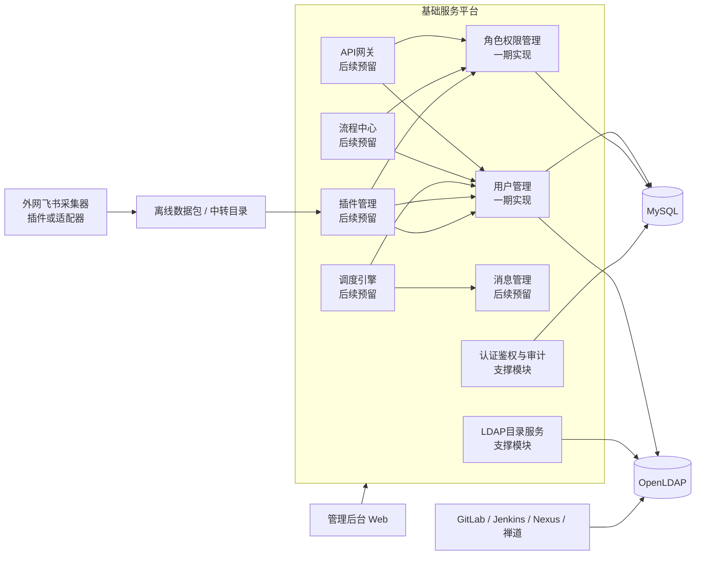
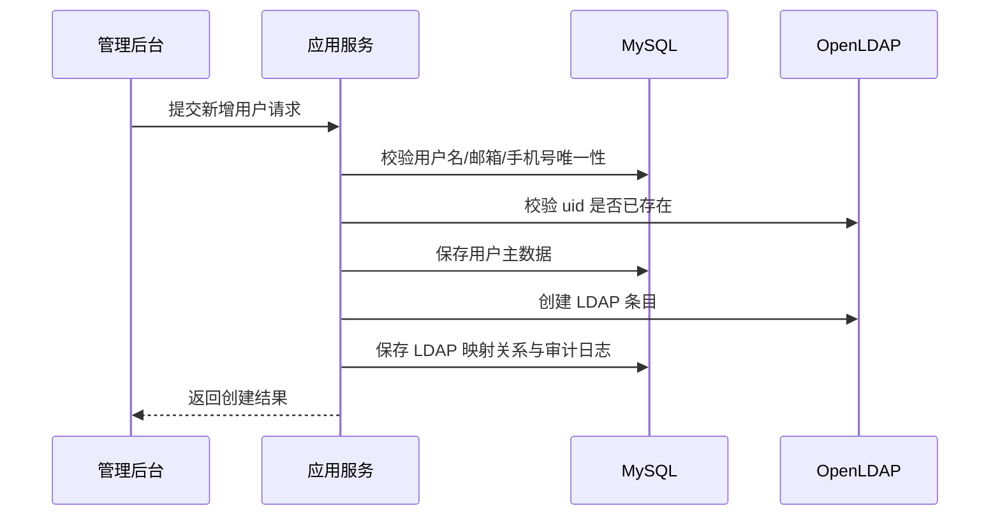

# 企业统一身份与LDAP管理平台项目设计文档

## 1. 文档概述

### 1.1 文档目标

本文档用于定义企业统一身份与 LDAP 管理平台的整体设计方案。平台部署于公司内网，目标是在 OpenLDAP 管理能力基础上，逐步支持以下能力：

- 对 OpenLDAP 用户、组织及目录结构进行统一管理
- 集成从外网导入内网的飞书组织架构和员工数据
- 支持手动或自动同步组织架构与员工信息到平台
- 通过 LDAP 为 GitLab 等公司内网第三方系统提供统一认证能力
- 在当前阶段优先交付用户管理模块和角色权限管理模块

### 1.2 范围说明

本文档现已结合所提供的“基础服务层红色框”架构图进行修订。根据图示，基础服务层中与本项目直接相关的目标模块包括：

- 用户管理
- 角色权限管理
- API 网关
- 消息管理
- 流程中心
- 调度引擎
- 插件管理

当前一期建设范围仅包含：

- 用户管理模块
- 角色权限管理模块
- OpenLDAP 基础连接与用户目录写入能力
- 平台自身的 JWT 登录认证与 Casbin 授权控制

后续预留范围包含：

- API 网关模块
- 消息管理模块
- 流程中心模块
- 调度引擎模块
- 插件管理模块
- 飞书数据导入与同步模块
- 组织架构管理模块
- 第三方应用接入模块

说明：

- 架构图中的 `租户管理`、`运营数据`、`组件管理`、`环境管理`、`元数据管理` 属于相邻基础能力，不作为本次一期交付范围。
- 本文会对红框模块给出整体设计边界，但只对“用户管理”和“角色权限管理”展开到一期可落地深度。

### 1.3 设计原则

- 内网优先：所有核心服务部署在公司内网，不依赖运行时公网访问
- 单体优先、边界清晰：一期采用模块化单体架构，降低部署与运维复杂度，为后续服务拆分预留边界
- LDAP 与业务库职责分离：LDAP 负责统一身份目录与第三方认证，关系型数据库负责平台业务数据与权限数据
- 配置化与可扩展：对 LDAP、飞书导入、定时同步、第三方接入全部采用配置化设计
- 规范优先：遵循阿里巴巴 Java 项目开发规范，保证命名、分层、事务、日志、异常、测试的一致性

## 2. 项目目标与建设边界

### 2.1 业务目标

平台的长期业务目标如下：

1. 建立统一的企业身份目录中心
2. 将 OpenLDAP 作为内网第三方平台统一认证的数据源
3. 将飞书中的组织架构与员工主数据导入到内网并完成统一管理
4. 通过角色权限模型对平台后台管理能力进行细粒度控制

### 2.2 一期目标

一期聚焦“先把人和权限管起来”，交付以下内容：

- 平台管理员登录、登出、令牌续期
- 用户新增、编辑、查询、禁用、启用、重置密码
- 用户与 LDAP 目录信息双向映射
- 角色管理、权限点管理、用户角色分配
- 基于 Casbin 的接口级和按钮级授权
- 为后续 API 网关、消息管理、调度引擎、流程中心、插件管理预留清晰的领域边界与扩展接口
- 审计日志、基础单元测试、集成测试

### 2.3 非目标

以下能力不在一期实现范围内，但需要在架构上预留：

- 飞书 API 直连采集
- 组织架构全量同步
- 租户管理能力正式启用
- API 网关统一路由与流控
- 消息中心统一事件投递
- 流程审批与编排引擎
- 插件市场与插件生命周期管理
- 单点登录协议网关，例如 OIDC、SAML、CAS Server
- 自助门户、审批流、消息通知中心

## 3. 总体技术方案

### 3.1 技术栈

| 层次 | 技术选型 | 用途说明 |
| --- | --- | --- |
| 语言与运行时 | Java 17 | LTS 版本，满足长期维护需求 |
| 核心框架 | Spring Boot 3.x | 统一应用启动、自动装配、配置管理 |
| LDAP 集成 | Spring LDAP | 负责 LDAP 查询、绑定、写入、修改 |
| 安全认证 | Spring Security + JWT | 平台后台登录认证与接口访问控制 |
| 鉴权引擎 | Casbin | 基于 RBAC 模型完成资源权限判定 |
| ORM | MyBatis-Plus | 业务数据库 CRUD、分页、条件构造 |
| 简化编码 | Lombok | 减少模板代码 |
| 数据库 | MySQL 8.0 | 存储平台业务数据、权限数据、任务日志 |
| 目录服务 | OpenLDAP 2.x | 企业身份目录、第三方 LDAP 认证数据源 |
| 接口文档 | springdoc-openapi | 自动生成 OpenAPI 文档 |
| 数据迁移 | Flyway | 版本化数据库脚本管理 |
| 测试 | JUnit 5、Mockito、Spring Boot Test、Testcontainers | 单元测试与集成测试 |
| 构建 | Maven | 统一依赖管理与多模块构建 |

说明：

- 一期建议引入 Spring Security，负责 JWT 过滤器、登录会话上下文与接口访问拦截。
- Casbin 负责“是否有权访问资源”，Spring Security 负责“你是谁以及请求是否合法”。

### 3.2 架构形态选择

一期采用“模块化单体”而非微服务，原因如下：

- 当前核心业务边界清晰，但体量不大，单体更适合快速落地
- LDAP、权限、用户管理之间事务一致性要求较高
- 公司内网项目通常更看重稳定性、可控性和低运维成本
- 后续可以按模块边界逐步拆分为独立服务

### 3.3 总体逻辑架构



说明：

- 一期交付的核心是 `用户管理 + 角色权限管理 + LDAP 目录服务 + 认证鉴权`。
- API 网关、消息管理、流程中心、调度引擎、插件管理全部建立在身份、权限和审计能力之上。
- 平台自身的管理登录基于 JWT，不走第三方平台 LDAP 认证链路。
- GitLab 等第三方系统直接对接 OpenLDAP，从而减少平台在运行时认证链路中的单点风险。
- 飞书能力按“外网采集 + 内网导入 + 插件适配”的方式预留，适应内外网隔离环境。

## 4. 分层与模块设计

### 4.1 分层设计

参考阿里巴巴 Java 项目规范，采用清晰的四层结构：

- `interfaces`：接口层，负责 REST API、参数校验、VO 转换、统一返回
- `application`：应用层，负责编排用例、事务控制、权限入口、任务触发
- `domain`：领域层，负责核心实体、领域服务、仓储接口、业务规则
- `infrastructure`：基础设施层，负责 MyBatis-Plus、Spring LDAP、JWT、Casbin、调度器、审计日志等技术实现

推荐基础包结构如下：

```text
com.company.idm
├─ boot
├─ common
│  ├─ api
│  ├─ enums
│  ├─ exception
│  ├─ model
│  └─ util
├─ interfaces
│  ├─ auth
│  ├─ user
│  ├─ role
│  └─ permission
├─ application
│  ├─ auth
│  ├─ user
│  ├─ rbac
│  ├─ gateway
│  ├─ message
│  ├─ workflow
│  ├─ plugin
│  └─ sync
├─ domain
│  ├─ auth
│  ├─ user
│  ├─ rbac
│  ├─ ldap
│  ├─ gateway
│  ├─ message
│  ├─ workflow
│  ├─ plugin
│  └─ sync
└─ infrastructure
   ├─ config
   ├─ persistence
   ├─ ldap
   ├─ security
   ├─ gateway
   ├─ message
   ├─ workflow
   ├─ plugin
   ├─ casbin
   ├─ schedule
   └─ audit
```

### 4.2 Maven 工程建议

原型阶段建议优先采用“单 Maven 工程 + 分层包结构”，而不是将 `common`、`domain`、`application`、`interfaces`、`infrastructure` 全部拆成独立 Maven 模块。

推荐结构如下：

```text
corp-idm-platform
├─ pom.xml
├─ docs
└─ src
   ├─ main
   │  ├─ java
   │  │  └─ com.company.idm
   │  │     ├─ boot
   │  │     ├─ common
   │  │     ├─ domain
   │  │     ├─ application
   │  │     ├─ interfaces
   │  │     └─ infrastructure
   │  └─ resources
   └─ test
      └─ java
```

说明：

- 一期与原型阶段以快速落地、便于调试为主，单模块更适合当前体量。
- `domain`、`application`、`interfaces`、`infrastructure` 通过包边界分层，而不是依赖 Maven 模块边界。
- 当后续团队规模、构建时长或发布边界变复杂时，再考虑按稳定边界拆成多模块。
- 不建议一期上来就做微服务拆分，否则会把主要精力浪费在服务治理与部署编排上。

### 4.3 基础服务层模块划分

| 模块 | 当前状态 | 说明 |
| --- | --- | --- |
| 认证鉴权模块 | 一期实现 | 平台登录、JWT、Casbin 授权 |
| 用户管理模块 | 一期实现 | 用户增删改查、启停用、密码重置、LDAP 映射 |
| 角色权限管理模块 | 一期实现 | 角色、权限点、用户角色绑定、资源授权 |
| LDAP 目录服务模块 | 一期实现 | LDAP 查询、写入、更新、密码修改 |
| 审计日志模块 | 一期实现简版 | 记录登录、用户变更、角色变更、权限变更 |
| API 网关模块 | 后续预留 | 统一 API 接入、鉴权透传、接口治理、限流与审计接入 |
| 消息管理模块 | 后续预留 | 领域事件投递、异步通知、重试队列、任务解耦 |
| 流程中心模块 | 后续预留 | 高风险操作审批、变更编排、流程回调 |
| 调度引擎模块 | 后续预留 | 自动同步、补偿重试、定时扫描、策略刷新 |
| 插件管理模块 | 后续预留 | 飞书导入插件、第三方平台适配器、扩展点管理 |
| 组织架构模块 | 后续预留 | 部门树、上下级关系、负责人等 |
| 飞书同步模块 | 后续预留 | 全量导入、增量导入、任务调度、差异比对 |
| 第三方应用接入模块 | 后续预留 | GitLab 等接入参数管理与联调信息留档 |

补充说明：

- 图中红框模块是基础服务层的重点建设对象，其中一期只落地 `用户管理` 与 `角色权限管理`。
- 图中的 `租户管理`、`运营数据`、`组件管理`、`环境管理`、`元数据管理` 可视为平台级相邻模块，当前系统通过接口或数据边界兼容，但不在本次详细设计与实施范围内。

### 4.4 红框模块依赖关系

从基础服务层视角，建议按如下依赖关系理解各模块边界：

1. 用户管理是身份主数据入口，负责账号、LDAP 映射和员工主数据承载。
2. 角色权限管理建立在用户之上，负责平台内部资源授权，不替代 OpenLDAP 对第三方系统的认证职责。
3. API 网关后续消费认证和权限能力，为门户化接入、统一 API 出入口和接口治理提供能力。
4. 消息管理与调度引擎用于把飞书同步、LDAP 补偿、权限刷新等异步事务从主业务流程中解耦出来。
5. 流程中心用于承载高风险变更审批，例如管理员角色授予、核心账号禁用、批量导入确认。
6. 插件管理用于适配飞书、GitLab、Jenkins 等外部系统或数据源，使基础服务层保持可扩展而非硬编码集成。

## 5. 核心业务设计

### 5.1 核心实体

一期核心实体建议如下：

- 用户 `User`
- 部门 `Department`
- LDAP 账户映射 `LdapAccount`
- 角色 `Role`
- 权限 `Permission`
- 用户角色关系 `UserRole`
- 角色权限关系 `RolePermission`
- 审计日志 `AuditLog`

后续预留实体：

- 同步任务 `SyncJob`
- 同步批次 `SyncBatch`
- 第三方应用 `Application`
- API 路由 `ApiRoute`
- 事件消息 `EventMessage`
- 调度任务 `ScheduleJob`
- 流程定义 `WorkflowDefinition`
- 流程实例 `WorkflowInstance`
- 插件定义 `PluginDefinition`

### 5.2 用户主数据归属原则

为避免“LDAP 和数据库哪个是真实来源”长期失控，建议采用以下原则：

- 平台业务属性以 MySQL 为主存储
- LDAP 目录属性以 OpenLDAP 为主存储
- 用户核心身份数据在平台中维护，并同步写入 LDAP
- LDAP 只保存第三方认证所需的最小必要身份属性

建议同步的数据边界：

- MySQL 保存：账号状态、展示信息、手机号、邮箱、员工编号、角色关系、审计信息、来源标记
- LDAP 保存：用户名、显示名、邮箱、手机号、员工编号、部门编码、密码散列值、启用状态

### 5.3 用户管理模块设计

#### 5.3.1 功能范围

- 用户列表查询
- 按用户名、姓名、手机号、邮箱、状态筛选
- 用户新增
- 用户编辑
- 用户禁用 / 启用
- 用户删除逻辑控制
- 用户密码重置
- 用户角色分配
- 同步到 LDAP
- 从 LDAP 回读校验

#### 5.3.2 业务规则

1. 用户名全局唯一，建议与 LDAP `uid` 一致
2. 邮箱、手机号可配置是否唯一，默认唯一
3. 禁用用户后，平台 JWT 登录失效，LDAP 账户同步设置为不可用
4. 删除用户默认采用逻辑删除，不直接删除 LDAP 条目；应提供“冻结后归档”的运维策略
5. 密码不落库，不保存明文，不记录日志
6. 用户创建成功后，必须保证 MySQL 与 LDAP 至少最终一致

#### 5.3.3 用户创建流程



一致性策略建议：

- 优先本地事务保存业务数据，再调用 LDAP 创建条目
- 若 LDAP 创建失败，则将用户状态标记为“待同步”，由补偿任务重试
- 不建议将 LDAP 操作纳入分布式事务，一期采用“本地事务 + 补偿重试”更稳妥

### 5.4 角色权限管理模块设计

#### 5.4.1 模型选择

平台采用 RBAC 模型，并结合 Casbin 实现策略判定：

- 用户 `User`
- 角色 `Role`
- 权限 `Permission`
- 用户与角色关系 `UserRole`
- 角色与权限关系 `RolePermission`

权限粒度建议支持：

- 菜单级
- 页面级
- 按钮级
- 接口级

#### 5.4.2 Casbin 模型建议

模型可采用标准 RBAC 变体：

```text
[request_definition]
r = sub, obj, act

[policy_definition]
p = sub, obj, act

[role_definition]
g = _, _

[policy_effect]
e = some(where (p.eft == allow))

[matchers]
m = g(r.sub, p.sub) && r.obj == p.obj && r.act == p.act
```

说明：

- `sub` 表示角色编码
- `obj` 表示资源标识，例如 `/api/v1/users`
- `act` 表示动作，例如 `GET`、`POST`、`EXPORT`
- 用户与角色的归属关系可映射为 Casbin 中的 `g` 规则

#### 5.4.3 权限数据维护策略

推荐采用“双层模型”：

- 业务展示层使用 `sys_role`、`sys_permission`、`sys_user_role`、`sys_role_permission`
- 运行授权层使用 Casbin 策略数据进行快速判定

权限变更时的处理流程：

1. 更新业务关系表
2. 生成或刷新 Casbin 策略
3. 刷新本地权限缓存
4. 记录审计日志

这样可以兼顾：

- 管理界面的可维护性
- Casbin 的高效运行时判定
- 后续支持数据权限或多应用权限模型扩展

### 5.5 LDAP 目录服务设计

#### 5.5.1 LDAP 目录树建议

以企业内网域 `dc=corp,dc=local` 为例：

```text
dc=corp,dc=local
├─ ou=people
│  ├─ uid=zhangsan
│  └─ uid=lisi
├─ ou=groups
│  ├─ cn=gitlab-users
│  └─ cn=ops-users
└─ ou=departments    # 后续预留
   ├─ ou=研发中心
   └─ ou=运维部
```

#### 5.5.2 用户条目建议

建议使用以下对象类：

- `top`
- `person`
- `organizationalPerson`
- `inetOrgPerson`

示例：

```ldif
dn: uid=zhangsan,ou=people,dc=corp,dc=local
objectClass: top
objectClass: person
objectClass: organizationalPerson
objectClass: inetOrgPerson
uid: zhangsan
cn: 张三
sn: 张
mail: zhangsan@corp.local
mobile: 13800000000
employeeNumber: E10001
departmentNumber: D001
userPassword: {SSHA}******
```

#### 5.5.3 LDAP 集成接口职责

`LdapDirectoryService` 建议提供如下能力：

- `createUser`
- `updateUser`
- `disableUser`
- `enableUser`
- `resetPassword`
- `findByUid`
- `findByEmployeeNumber`
- `existsByUid`

#### 5.5.4 第三方认证方式

GitLab 等系统直接配置 LDAP 参数连接 OpenLDAP：

- Host
- Port
- Base DN
- Bind DN
- User Filter
- UID Attribute
- Encryption Mode

平台只负责维护 LDAP 数据，不进入第三方系统的登录鉴权链路。该设计可以显著降低平台宕机对第三方登录的影响。

### 5.6 飞书数据集成设计（后续预留）

考虑到系统部署在内网，而飞书通常位于外网环境，建议采用“外网采集、内网导入”的解耦模式。

#### 5.6.1 逻辑流程


#### 5.6.2 同步模式

- 手动同步：管理员上传飞书导出包，确认差异后执行导入
- 自动同步：定时扫描中转目录或 SFTP 目录，自动拉取并执行同步

#### 5.6.3 同步策略

- 支持全量同步与增量同步
- 支持“预览差异”后再提交
- 支持失败重试和批次追踪
- 支持导入幂等，避免重复包重复执行

#### 5.6.4 一期预留要求

一期即使不实现飞书同步，也建议预留以下表和接口边界：

- 数据来源字段 `source_type`
- 外部系统主键字段 `external_id`
- 同步状态字段 `sync_status`
- 同步任务与批次日志表

### 5.7 API 网关模块设计（后续预留）

根据基础服务层架构图，API 网关是后续统一门户与统一 API 接入的重要入口，但不建议在一期与身份管理核心强耦合。

建议职责如下：

- 对内提供统一 API 接入入口
- 对接平台 JWT 与权限上下文，完成身份透传
- 提供接口级限流、黑白名单、审计埋点
- 对外暴露统一的插件接入入口和回调入口

设计约束如下：

- API 网关不代理 GitLab 等系统的 LDAP 认证行为
- API 网关应独立部署或独立模块化，避免与用户管理主流程相互影响
- 一期先统一接口规范、错误码、鉴权头和 traceId 传递协议，为后续网关接入做好准备

### 5.8 消息管理与调度引擎设计（后续预留）

在基础服务层中，`消息管理` 与 `调度引擎` 应共同承担异步解耦和补偿执行职责。

典型事件包括：

- `USER_CREATED`
- `USER_STATUS_CHANGED`
- `ROLE_PERMISSION_CHANGED`
- `LDAP_SYNC_RETRY`
- `FEISHU_IMPORT_EXECUTE`

典型调度任务包括：

- 飞书离线包扫描任务
- LDAP 同步失败补偿任务
- Casbin 策略刷新任务
- 长时间未处理流程实例提醒任务

一期预留建议：

- 在数据库中预留 Outbox 或事件消息表
- 将用户同步、角色策略刷新封装为可异步化的应用服务命令
- 统一任务状态机，例如 `INIT`、`RUNNING`、`SUCCESS`、`FAIL`、`RETRY`

### 5.9 流程中心设计（后续预留）

流程中心主要用于控制高风险或跨角色协作的变更动作，避免后续把审批逻辑散落在用户管理和权限管理代码中。

适用场景建议：

- 超级管理员角色授予
- 核心账号禁用
- 批量导入员工信息确认
- 第三方应用接入审批

设计原则：

- 流程中心只编排，不直接承载身份主数据
- 流程节点动作最终仍由用户管理、角色权限管理等业务应用服务执行
- 流程实例必须具备审计追踪、回调重试和幂等处理能力

### 5.10 插件管理设计（后续预留）

插件管理是图中红框模块与飞书集成、第三方平台接入之间的关键桥梁，建议采用“平台核心稳定、适配逻辑插件化”的策略。

建议插件类型如下：

- 数据导入插件，例如飞书组织与员工数据导入
- 应用适配插件，例如 GitLab、Jenkins、Nexus 接入说明与参数模板
- 回调处理插件，例如外部事件回传处理

建议预留能力如下：

- 插件注册、启停、版本管理
- 插件配置项管理
- 插件权限隔离与审计
- 插件回调入口与异常隔离

## 6. 数据库设计

### 6.1 MySQL 表设计建议

#### 6.1.1 用户表 `sys_user`

核心字段建议如下：

| 字段 | 类型 | 说明 |
| --- | --- | --- |
| id | bigint | 主键 |
| username | varchar(64) | 用户名，唯一 |
| real_name | varchar(64) | 真实姓名 |
| email | varchar(128) | 邮箱 |
| mobile | varchar(32) | 手机号 |
| employee_no | varchar(64) | 员工编号 |
| dept_code | varchar(64) | 部门编码，后续对接组织树 |
| status | tinyint | 1 启用，0 禁用 |
| source_type | varchar(32) | MANUAL、FEISHU |
| external_id | varchar(128) | 外部系统唯一标识 |
| ldap_dn | varchar(256) | LDAP 条目 DN |
| remark | varchar(256) | 备注 |
| deleted | tinyint | 逻辑删除标记 |
| creator | varchar(64) | 创建人 |
| modifier | varchar(64) | 修改人 |
| gmt_create | datetime | 创建时间 |
| gmt_modified | datetime | 修改时间 |

#### 6.1.2 角色表 `sys_role`

| 字段 | 类型 | 说明 |
| --- | --- | --- |
| id | bigint | 主键 |
| role_code | varchar(64) | 角色编码，唯一 |
| role_name | varchar(64) | 角色名称 |
| status | tinyint | 状态 |
| remark | varchar(256) | 备注 |
| creator | varchar(64) | 创建人 |
| modifier | varchar(64) | 修改人 |
| gmt_create | datetime | 创建时间 |
| gmt_modified | datetime | 修改时间 |

#### 6.1.3 权限表 `sys_permission`

| 字段 | 类型 | 说明 |
| --- | --- | --- |
| id | bigint | 主键 |
| permission_code | varchar(128) | 权限编码，唯一 |
| permission_name | varchar(128) | 权限名称 |
| permission_type | varchar(32) | MENU、BUTTON、API |
| resource_path | varchar(256) | 资源路径 |
| action | varchar(32) | GET、POST、PUT、DELETE、EXPORT |
| parent_id | bigint | 父权限 ID |
| sort_no | int | 排序 |
| status | tinyint | 状态 |
| remark | varchar(256) | 备注 |
| gmt_create | datetime | 创建时间 |
| gmt_modified | datetime | 修改时间 |

#### 6.1.4 关系表

- `sys_user_role(user_id, role_id, gmt_create, creator)`
- `sys_role_permission(role_id, permission_id, gmt_create, creator)`

#### 6.1.5 审计表 `sys_audit_log`

| 字段 | 类型 | 说明 |
| --- | --- | --- |
| id | bigint | 主键 |
| trace_id | varchar(64) | 链路 ID |
| operator | varchar(64) | 操作人 |
| operation_type | varchar(64) | 操作类型 |
| biz_type | varchar(64) | USER、ROLE、PERMISSION、AUTH |
| biz_id | varchar(64) | 业务主键 |
| before_json | text | 变更前 |
| after_json | text | 变更后 |
| result | varchar(32) | SUCCESS、FAIL |
| error_msg | varchar(512) | 错误信息 |
| gmt_create | datetime | 创建时间 |

#### 6.1.6 Casbin 表

若采用 JDBC Adapter，可直接使用标准 `casbin_rule` 表。

建议字段至少包括：

- `ptype`
- `v0`
- `v1`
- `v2`
- `v3`
- `v4`
- `v5`

#### 6.1.7 后续预留表

为匹配基础服务层红框模块，建议按需预留如下表设计：

- `sys_event_message`：消息管理模块的事件消息与重试记录
- `sys_schedule_job`：调度引擎任务定义
- `sys_schedule_job_log`：调度执行日志
- `sys_workflow_definition`：流程定义
- `sys_workflow_instance`：流程实例
- `sys_workflow_task`：流程节点任务
- `sys_plugin_definition`：插件定义
- `sys_plugin_config`：插件配置项
- `sys_api_route`：API 网关路由元数据

### 6.2 索引设计建议

- `sys_user.uk_username`
- `sys_user.uk_email`
- `sys_user.uk_mobile`
- `sys_user.idx_employee_no`
- `sys_role.uk_role_code`
- `sys_permission.uk_permission_code`
- `sys_user_role.uk_user_role`
- `sys_role_permission.uk_role_permission`

### 6.3 表设计规范

遵循阿里巴巴 Java 项目设计规范建议：

- 表名、字段名使用小写字母加下划线
- 每张表必须包含 `gmt_create`、`gmt_modified`
- 状态值、来源值、类型值统一使用枚举定义
- 禁止使用保留字作为字段名
- 大文本仅用于审计与快照，不滥用 `text`

## 7. 接口设计

### 7.1 认证接口

- `POST /api/v1/auth/login`
- `POST /api/v1/auth/logout`
- `POST /api/v1/auth/refresh`
- `GET /api/v1/auth/me`

### 7.2 用户管理接口

- `GET /api/v1/users`
- `GET /api/v1/users/{id}`
- `POST /api/v1/users`
- `PUT /api/v1/users/{id}`
- `PUT /api/v1/users/{id}/status`
- `PUT /api/v1/users/{id}/password/reset`
- `PUT /api/v1/users/{id}/roles`
- `POST /api/v1/users/{id}/sync-ldap`

### 7.3 角色权限接口

- `GET /api/v1/roles`
- `POST /api/v1/roles`
- `PUT /api/v1/roles/{id}`
- `PUT /api/v1/roles/{id}/status`
- `GET /api/v1/permissions/tree`
- `POST /api/v1/permissions`
- `PUT /api/v1/permissions/{id}`
- `PUT /api/v1/roles/{id}/permissions`

### 7.4 未来预留接口

- `GET /api/v1/gateway/routes`
- `POST /api/v1/gateway/routes`
- `GET /api/v1/messages/events`
- `POST /api/v1/messages/retry/{id}`
- `GET /api/v1/schedules/jobs`
- `POST /api/v1/schedules/jobs`
- `GET /api/v1/workflows/instances`
- `POST /api/v1/workflows/instances`
- `GET /api/v1/plugins`
- `POST /api/v1/plugins`
- `POST /api/v1/sync/feishu/upload`
- `POST /api/v1/sync/feishu/preview`
- `POST /api/v1/sync/feishu/execute`
- `GET /api/v1/sync/jobs`

## 8. 安全设计

### 8.1 认证设计

平台后台登录流程建议如下：

1. 用户输入用户名和密码
2. 平台根据用户名查询本地用户状态
3. 校验用户是否启用、是否具备后台登录权限
4. 使用 Spring LDAP 对 OpenLDAP 执行 Bind 校验密码
5. 校验通过后签发 JWT
6. 后续请求由 JWT 过滤器解析用户身份

说明：

- 推荐管理员账号默认来源于 LDAP，避免形成两套身份口径
- 可保留一个受限本地超级管理员账号，用于 LDAP 故障下的应急登录

### 8.2 授权设计

- 控制器或接口层通过注解或统一切面调用 Casbin 授权
- 菜单与按钮权限由前端根据权限码进行渲染控制
- 接口权限必须由后端再次校验，不能仅依赖前端隐藏

### 8.3 密码与敏感数据处理

- 平台不保存明文密码
- LDAP 中密码使用安全散列算法
- 日志中脱敏手机号、邮箱、DN、token
- JWT 建议设置较短过期时间，例如 30 分钟
- 支持 token 黑名单或版本号失效机制，用于禁用用户后的即时失效

### 8.4 审计要求

以下操作必须审计：

- 登录成功、登录失败、退出登录
- 用户新增、编辑、禁用、启用、密码重置
- 角色新增、编辑、权限变更
- LDAP 同步执行结果

## 9. 关键技术实现建议

### 9.1 Spring LDAP 使用建议

- 使用 `LdapTemplate` 封装目录查询与写入
- 将 DN 构造、属性映射封装为独立组件，避免散落在业务代码中
- 对 LDAP 异常进行统一转换，例如账户已存在、DN 无效、连接失败

### 9.2 MyBatis-Plus 使用建议

- 仅在基础 CRUD 与分页场景使用 MyBatis-Plus
- 复杂查询使用 XML 或自定义 Mapper，避免把 Lambda Wrapper 写成业务逻辑
- DO、DTO、VO 分层清晰，不直接将 DO 暴露给接口

### 9.3 Casbin 使用建议

- 将策略加载与刷新封装为独立 `PolicyService`
- 用户角色和角色权限变更后主动刷新策略
- 高并发场景下可引入本地缓存，但必须设计失效机制

### 9.4 JWT 使用建议

- Token 中只保存必要信息，例如用户 ID、用户名、角色摘要、版本号
- 不在 JWT 中放置敏感个人信息
- 配置统一签名密钥与过期时间

## 10. 代码规范与工程规范

### 10.1 命名规范

参考阿里巴巴 Java 项目规范：

- 包名全部小写，单数语义优先
- 类名使用 UpperCamelCase
- 方法名、变量名使用 lowerCamelCase
- 常量使用全大写加下划线
- 布尔字段命名避免歧义，例如 `enabled`、`deleted`

### 10.2 分层对象规范

- `Req`：请求对象
- `Resp` 或 `VO`：响应对象
- `DTO`：应用层传输对象
- `Entity`：领域实体
- `DO`：数据库持久化对象

禁止：

- Controller 直接返回数据库 DO
- Service 之间随意传递 Map
- 用 `Object`、`JSONObject` 作为核心业务入参

### 10.3 异常规范

- 使用统一业务异常基类，例如 `BizException`
- 错误码统一管理，例如 `USER_NOT_FOUND`、`ROLE_CODE_DUPLICATE`
- 禁止直接向前端透出底层 LDAP 或 SQL 异常堆栈

### 10.4 日志规范

- 使用 SLF4J
- 关键日志必须带 `traceId`
- 禁止记录密码、token 全值、身份证号等敏感信息
- 变更日志与审计日志分离，技术日志不代替审计日志

## 11. 测试设计

### 11.1 测试分层

- 单元测试：校验领域规则、权限计算、参数校验、异常分支
- 集成测试：验证 MySQL、LDAP、JWT、Casbin 之间的协同
- 接口测试：验证 REST API 入参校验、鉴权、返回码

### 11.2 测试工具建议

- `JUnit 5`
- `Mockito`
- `Spring Boot Test`
- `Testcontainers`

建议的集成测试容器：

- MySQL 容器
- OpenLDAP 容器

### 11.3 一期重点测试场景

- 新增用户成功并写入 LDAP
- LDAP 用户已存在时的失败处理
- 禁用用户后 JWT 访问失效
- 用户绑定多个角色后的权限合并
- 角色权限变更后 Casbin 策略刷新生效
- 非授权用户访问受限接口被正确拒绝

### 11.4 质量门禁

建议设置如下质量目标：

- 核心业务单元测试覆盖率不低于 70%
- 关键授权逻辑与 LDAP 适配逻辑必须覆盖异常分支
- 所有数据库脚本必须经过 Flyway 校验

## 12. 部署与运维设计

### 12.1 部署形态

一期建议部署为单应用实例起步，后续根据压力扩容为双节点或多节点：

- `corp-idm-platform`
- `MySQL`
- `OpenLDAP`

### 12.2 配置管理

建议通过 `application-{profile}.yml` 管理不同环境配置：

- `dev`
- `test`
- `prod`

敏感配置应通过环境变量或内网密钥管理系统注入：

- LDAP 管理员密码
- JWT 签名密钥
- 数据库账号密码

### 12.3 监控与告警

建议至少监控以下指标：

- 应用存活状态
- LDAP 连接可用性
- 登录失败率
- 用户同步失败次数
- 数据库连接池状态

## 13. 分阶段实施建议

### 13.1 第一阶段

- 完成工程初始化
- 完成认证鉴权基础框架
- 完成用户管理
- 完成角色权限管理
- 完成 OpenLDAP 基础集成
- 统一审计日志与接口规范
- 完成单元测试与集成测试

### 13.2 第二阶段

- 增加消息管理与调度引擎基础能力
- 补充组织架构管理
- 实现飞书导入与同步
- 增加同步任务中心与批次日志
- 建立插件 SPI 与飞书导入适配器
- 支持更多第三方系统接入说明模板

### 13.3 第三阶段

- 增加 API 网关能力
- 增加流程中心能力
- 完善插件管理后台与应用接入台账
- 支持更细粒度的数据权限
- 视业务体量拆分同步服务、认证服务、网关服务

## 14. 主要风险与应对

| 风险 | 说明 | 应对建议 |
| --- | --- | --- |
| LDAP 与数据库不一致 | 双写场景可能失败 | 采用补偿任务、待同步状态、审计追踪 |
| 内外网隔离导致飞书直连不可行 | 内网不能直接访问飞书 | 采用离线数据包或中转目录方案 |
| 角色权限模型过于粗糙 | 后续功能扩展受限 | 一期即按资源和动作维度设计权限 |
| 第三方系统 LDAP 配置差异 | GitLab、Jenkins 等配置项不同 | 预留应用接入模板与参数说明 |
| 平台宕机影响后台管理 | 用户、角色无法修改 | 第三方认证直接连 LDAP，降低运行时依赖 |

## 15. 结论

该方案以“模块化单体 + OpenLDAP + MySQL”为核心，并已与基础服务层架构图中的红框模块完成对齐。整体上围绕 `用户管理`、`角色权限管理`、`API 网关`、`消息管理`、`流程中心`、`调度引擎`、`插件管理` 建立统一的基础服务能力版图。

其中，一期优先完成用户管理与角色权限管理，并通过 Spring LDAP、Spring Security、JWT、Casbin、MyBatis-Plus 建立统一身份底座；后续再平滑扩展飞书导入、组织同步、API 网关、流程与插件体系，而无需推翻一期的整体架构。
