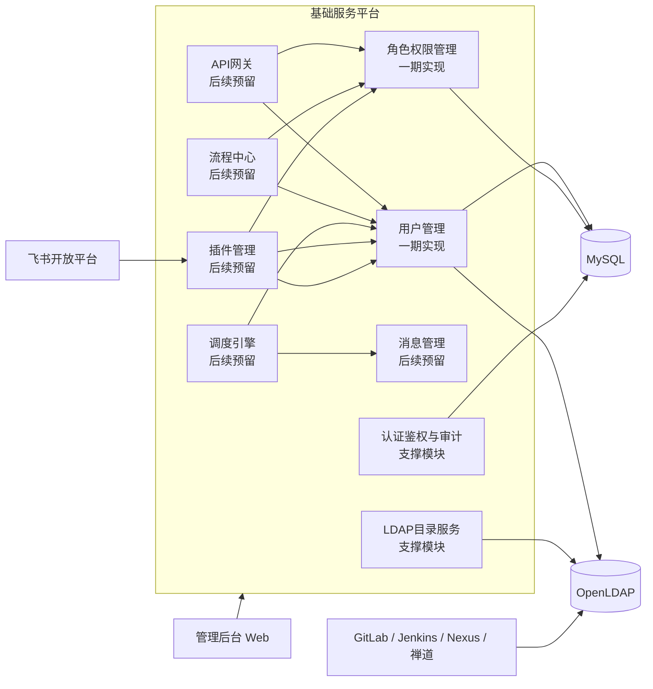
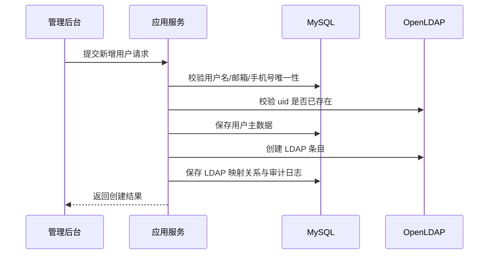
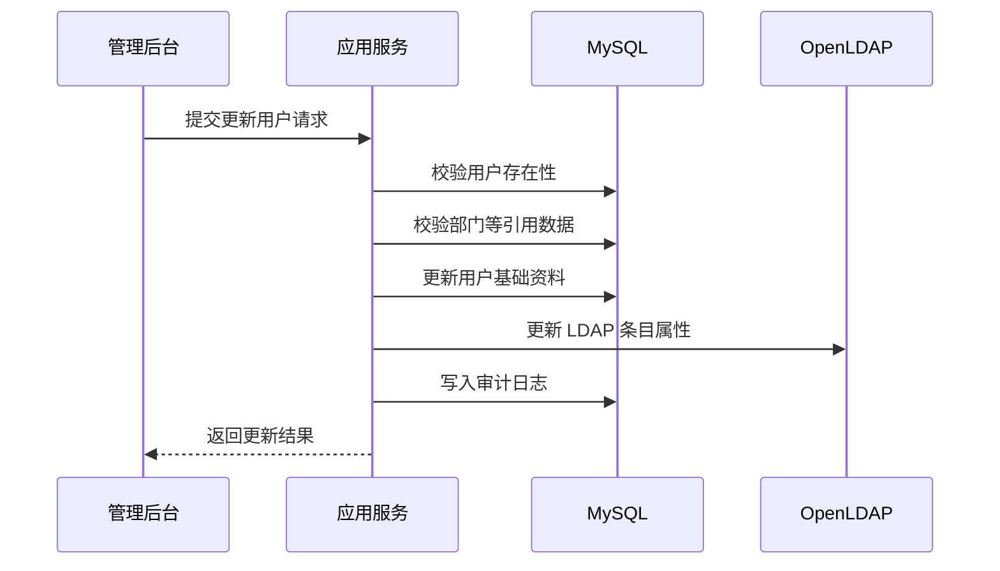
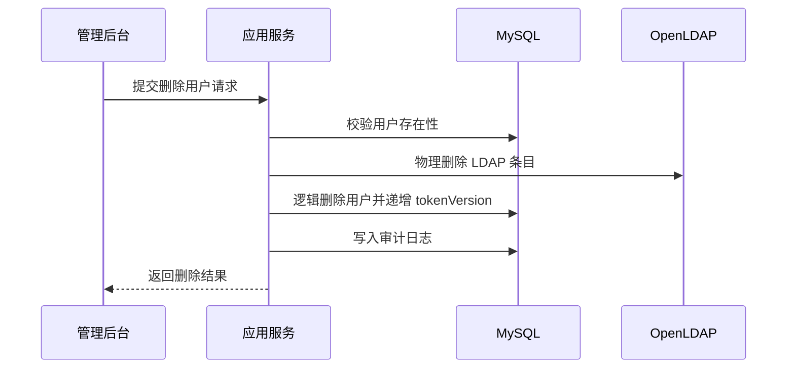
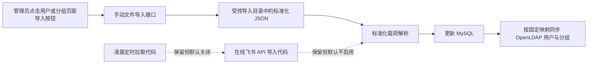

# 企业统一身份与LDAP管理平台项目设计文档

## 1. 文档概述

### 1.1 文档目标

本文档用于定义企业统一身份与 LDAP 管理平台的整体设计方案。平台部署于公司内网，目标是在 OpenLDAP 管理能力基础上，逐步支持以下能力：

- 对 OpenLDAP 用户、组织及目录结构进行统一管理
- 集成从外网导入内网的飞书组织架构和员工数据
- 支持手动或自动同步组织架构与员工信息到平台
- 通过 LDAP 为 GitLab 等公司内网第三方系统提供统一认证能力
- 在当前阶段优先交付用户管理模块和角色权限管理模块

### 1.2 范围说明

本文档现已结合所提供的“基础服务层红色框”架构图进行修订。根据图示，基础服务层中与本项目直接相关的目标模块包括：

- 用户管理
- 角色权限管理
- API 网关
- 消息管理
- 流程中心
- 调度引擎
- 插件管理

当前一期建设范围仅包含：

- 用户管理模块
- 角色权限管理模块
- OpenLDAP 基础连接与用户目录写入能力
- 平台自身的 JWT 登录认证与 Casbin 授权控制

后续预留范围包含：

- API 网关模块
- 消息管理模块
- 流程中心模块
- 调度引擎模块
- 插件管理模块
- 飞书数据导入与同步模块
- 组织架构管理模块
- 第三方应用接入模块

说明：

- 架构图中的 `租户管理`、`运营数据`、`组件管理`、`环境管理`、`元数据管理` 属于相邻基础能力，不作为本次一期交付范围。
- 本文会对红框模块给出整体设计边界，但只对“用户管理”和“角色权限管理”展开到一期可落地深度。

### 1.3 设计原则

- 内网优先：所有核心服务部署在公司内网，不依赖运行时公网访问
- 单体优先、边界清晰：一期采用模块化单体架构，降低部署与运维复杂度，为后续服务拆分预留边界
- LDAP 与业务库职责分离：LDAP 负责统一身份目录与第三方认证，关系型数据库负责平台业务数据与权限数据
- 配置化与可扩展：对 LDAP、飞书导入、定时同步、第三方接入全部采用配置化设计
- 规范优先：遵循阿里巴巴 Java 项目开发规范，保证命名、分层、事务、日志、异常、测试的一致性

## 2. 项目目标与建设边界

### 2.1 业务目标

平台的长期业务目标如下：

1. 建立统一的企业身份目录中心
2. 将 OpenLDAP 作为内网第三方平台统一认证的数据源
3. 将飞书中的组织架构与员工主数据导入到内网并完成统一管理
4. 通过角色权限模型对平台后台管理能力进行细粒度控制

### 2.2 一期目标

一期聚焦“先把人和权限管起来”，交付以下内容：

- 平台管理员登录、登出、令牌续期
- 用户新增、编辑、查询、禁用、启用、重置密码
- 用户、部门与分组信息由 MySQL 向 LDAP 单向投影
- 角色管理、菜单授权、用户角色分配
- 基于 Casbin 的接口级授权与基于角色菜单的菜单树渲染
- 为后续 API 网关、消息管理、调度引擎、流程中心、插件管理预留清晰的领域边界与扩展接口
- 审计日志、基础单元测试、集成测试

### 2.3 非目标

以下能力不在一期实现范围内，但需要在架构上预留：

- 飞书 API 直连采集
- 组织架构全量同步
- 租户管理能力正式启用
- 数据权限模型正式启用
- 菜单多语言、菜单多租户隔离、菜单版本发布
- 按钮级资源模型与按钮权限管理
- API 网关统一路由与流控
- 消息中心统一事件投递
- 流程审批与编排引擎
- 插件市场与插件生命周期管理
- 单点登录协议网关，例如 OIDC、SAML、CAS Server
- 自助门户、审批流、消息通知中心

## 3. 总体技术方案

### 3.1 技术栈

| 层次 | 技术选型 | 用途说明 |
| --- | --- | --- |
| 语言与运行时 | Java 17 | LTS 版本，满足长期维护需求 |
| 核心框架 | Spring Boot 3.x | 统一应用启动、自动装配、配置管理 |
| LDAP 集成 | Spring LDAP | 负责 LDAP 查询、绑定、写入、修改 |
| 安全认证 | Spring Security + JWT | 平台后台登录认证与接口访问控制 |
| 鉴权引擎 | Casbin | 基于 RBAC 模型完成资源权限判定 |
| ORM | MyBatis-Plus | 业务数据库 CRUD、分页、条件构造 |
| 简化编码 | Lombok | 减少模板代码 |
| 数据库 | MySQL 8.0 | 存储平台业务数据、权限数据、任务日志 |
| 目录服务 | OpenLDAP 2.x | 企业身份目录、第三方 LDAP 认证数据源 |
| 接口文档 | springdoc-openapi | 自动生成 OpenAPI 文档 |
| 数据迁移 | Flyway | 版本化数据库脚本管理 |
| 测试 | JUnit 5、Mockito、Spring Boot Test、Testcontainers | 单元测试与集成测试 |
| 构建 | Maven | 统一依赖管理与多模块构建 |

说明：

- 一期建议引入 Spring Security，负责 JWT 过滤器、登录会话上下文与接口访问拦截。
- Casbin 负责“是否有权访问资源”，Spring Security 负责“你是谁以及请求是否合法”。
- 原型阶段可使用 H2 内存库快速联调，并通过 `MODE=MySQL` 保持 SQL 语义尽量贴近 MySQL；测试与生产目标数据库仍应以 MySQL 8.0 为准。

### 3.2 架构形态选择

一期采用“模块化单体”而非微服务，原因如下：

- 当前核心业务边界清晰，但体量不大，单体更适合快速落地
- LDAP、权限、用户管理之间事务一致性要求较高
- 公司内网项目通常更看重稳定性、可控性和低运维成本
- 后续可以按模块边界逐步拆分为独立服务

### 3.3 总体逻辑架构



说明：

- 一期交付的核心是 `用户管理 + 角色权限管理 + LDAP 目录服务 + 认证鉴权`。
- API 网关、消息管理、流程中心、调度引擎、插件管理全部建立在身份、权限和审计能力之上。
- 平台自身的管理登录基于 JWT，不走第三方平台 LDAP 认证链路。
- GitLab 等第三方系统直接对接 OpenLDAP，从而减少平台在运行时认证链路中的单点风险。
- 飞书能力按“外网采集 + 内网导入 + 插件适配”的方式预留，适应内外网隔离环境。

## 4. 分层与模块设计

### 4.1 分层设计

参考阿里巴巴 Java 项目规范，采用清晰的四层结构：

- `interfaces`：接口层，负责 REST API、参数校验、VO 转换、统一返回
- `application`：应用层，负责编排用例、事务控制、权限入口、任务触发
- `domain`：领域层，负责核心实体、领域服务、仓储接口、业务规则
- `infrastructure`：基础设施层，负责 MyBatis-Plus、Spring LDAP、JWT、Casbin、调度器、审计日志等技术实现

推荐基础包结构如下：

```text
com.company.idm
├─ boot
├─ common
│  ├─ api
│  ├─ enums
│  ├─ exception
│  ├─ model
│  └─ util
├─ interfaces
│  ├─ auth
│  ├─ user
│  ├─ role
│  └─ permission
├─ application
│  ├─ auth
│  ├─ user
│  ├─ rbac
│  ├─ gateway
│  ├─ message
│  ├─ workflow
│  ├─ plugin
│  └─ sync
├─ domain
│  ├─ auth
│  ├─ user
│  ├─ rbac
│  ├─ ldap
│  ├─ gateway
│  ├─ message
│  ├─ workflow
│  ├─ plugin
│  └─ sync
└─ infrastructure
   ├─ config
   ├─ persistence
   ├─ ldap
   ├─ security
   ├─ gateway
   ├─ message
   ├─ workflow
   ├─ plugin
   ├─ casbin
   ├─ schedule
   └─ audit
```

### 4.2 Maven 工程建议

原型阶段建议优先采用“单 Maven 工程 + 分层包结构”，而不是将 `common`、`domain`、`application`、`interfaces`、`infrastructure` 全部拆成独立 Maven 模块。

推荐结构如下：

```text
corp-idm-platform
├─ pom.xml
├─ docs
└─ src
   ├─ main
   │  ├─ java
   │  │  └─ com.company.idm
   │  │     ├─ boot
   │  │     ├─ common
   │  │     ├─ domain
   │  │     ├─ application
   │  │     ├─ interfaces
   │  │     └─ infrastructure
   │  └─ resources
   └─ test
      └─ java
```

说明：

- 一期与原型阶段以快速落地、便于调试为主，单模块更适合当前体量。
- `domain`、`application`、`interfaces`、`infrastructure` 通过包边界分层，而不是依赖 Maven 模块边界。
- 当后续团队规模、构建时长或发布边界变复杂时，再考虑按稳定边界拆成多模块。
- 不建议一期上来就做微服务拆分，否则会把主要精力浪费在服务治理与部署编排上。

### 4.3 基础服务层模块划分

| 模块 | 当前状态 | 说明 |
| --- | --- | --- |
| 认证鉴权模块 | 一期实现 | 平台登录、JWT、Casbin 授权 |
| 用户管理模块 | 一期实现 | 用户增删改查、启停用、密码重置、LDAP 映射 |
| 角色权限管理模块 | 一期实现 | 角色、菜单、用户角色绑定、资源授权与权限等级控制 |
| LDAP 目录服务模块 | 一期实现 | LDAP 查询、写入、更新、密码修改 |
| 审计日志模块 | 一期实现简版 | 记录登录、用户变更、角色变更、权限变更 |
| API 网关模块 | 后续预留 | 统一 API 接入、鉴权透传、接口治理、限流与审计接入 |
| 消息管理模块 | 后续预留 | 领域事件投递、异步通知、重试队列、任务解耦 |
| 流程中心模块 | 后续预留 | 高风险操作审批、变更编排、流程回调 |
| 调度引擎模块 | 后续预留 | 自动同步、补偿重试、定时扫描、策略刷新 |
| 插件管理模块 | 后续预留 | 飞书导入插件、第三方平台适配器、扩展点管理 |
| 组织架构模块 | 一期实现简版 | 部门树、部门 CRUD、外部部门 ID 与 LDAP DN 映射 |
| 飞书同步模块 | 后续预留 | 全量导入、增量导入、任务调度、差异比对 |
| 第三方应用接入模块 | 后续预留 | GitLab 等接入参数管理与联调信息留档 |

补充说明：

- 图中红框模块是基础服务层的重点建设对象，当前原型已落地 `用户管理`、`角色权限管理`，并补充实现了支撑用户与 LDAP 映射的 `组织架构模块` 简版能力。
- 图中的 `租户管理`、`运营数据`、`组件管理`、`环境管理`、`元数据管理` 可视为平台级相邻模块，当前系统通过接口或数据边界兼容，但不在本次详细设计与实施范围内。

### 4.4 红框模块依赖关系

从基础服务层视角，建议按如下依赖关系理解各模块边界：

1. 用户管理是身份主数据入口，负责账号、LDAP 映射和员工主数据承载。
2. 角色权限管理建立在用户之上，负责平台内部资源授权，不替代 OpenLDAP 对第三方系统的认证职责。
3. API 网关后续消费认证和权限能力，为门户化接入、统一 API 出入口和接口治理提供能力。
4. 消息管理与调度引擎用于把飞书同步、LDAP 补偿、权限刷新等异步事务从主业务流程中解耦出来。
5. 流程中心用于承载高风险变更审批，例如管理员角色授予、核心账号禁用、批量导入确认。
6. 插件管理用于适配飞书、GitLab、Jenkins 等外部系统或数据源，使基础服务层保持可扩展而非硬编码集成。

## 5. 核心业务设计

### 5.1 核心实体

一期核心实体建议如下：

- 用户 `User`
- 部门 `Department`
- LDAP 账户映射 `LdapAccount`
- 角色 `Role`
- 菜单 `Menu`
- 权限 `Permission`
- 用户角色关系 `UserRole`
- 角色菜单关系 `RoleMenu`
- 角色权限关系 `RolePermission`
- 审计日志 `AuditLog`

后续预留实体：

- 同步任务 `SyncJob`
- 同步批次 `SyncBatch`
- 第三方应用 `Application`
- API 路由 `ApiRoute`
- 事件消息 `EventMessage`
- 调度任务 `ScheduleJob`
- 流程定义 `WorkflowDefinition`
- 流程实例 `WorkflowInstance`
- 插件定义 `PluginDefinition`

### 5.2 用户主数据归属原则

为避免“LDAP 和数据库哪个是真实来源”长期失控，建议采用以下原则：

- 平台业务属性以 MySQL 为主存储
- LDAP 目录属性以 OpenLDAP 为主存储
- 用户核心身份数据在平台中维护，并同步写入 LDAP
- LDAP 只保存第三方认证所需的最小必要身份属性

建议同步的数据边界：

- MySQL 保存：账号状态、展示信息、手机号、邮箱、员工编号、角色关系、审计信息、来源标记
- LDAP 保存：用户名、显示名、邮箱、手机号、员工编号、部门编码、密码散列值、启用状态

当前阶段同步原则补充：

- MySQL 是主数据源，LDAP 是目录投影
- 当前仅支持 **MySQL -> LDAP** 单向同步
- 不支持 LDAP 回写 MySQL
- 当前仅对接飞书导入场景，因此采用固定映射规则，不引入动态字段映射引擎

#### 5.2.1 部门主数据与组织架构设计

部门模块当前不仅承担“用户合法部门引用”“前端部门树渲染”“LDAP group 同步源”三个职责，还需要同时承载：

- 业务组织架构的树形主数据
- 飞书部门 `external_id` 的落库映射
- 当前 LDAP group `ldap_dn` 的持久化映射

部门模块职责边界建议如下：

- MySQL 中的 `Department` 是组织架构与同步映射的主数据源
- LDAP 中的 group 是第三方系统登录授权目录的组织投影
- 飞书部门 ID 只作为外部来源定位键，不替代内部 `dept_code`

#### 5.2.2 部门模型设计

部门实体建议包含以下核心字段：

- `dept_code`：内部稳定业务编码，创建后不允许修改
- `dept_name`：部门名称
- `parent_dept_code`：父部门编码，根部门为空
- `ancestor_path`：祖先路径，例如 `/D001/D001002`
- `dept_level`：组织层级深度
- `source_type`：`MANUAL`、`FEISHU`
- `external_id`：飞书部门外部主键
- `ldap_dn`：当前 LDAP group 的真实 DN
- `status`：启停状态

字段职责说明：

- `dept_code` 用于平台内部业务引用、用户归属和稳定主键定位
- `external_id` 用于飞书导入场景下的幂等更新和映射追踪
- `ldap_dn` 用于记录当前 LDAP 节点位置，支撑节点重命名后的回写
- `ancestor_path` 与 `dept_level` 用于部门树查询、层级渲染和防循环校验

#### 5.2.3 部门 CRUD 规则

部门管理建议提供：

- 部门树查询
- 部门详情查询
- 部门创建
- 部门更新
- 部门删除

业务规则如下：

1. `dept_code` 全局唯一，创建后不允许修改
2. 非根部门的 `parent_dept_code` 必须存在
3. 部门不能挂到自身或自身下级节点之下
4. 部门移动时需同步更新本节点及全部子孙节点的 `ancestor_path` 与 `dept_level`
5. 删除部门前必须校验无子部门、无用户引用
6. 用户侧引用部门时，只允许选择启用中的部门
7. `external_id` 与 `source_type` 作为来源识别字段，不在普通编辑接口中修改

#### 5.2.4 部门与 LDAP group 映射规则

部门同步到 LDAP 时，建议采用“稳定编码 + 可变名称”的组合模型：

- `dept_code` 固定映射到 LDAP group 的业务标识属性，例如 `businessCategory`
- `dept_name` 固定映射到 LDAP group 的 `description`
- LDAP group 的 RDN 建议采用 `cn=${dept_code}_${dept_name}`
- `ldap_dn` 作为当前目录节点位置回写到 `sys_department`

因此，当部门名称变更时：

1. 需要先根据旧 `ldap_dn` 或业务标识定位原 LDAP group
2. 通过 LDAP `rename / modifyDN` 重命名节点
3. 获取新的 DN
4. 回写 `sys_department.ldap_dn`

这样可以保留 group 成员关系，避免采用“删旧建新”带来的成员丢失风险。

#### 5.2.5 部门与飞书导入映射规则

当前仅考虑飞书导入场景，因此映射规则固定化：

- 飞书部门 ID -> `sys_department.external_id`
- 飞书父部门 ID -> 解析为 `parent_dept_code`
- 当前 LDAP DN -> `sys_department.ldap_dn`

导入策略建议：

- 以 `external_id` 作为飞书部门幂等更新主键
- 以 `dept_code` 作为平台内部稳定业务编码
- 以 `ldap_dn` 作为 LDAP 节点重命名后的结果映射

#### 5.2.6 当前原型落地说明

当前原型已实现以下部门管理能力：

- 部门树查询
- 部门详情查询
- 部门创建
- 部门更新
- 部门删除
- 部门层级路径 `ancestor_path` 与层级深度 `dept_level` 维护
- 部门名称变更时 LDAP group 节点重命名与 `ldap_dn` 回写
- 删除部门前对子部门与用户引用关系校验
- 用户流程首次补建 LDAP group 时对部门 `ldap_dn` 回写补偿

### 5.3 用户管理模块设计

#### 5.3.1 功能范围

- 用户列表查询
- 用户详情查询
- 按用户名、姓名、手机号、邮箱、状态筛选
- 用户新增
- 用户编辑
- 用户禁用 / 启用
- 用户删除逻辑控制
- 用户本人修改密码
- 用户密码重置
- 用户角色分配
- 同步到 LDAP
- 从 LDAP 回读校验

#### 5.3.2 业务规则

1. 用户名全局唯一，建议与 LDAP `uid` 一致
2. 邮箱、手机号可配置是否唯一，默认唯一
3. 禁用用户后，平台 JWT 登录失效，LDAP 账户同步设置为不可用
4. 删除用户时，在 LDAP 中执行物理删除，在 MySQL 中执行逻辑删除，以便员工再次入职时可恢复业务数据
5. 密码不落库，不保存明文，不记录日志
6. 当前密码策略按业务要求执行最小限制：长度不少于 6 位，允许弱口令，允许纯数字口令
7. 用户修改本人密码时必须校验旧密码，新旧密码不能相同，且修改成功后需使历史 token 失效
8. 管理员重置用户密码时，当前阶段统一重置为 `123456`，且不启用首次登录强制改密逻辑
9. 用户创建成功后，必须保证 MySQL 与 LDAP 至少最终一致

#### 5.3.3 用户创建流程



一致性策略建议：

- 优先本地事务保存业务数据，再调用 LDAP 创建条目
- 若 LDAP 创建失败，则将用户状态标记为“待同步”，由补偿任务重试
- 不建议将 LDAP 操作纳入分布式事务，一期采用“本地事务 + 补偿重试”更稳妥

#### 5.3.4 用户更新流程



说明：

- 用户更新接口仅维护基础资料，不修改 `username`、`source_type`、`external_id`、`token_version` 等身份主键属性。
- 用户资料更新后，LDAP 同步更新 `cn`、`mail`、`mobile`、`employeeNumber`、`departmentNumber` 等字段。

#### 5.3.5 用户删除流程



说明：

- 删除后平台侧通过 `deleted=1` 标记逻辑删除，并同步将用户视为不可登录。
- 再次入职时可基于 MySQL 中的历史业务数据进行恢复或重建。

#### 5.3.6 密码管理设计

密码管理区分“本人修改密码”和“管理员重置密码”两类场景。

本人修改密码规则：

- 当前登录用户发起
- 必须校验旧密码
- 新旧密码不能相同
- 两次新密码必须一致
- 修改成功后递增 `token_version`，使旧 token 失效

管理员重置密码规则：

- 仅拥有 `ADMIN` 角色的管理员允许执行
- 当前阶段固定重置密码为 `123456`
- 不开启首次登录强制改密
- 重置成功后递增 `token_version`

密码校验规则：

- 密码不能为空
- 密码长度至少 6 位
- 不要求大写字母、小写字母、数字、特殊字符的复杂度组合

#### 5.3.7 当前原型落地说明

当前原型已实现以下用户管理能力：

- 用户列表查询
- 用户新增
- 用户编辑
- 用户状态更新
- 用户删除
- 用户本人修改密码
- 管理员重置密码
- 与 LDAP 的创建、更新、启停、删除、改密联动

### 5.4 角色权限管理模块设计

#### 5.4.1 模型选择

平台当前采用“用户-角色-菜单”作为主关系模型，并以 `permission_level` 作为对象级操作边界控制字段：

- 用户 `User`
- 角色 `Role`
- 菜单 `Menu`
- 用户与角色关系 `UserRole`
- 角色与菜单关系 `RoleMenu`
- 接口权限 `Permission`（用于 Casbin 的运行时接口鉴权）

当前阶段设计约束如下：

- 系统初始化自动生成两个默认角色：`ADMIN`、`NORMAL_USER`
- `ADMIN.permission_level = 1`
- `NORMAL_USER.permission_level = 3`
- 第三方导入用户默认绑定 `NORMAL_USER`
- 当前允许创建、更新、删除自定义角色，并在创建和更新角色时手动指定 `permission_level`
- 菜单授权默认只给 `ADMIN` 绑定全部菜单
- `NORMAL_USER` 默认不绑定任何后台管理菜单，仅保留查看个人信息、修改本人密码等基础功能接口

多角色用户的权限计算规则：

- 用户生效权限等级 = 其所拥有角色中最小的 `permission_level`
- 用户可见菜单 = 其所有角色绑定菜单的并集

对象级权限控制规则：

- 对用户基础信息修改：仅允许修改 `permission_level` 低于自己的用户
- 对密码重置、状态控制、删除等敏感操作：仅管理员允许执行
- 对角色、菜单授权等后台高风险操作：通过接口准入 + `permission_level` 规则双重控制

#### 5.4.2 Casbin 模型建议

模型可采用标准 RBAC 变体：

```text
[request_definition]
r = sub, obj, act

[policy_definition]
p = sub, obj, act

[role_definition]
g = _, _

[policy_effect]
e = some(where (p.eft == allow))

[matchers]
m = g(r.sub, p.sub) && r.obj == p.obj && r.act == p.act
```

说明：

- `sub` 表示角色编码
- `obj` 表示资源标识，例如 `/api/v1/users`
- `act` 表示动作，例如 `GET`、`POST`、`EXPORT`
- 用户与角色的归属关系可映射为 Casbin 中的 `g` 规则
- Casbin 在当前方案中主要负责接口级准入，而不是代替 `permission_level` 做对象级操作判断

#### 5.4.3 权限数据维护策略

推荐采用“双层模型”：

- 业务展示层使用 `sys_role`、`sys_menu`、`sys_user_role`、`sys_role_menu`
- 运行授权层使用 Casbin 策略数据进行快速判定

权限变更时的处理流程：

1. 更新角色、菜单或用户角色关系
2. 角色菜单关系用于前端菜单树渲染
3. 角色与接口权限关系用于刷新 Casbin 策略
4. 权限等级规则服务负责“谁能改谁”的业务判断
5. 记录审计日志

这样可以兼顾：

- 管理界面的可维护性
- Casbin 的高效运行时判定
- 基于 `permission_level` 的对象级控制
- 后续支持自定义角色、多角色扩展或更细粒度数据权限模型

#### 5.4.4 角色管理规则

当前角色管理规则如下：

- 角色支持创建、更新、删除
- `role_code` 全局唯一，创建后不允许修改
- 创建、更新角色时允许手动设置 `permission_level`
- 系统初始化内置角色 `ADMIN` 与 `NORMAL_USER`
- 删除角色前必须校验是否仍被用户绑定
- 被用户绑定的角色不允许直接删除

#### 5.4.5 菜单授权规则

菜单授权用于前端菜单树渲染，不直接承担对象级权限判断。

当前规则如下：

- `ADMIN` 默认绑定全部菜单
- `NORMAL_USER` 默认不绑定后台管理菜单
- 自定义角色菜单由管理员手工绑定
- 角色绑定叶子菜单时，系统自动补齐祖先目录菜单，确保前端可稳定渲染菜单树
- 菜单可预留 `min_permission_level` 字段，用于限制低等级角色绑定高风险菜单

#### 5.4.6 菜单管理规则

当前菜单管理规则如下：

- 菜单节点当前仅支持 `CATALOG`、`MENU` 两种类型
- 菜单 CRUD 范围为：树查询、详情、创建、更新、删除，不提供菜单启停接口
- 当前不做菜单多语言、多租户隔离、菜单版本发布、按钮资源管理
- `menu_code` 全局唯一，创建后不允许修改
- 创建、更新、删除菜单仅允许管理员执行
- `parent_id = 0` 表示根节点；非根节点父菜单必须存在且必须为 `CATALOG`
- 菜单不允许挂载到自身或自身下级节点之下
- `MENU` 类型必须提供前端组件路径；`CATALOG` 类型若未显式指定组件，默认使用 `Layout`
- 新建菜单后系统自动将该菜单绑定到 `ADMIN`，确保管理员始终拥有完整菜单树
- 删除菜单前必须校验无子菜单；删除成功后自动清理 `sys_role_menu` 关系
- 若菜单已绑定给低权限角色，则不允许将 `min_permission_level` 收紧到与现有绑定冲突的范围

#### 5.4.7 当前原型落地说明

当前原型已实现以下角色权限管理能力：

- 角色列表
- 角色详情
- 角色创建
- 角色更新
- 角色状态更新
- 角色删除
- 角色菜单绑定
- 用户分配角色
- 菜单详情
- 菜单创建
- 菜单更新
- 菜单删除
- 全量菜单树查询
- 当前用户菜单树查询
- 基于 `permission_level` 的基础对象操作规则服务

### 5.5 LDAP 目录服务设计

#### 5.5.1 LDAP 目录树建议

以企业内网域 `dc=corp,dc=local` 为例：

```text
dc=corp,dc=local
├─ ou=people
│  ├─ uid=zhangsan
│  └─ uid=lisi
├─ ou=groups
│  ├─ cn=gitlab-users
│  └─ cn=ops-users
└─ ou=departments    # 后续预留
   ├─ ou=研发中心
   └─ ou=运维部
```

#### 5.5.2 用户条目建议

建议使用以下对象类：

- `top`
- `person`
- `organizationalPerson`
- `inetOrgPerson`

示例：

```ldif
dn: uid=zhangsan,ou=people,dc=corp,dc=local
objectClass: top
objectClass: person
objectClass: organizationalPerson
objectClass: inetOrgPerson
uid: zhangsan
cn: 张三
sn: 张
mail: zhangsan@corp.local
mobile: 13800000000
employeeNumber: E10001
departmentNumber: D001
userPassword: {SSHA}******
```

#### 5.5.3 LDAP 集成接口职责

`LdapDirectoryService` 建议提供如下能力：

- `createUser`
- `updateUser`
- `deleteUser`
- `disableUser`
- `enableUser`
- `resetPassword`
- `findByUid`
- `findByEmployeeNumber`
- `existsByUid`

#### 5.5.4 LDAP 分组同步设计

当前阶段 LDAP 不作为业务权限中心，而是作为第三方系统认证目录。

从 MySQL 单向同步到 LDAP 的数据主要包括：

- 用户基础数据
- 部门 / 分组数据
- 用户与分组的关联关系

职责边界如下：

- MySQL：管理项目业务，承载用户、角色、菜单、部门等业务主数据
- LDAP：管理第三方系统登录目录，承载用户目录与分组目录

当前阶段固定映射规则如下：

用户基础字段映射：

| MySQL 字段 | LDAP 属性 | 说明 |
| --- | --- | --- |
| `username` | `uid` | 登录账号 |
| `real_name` | `cn` | 显示姓名 |
| `real_name` | `sn` | 简化姓氏属性 |
| `email` | `mail` | 邮箱 |
| `mobile` | `mobile` | 手机号 |
| `employee_no` | `employeeNumber` | 员工编号 |
| `dept_code` | `departmentNumber` | 主部门编码 |
| `status` | `employeeType` | 目录启停状态 |
| 密码输入值 | `userPassword` | 登录密码 |

部门 / 分组映射：

- MySQL 中的 `Department.deptCode` 固定映射为 LDAP group 的业务标识属性，例如 `businessCategory`
- `Department.deptName` 固定映射为 LDAP group 的 `description`
- `Department.ldapDn` 保存当前 LDAP group 的真实 DN
- LDAP group 的 `cn` 建议采用 `${deptCode}_${deptName}`
- 当前 group 目录放在 `ou=groups`

建议组条目示例：

```ldif
dn: cn=D001_研发中心,ou=groups,dc=corp,dc=local
objectClass: top
objectClass: groupOfNames
cn: D001_研发中心
businessCategory: D001
description: 研发中心
member: uid=zhangsan,ou=people,dc=corp,dc=local
```

部门名称变更时的处理规则：

- 若 `dept_name` 发生变化，则 LDAP group 的 RDN 也会变化
- 更新流程中应执行 LDAP 节点重命名，而不是删除后重建
- 重命名成功后，需要将新的 DN 回写到 `sys_department.ldap_dn`

当前原型实现说明：

- 已实现用户基础数据同步到 LDAP 用户条目
- 已实现部门 group 创建、更新、删除
- 已实现按部门编码将用户同步加入 LDAP group
- 已实现用户部门变更时更新 LDAP group 成员关系
- 已实现删除用户前先移出所有 LDAP group，再删除 LDAP 用户条目
- 已实现部门名称变更时 LDAP group 节点重命名并更新 `ldap_dn`
- 当前尚未实现 LDAP -> MySQL 回写
- 当前尚未将业务角色或菜单权限直接同步为 LDAP 组权限模型

建议服务拆分：

- `LdapDirectoryService`：负责用户条目增删改查、启停、改密
- `LdapGroupService`：负责分组条目与成员关系同步

#### 5.5.5 第三方认证方式

GitLab 等系统直接配置 LDAP 参数连接 OpenLDAP：

- Host
- Port
- Base DN
- Bind DN
- User Filter
- UID Attribute
- Encryption Mode

平台只负责维护 LDAP 数据，不进入第三方系统的登录鉴权链路。该设计可以显著降低平台宕机对第三方登录的影响。

当前统一账号平台能力边界说明：

- 第二期目标为“统一身份认证”，而非“单点登录 SSO”
- 用户在本项目、GitLab 等第三方系统中使用同一套账号密码
- 第三方系统直接基于 LDAP 做登录校验
- 用户访问第三方系统时仍需要再次输入密码，不提供免密跳转或登录态透传

### 5.6 飞书数据集成设计（后续预留）

第二期飞书导入能力在代码层同时保留两条链路：

- 在线导入链路：后端直接调用飞书开放平台 API 拉取数据
- 手动文件导入链路：管理员根据飞书数据文档路径导入标准化 JSON 文件

当前阶段对外只开放“手动文件导入”能力；在线导入与凌晨自动拉取代码继续保留，但默认不作为前端入口，且定时任务默认关闭，方便后续恢复。

#### 5.6.1 逻辑流程



#### 5.6.2 导入模式

- 手动文件导入：管理员在“用户管理页”或“分组管理页”点击导入按钮，传入飞书标准化数据文档路径，由后端从受控目录读取文件并执行导入
- 在线导入：后端直接调用飞书开放平台 API 拉取数据并执行导入；当前代码保留，但默认不作为前端入口
- 自动导入：系统定时任务自动调用飞书开放平台 API 拉取数据；当前代码保留，但默认关闭

#### 5.6.3 同步策略

- 支持全量同步与增量同步
- 支持失败重试和批次追踪
- 支持导入幂等，避免重复包重复执行

#### 5.6.4 定时导入与对账策略

当前阶段：

- 凌晨自动拉取飞书 API 的调度代码保留
- 默认配置下关闭 `app.sync.schedule.feishu.enabled`
- 仅保留手动文件导入作为实际对外能力

后续若重新开启凌晨自动导入，建议执行顺序固定为：

1. 先执行飞书在线导入
2. 按既定固定映射规则完成 MySQL 与 LDAP 双写
3. 双写完成后，再执行 MySQL 与 LDAP 的差异对账
4. 对账任务输出缺失数据、字段差异、关系差异清单，并执行补写或修复

建议职责划分：

- 飞书同步任务：负责把外部数据导入到平台主数据，并完成当次 LDAP 写入
- LDAP 对账任务：负责扫描 MySQL 与 LDAP 之间的最终一致性差异，不负责外部采集

这种顺序可以避免在飞书导入前先做对账，导致无意义的差异噪音。

#### 5.6.5 一期预留要求

一期即使不实现飞书同步，也建议预留以下表和接口边界：

- 数据来源字段 `source_type`
- 外部系统主键字段 `external_id`
- 同步状态字段 `sync_status`
- 同步任务与批次日志表
- 固定映射规则由代码维护，后续如接入更多第三方来源再考虑映射配置化

#### 5.6.6 飞书部门导入设计

飞书部门导入建议在现有同步框架内实现，而不是绕开 `SyncBatch / SyncJob / SyncDiff` 单独开发。

当前部门导入同时保留两种数据来源：

- 在线导入：飞书开放平台 API
- 手动导入：受控目录中的标准化 JSON 文件

前端入口约束如下：

- 不单独提供飞书同步页面
- 仅在“用户管理页”和“分组管理页”上提供导入按钮
- 当前页面按钮默认走“按文档路径手动导入”
- 在线导入接口保留，但前端默认不接入
- 当前不做预览确认

当前阶段推荐的飞书部门标准化字段如下：

- `externalId`
- `departmentCode`
- `departmentName`
- `parentExternalId`
- `status`
- `orderNo`

核心业务规则如下：

1. `externalId` 作为飞书部门幂等更新主键
2. `departmentCode` 作为平台内部稳定部门编码，创建后不允许随 `externalId` 映射变化
3. `parentExternalId` 用于构建部门树，可引用同批次父部门或数据库中已存在父部门
4. 导入前必须校验：
   - `externalId` 不重复
   - `departmentCode` 不重复
   - 父节点存在
   - 不存在循环引用
5. 导入执行时必须维护：
   - `parent_dept_code`
   - `ancestor_path`
   - `dept_level`
6. 导入执行后必须完成部门到 LDAP group 的双写
7. 若部门名称变化，则 LDAP group 节点重命名，并回写最新 `ldap_dn`

当前原型已落地说明：

- 已落地 `FeishuDepartmentImportService`
- 已支持直接调用飞书开放平台 API 拉取部门数据
- 已支持按文档路径读取部门标准化 JSON 文件
- 已支持部门树构建、幂等更新和 LDAP group 同步
- 已支持通过文件导入接口触发部门手动导入
- 在线同步接口与定时任务代码仍保留，但默认不作为当前对外功能

#### 5.6.7 飞书用户导入设计

飞书用户导入同样基于统一同步框架实现，并遵循“主部门导入、默认角色绑定、LDAP 用户双写”的原则。

当前阶段用户模型仅维护一个主部门字段 `dept_code`，因此：

- 系统支持完整部门树导入，包括多个平级部门和上下级部门
- 但单个用户当前只保存一个主部门
- 若飞书返回多部门信息，则当前阶段仅取主部门写入 `sys_user.dept_code`

推荐的飞书用户标准化字段如下：

- `externalId`
- `username`
- `realName`
- `email`
- `mobile`
- `employeeNo`
- `mainDepartmentExternalId`
- `status`
- `orderNo`

核心业务规则如下：

1. `externalId` 作为飞书用户幂等更新主键
2. `username` 作为平台登录名，不允许在导入中被 `externalId` 映射为其他已有账号
3. `employeeNo` 作为辅助冲突校验字段
4. 用户导入必须建立在部门导入之后，`mainDepartmentExternalId` 必须能映射到部门
5. `preview` 只做解析、校验和差异计算，不落业务数据
6. `execute` 时需要完成：
   - MySQL 用户主数据落库
   - LDAP 用户条目创建或更新
   - 用户与部门 group 的成员关系同步
   - 新增用户默认绑定 `NORMAL_USER`
7. 对已有用户：
   - 不覆盖已有角色
   - 仅在当前无任何角色时补绑定 `NORMAL_USER`
8. 当前阶段为导入用户设置固定初始密码 `123456`，不启用首次登录强制改密

当前原型已落地说明：

- 已落地 `FeishuUserImportService`
- 已支持直接调用飞书开放平台 API 拉取用户数据
- 已支持按文档路径读取用户标准化 JSON 文件
- 已支持 `externalId` 幂等定位、`username / employeeNo` 冲突校验
- 已支持主部门映射、LDAP 用户双写和部门 group 成员关系同步
- 已支持新增飞书用户默认绑定 `NORMAL_USER`
- 已支持通过文件导入接口触发用户手动导入
- 在线同步接口与定时任务代码仍保留，但默认不作为当前对外功能

#### 5.6.8 同步公共模型与触发框架设计

为同时支撑飞书导入、LDAP 双写补偿和 MySQL 与 LDAP 对账，建议采用统一同步模型：

- 同步批次 `SyncBatch`
- 同步任务 `SyncJob`
- 同步差异 `SyncDiff`

模型职责如下：

- `SyncBatch`：描述一次导入、对账或重试的执行批次
- `SyncJob`：描述批次中的具体执行步骤，例如部门导入、用户导入、部门对账、用户对账
- `SyncDiff`：描述预览差异或对账扫描结果，用于后续修复或回溯
  当前同步框架仍保留差异模型，但不再向前端提供飞书导入预览交互

触发模式支持两类：

- `MANUAL`：管理员手工触发，适用于首次初始化、紧急同步和人工重试
- `SCHEDULED`：系统定时触发，适用于凌晨低峰的静默维护

设计原则：

- 手工触发和定时触发共用同一套应用服务编排
- 先把同步逻辑做成可手工执行，再接入定时任务
- 同类型同步批次同一时刻仅允许一个 `RUNNING`
- 差异扫描与执行修复使用同一套计算逻辑

当前原型已落地说明：

- 已落地 `sys_sync_batch`、`sys_sync_job`、`sys_sync_diff`
- 已落地同步应用服务 `SyncApplicationService`
- 已落地手工触发接口
- 已落地轻量定时触发器 `SyncScheduleLauncher`
- 已落地基础 LDAP 对账处理器，当前覆盖部门与用户维度
- 已落地飞书导入公共处理器框架，其中“飞书部门导入”和“飞书用户导入”均已实现在线导入与手动文件导入
- 当前 `SyncScheduleLauncher` 中的飞书自动拉取代码默认关闭，仅保留对账定时任务的可配置能力

#### 5.6.9 MySQL 与 LDAP 对账补偿设计

MySQL 与 LDAP 对账补偿建议采用“**MySQL 为主数据源，LDAP 为目录投影**”的设计原则：

- MySQL 负责用户、部门、角色和组织关系主数据
- LDAP 负责第三方系统登录所需的目录与分组投影
- 对账负责发现差异
- 补偿负责在可控范围内自动修复差异

建议将对账拆分为三个维度：

1. 部门维度

- MySQL 有部门，LDAP group 缺失
- LDAP group 存在，但 `ldapDn` 不一致
- LDAP group 存在，但名称与 `deptName` 不一致
- LDAP 中存在 MySQL 未维护的孤儿 group

2. 用户维度

- MySQL 有用户，LDAP 用户缺失
- LDAP 用户存在，但 `ldapDn` 不一致
- 用户字段不一致：
  - `realName`
  - `email`
  - `mobile`
  - `employeeNo`
  - `deptCode`
- 用户状态不一致：
  - MySQL 启用 / 禁用 与 LDAP `employeeType` 不一致
- LDAP 中存在 MySQL 未维护的孤儿用户

3. 成员关系维度

- 用户未加入主部门对应 LDAP group
- 用户残留在旧部门 group
- LDAP group 成员关系与 MySQL `deptCode` 不一致

差异类型建议至少包括：

- `MISSING_IN_MYSQL`
- `MISSING_IN_LDAP`
- `FIELD_MISMATCH`
- `RELATION_MISMATCH`
- `STATUS_MISMATCH`
- `DN_MISMATCH`

补偿策略建议分级：

- 自动补偿：
  - LDAP 用户缺失
  - LDAP group 缺失
  - 字段不一致
  - 状态不一致
  - `ldapDn` 不一致
  - 成员关系不一致

- 仅记录不自动修复：
  - LDAP 中存在而 MySQL 中不存在的孤儿用户
  - LDAP 中存在而 MySQL 中不存在的孤儿 group

这种策略可以降低误删 LDAP 条目的风险。

当前原型已落地说明：

- 已落地 `LdapReconcileDepartmentHandler`
- 已落地 `LdapReconcileUserHandler`
- 已落地 `LdapReconcileMembershipHandler`
- 已支持手工触发与定时触发两种方式
- 已支持部门、用户、成员关系三层顺序对账
- 已支持缺失补建、字段修正、状态修正、成员关系修正
- 已对 LDAP 孤儿用户 / 孤儿 group 进行记录，但当前默认不自动删除

### 5.7 API 网关模块设计（后续预留）

根据基础服务层架构图，API 网关是后续统一门户与统一 API 接入的重要入口，但不建议在一期与身份管理核心强耦合。

建议职责如下：

- 对内提供统一 API 接入入口
- 对接平台 JWT 与权限上下文，完成身份透传
- 提供接口级限流、黑白名单、审计埋点
- 对外暴露统一的插件接入入口和回调入口

设计约束如下：

- API 网关不代理 GitLab 等系统的 LDAP 认证行为
- API 网关应独立部署或独立模块化，避免与用户管理主流程相互影响
- 一期先统一接口规范、错误码、鉴权头和 traceId 传递协议，为后续网关接入做好准备

### 5.8 消息管理与调度引擎设计（后续预留）

在基础服务层中，`消息管理` 与 `调度引擎` 应共同承担异步解耦和补偿执行职责。

典型事件包括：

- `USER_CREATED`
- `USER_STATUS_CHANGED`
- `ROLE_PERMISSION_CHANGED`
- `LDAP_SYNC_RETRY`
- `FEISHU_IMPORT_EXECUTE`

典型调度任务包括：

- 飞书离线包扫描任务
- LDAP 同步失败补偿任务
- Casbin 策略刷新任务
- 长时间未处理流程实例提醒任务

一期预留建议：

- 在数据库中预留 Outbox 或事件消息表
- 将用户同步、角色策略刷新封装为可异步化的应用服务命令
- 统一任务状态机，例如 `INIT`、`RUNNING`、`SUCCESS`、`FAIL`、`RETRY`

### 5.9 流程中心设计（后续预留）

流程中心主要用于控制高风险或跨角色协作的变更动作，避免后续把审批逻辑散落在用户管理和权限管理代码中。

适用场景建议：

- 超级管理员角色授予
- 核心账号禁用
- 批量导入员工信息确认
- 第三方应用接入审批

设计原则：

- 流程中心只编排，不直接承载身份主数据
- 流程节点动作最终仍由用户管理、角色权限管理等业务应用服务执行
- 流程实例必须具备审计追踪、回调重试和幂等处理能力

### 5.10 插件管理设计（后续预留）

插件管理是图中红框模块与飞书集成、第三方平台接入之间的关键桥梁，建议采用“平台核心稳定、适配逻辑插件化”的策略。

建议插件类型如下：

- 数据导入插件，例如飞书组织与员工数据导入
- 应用适配插件，例如 GitLab、Jenkins、Nexus 接入说明与参数模板
- 回调处理插件，例如外部事件回传处理

建议预留能力如下：

- 插件注册、启停、版本管理
- 插件配置项管理
- 插件权限隔离与审计
- 插件回调入口与异常隔离

## 6. 数据库设计

### 6.1 MySQL 表设计建议

#### 6.1.1 用户表 `sys_user`

核心字段建议如下：

| 字段 | 类型 | 说明 |
| --- | --- | --- |
| id | bigint | 主键 |
| username | varchar(64) | 用户名，唯一 |
| real_name | varchar(64) | 真实姓名 |
| email | varchar(128) | 邮箱 |
| mobile | varchar(32) | 手机号 |
| employee_no | varchar(64) | 员工编号 |
| dept_code | varchar(64) | 部门编码，后续对接组织树 |
| status | tinyint | 1 启用，0 禁用 |
| source_type | varchar(32) | MANUAL、FEISHU |
| external_id | varchar(128) | 外部系统唯一标识 |
| ldap_dn | varchar(256) | LDAP 条目 DN |
| token_version | int | token 版本号，用于使历史 token 失效 |
| remark | varchar(256) | 备注 |
| deleted | tinyint | 逻辑删除标记 |
| creator | varchar(64) | 创建人 |
| modifier | varchar(64) | 修改人 |
| gmt_create | datetime | 创建时间 |
| gmt_modified | datetime | 修改时间 |

#### 6.1.2 部门表 `sys_department`

| 字段 | 类型 | 说明 |
| --- | --- | --- |
| id | bigint | 主键 |
| dept_code | varchar(64) | 部门编码，平台内部稳定业务主键 |
| dept_name | varchar(128) | 部门名称 |
| parent_dept_code | varchar(64) | 父部门编码 |
| ancestor_path | varchar(512) | 祖先路径，例如 `/D001/D001002` |
| dept_level | int | 部门层级深度 |
| source_type | varchar(32) | MANUAL、FEISHU |
| external_id | varchar(128) | 飞书部门外部 ID |
| ldap_dn | varchar(512) | 当前 LDAP group DN |
| status | tinyint | 1 启用，0 禁用 |
| gmt_create | datetime | 创建时间 |
| gmt_modified | datetime | 修改时间 |

说明：

- `dept_code` 用于平台内部主键定位，不随组织树调整而变化
- `external_id` 用于飞书导入幂等更新
- `ldap_dn` 用于保存 LDAP 节点重命名后的最新目录位置
- `ancestor_path` 与 `dept_level` 用于部门树快速查询、层级渲染和防循环校验

#### 6.1.3 角色表 `sys_role`

| 字段 | 类型 | 说明 |
| --- | --- | --- |
| id | bigint | 主键 |
| role_code | varchar(64) | 角色编码，唯一 |
| role_name | varchar(64) | 角色名称 |
| permission_level | int | 权限等级，最小为 1，数值越小权限越高 |
| built_in | tinyint | 是否系统内置角色 |
| status | tinyint | 状态 |
| remark | varchar(256) | 备注 |
| creator | varchar(64) | 创建人 |
| modifier | varchar(64) | 修改人 |
| gmt_create | datetime | 创建时间 |
| gmt_modified | datetime | 修改时间 |

#### 6.1.4 菜单表 `sys_menu`

| 字段 | 类型 | 说明 |
| --- | --- | --- |
| id | bigint | 主键 |
| menu_code | varchar(64) | 菜单编码，唯一 |
| menu_name | varchar(128) | 菜单名称 |
| parent_id | bigint | 父菜单 ID |
| menu_type | varchar(32) | CATALOG、MENU |
| path | varchar(256) | 前端路由路径 |
| component | varchar(256) | 前端组件路径 |
| icon | varchar(64) | 图标 |
| sort_no | int | 排序 |
| status | tinyint | 预留字段，当前固定为 1，不开放菜单启停管理 |
| visible | tinyint | 预留字段，当前固定为 1，不开放独立菜单显隐管理 |
| min_permission_level | int | 允许绑定该菜单的最低角色等级 |
| remark | varchar(256) | 备注 |
| gmt_create | datetime | 创建时间 |
| gmt_modified | datetime | 修改时间 |

说明：

- 当前菜单模型仅覆盖 `CATALOG` 与 `MENU` 两类节点，满足后台菜单树渲染需求
- 按钮、多语言、多租户菜单隔离、菜单版本发布不纳入当前设计与实现范围

#### 6.1.5 权限表 `sys_permission`

| 字段 | 类型 | 说明 |
| --- | --- | --- |
| id | bigint | 主键 |
| permission_code | varchar(128) | 权限编码，唯一 |
| permission_name | varchar(128) | 权限名称 |
| permission_type | varchar(32) | MENU、BUTTON、API |
| resource_path | varchar(256) | 资源路径 |
| action | varchar(32) | GET、POST、PUT、DELETE、EXPORT |
| parent_id | bigint | 父权限 ID |
| sort_no | int | 排序 |
| status | tinyint | 状态 |
| remark | varchar(256) | 备注 |
| gmt_create | datetime | 创建时间 |
| gmt_modified | datetime | 修改时间 |

说明：

- 当前原型实际落地的权限类型为 `API`
- `BUTTON` 与更细粒度前端资源权限不纳入当前实现范围

#### 6.1.6 关系表

- `sys_user_role(user_id, role_id, gmt_create, creator)`
- `sys_role_menu(role_id, menu_id, gmt_create, creator)`
- `sys_role_permission(role_id, permission_id, gmt_create, creator)`

#### 6.1.7 审计表 `sys_audit_log`

| 字段 | 类型 | 说明 |
| --- | --- | --- |
| id | bigint | 主键 |
| trace_id | varchar(64) | 链路 ID |
| operator | varchar(64) | 操作人 |
| operation_type | varchar(64) | 操作类型 |
| biz_type | varchar(64) | USER、ROLE、PERMISSION、AUTH |
| biz_id | varchar(64) | 业务主键 |
| before_json | text | 变更前 |
| after_json | text | 变更后 |
| result | varchar(32) | SUCCESS、FAIL |
| error_msg | varchar(512) | 错误信息 |
| gmt_create | datetime | 创建时间 |

#### 6.1.8 同步表

同步框架当前已实际落地以下表：

- `sys_sync_batch`
- `sys_sync_job`
- `sys_sync_diff`

`sys_sync_batch` 核心字段建议：

- `batch_no`
- `batch_type`
- `source_type`
- `trigger_mode`
- `file_name`
- `file_hash`
- `status`
- `summary_json`
- `operator`
- `correlation_batch_no`

`sys_sync_job` 核心字段建议：

- `batch_no`
- `job_type`
- `target_type`
- `status`
- `request_json`
- `result_json`
- `error_message`
- `retry_count`

`sys_sync_diff` 核心字段建议：

- `batch_no`
- `job_id`
- `target_type`
- `target_key`
- `diff_type`
- `source_snapshot`
- `target_snapshot`
- `repairable`
- `status`

#### 6.1.9 Casbin 表

若采用 JDBC Adapter，可直接使用标准 `casbin_rule` 表。

建议字段至少包括：

- `ptype`
- `v0`
- `v1`
- `v2`
- `v3`
- `v4`
- `v5`

#### 6.1.10 后续预留表

为匹配基础服务层红框模块，建议按需预留如下表设计：

- `sys_event_message`：消息管理模块的事件消息与重试记录
- `sys_schedule_job`：调度引擎任务定义
- `sys_schedule_job_log`：调度执行日志
- `sys_workflow_definition`：流程定义
- `sys_workflow_instance`：流程实例
- `sys_workflow_task`：流程节点任务
- `sys_plugin_definition`：插件定义
- `sys_plugin_config`：插件配置项
- `sys_api_route`：API 网关路由元数据

### 6.2 索引设计建议

- `sys_user.uk_username`
- `sys_user.uk_email`
- `sys_user.uk_mobile`
- `sys_user.idx_employee_no`
- `sys_department.uk_dept_code`
- `sys_department.uk_external_id`
- `sys_department.uk_ldap_dn`
- `sys_department.idx_parent_dept_code`
- `sys_sync_batch.uk_batch_no`
- `sys_sync_job.idx_batch_no`
- `sys_sync_diff.idx_batch_no`
- `sys_sync_diff.idx_job_id`
- `sys_role.uk_role_code`
- `sys_menu.uk_menu_code`
- `sys_permission.uk_permission_code`
- `sys_user_role.uk_user_role`
- `sys_role_menu.uk_role_menu`
- `sys_role_permission.uk_role_permission`

### 6.3 表设计规范

遵循阿里巴巴 Java 项目设计规范建议：

- 表名、字段名使用小写字母加下划线
- 每张表必须包含 `gmt_create`、`gmt_modified`
- 状态值、来源值、类型值统一使用枚举定义
- 禁止使用保留字作为字段名
- 大文本仅用于审计与快照，不滥用 `text`

## 7. 接口设计

### 7.1 认证接口

当前已落地：

- `POST /api/v1/auth/login`
- `GET /api/v1/auth/me`

后续预留：

- `POST /api/v1/auth/logout`
- `POST /api/v1/auth/refresh`

### 7.2 用户管理接口

当前已落地：

- `GET /api/v1/users`
- `GET /api/v1/users/{id}`
- `POST /api/v1/users`
- `PUT /api/v1/users/{id}`
- `DELETE /api/v1/users/{id}`
- `PUT /api/v1/users/me/password`
- `PUT /api/v1/users/{id}/status`
- `PUT /api/v1/users/{id}/password/reset`
- `PUT /api/v1/users/{id}/roles`
- `POST /api/v1/users/{id}/sync-ldap`

### 7.3 部门管理接口

当前已落地：

- `GET /api/v1/departments/tree`
- `GET /api/v1/departments/{deptCode}`
- `POST /api/v1/departments`
- `PUT /api/v1/departments/{deptCode}`
- `DELETE /api/v1/departments/{deptCode}`
- `POST /api/v1/departments/{deptCode}/sync-ldap`

说明：

- `deptCode` 作为部门接口的主路径参数，保持与用户资料、飞书映射和 LDAP group 映射口径一致
- 部门树接口用于后台组织架构树和部门选择组件渲染
- 手工同步 LDAP 接口用于首次初始化、紧急修复和对账后人工补偿

### 7.4 角色与菜单接口

当前已落地：

- `GET /api/v1/roles`
- `GET /api/v1/roles/{id}`
- `POST /api/v1/roles`
- `PUT /api/v1/roles/{id}`
- `DELETE /api/v1/roles/{id}`
- `PUT /api/v1/roles/{id}/status`
- `PUT /api/v1/roles/{id}/menus`
- `GET /api/v1/menus/{id}`
- `POST /api/v1/menus`
- `PUT /api/v1/menus/{id}`
- `DELETE /api/v1/menus/{id}`
- `GET /api/v1/menus/tree`
- `GET /api/v1/menus/self/tree`

保留的接口权限原型能力：

- `GET /api/v1/permissions/tree`
- `PUT /api/v1/roles/{id}/permissions`

### 7.5 同步接口

当前已落地：

- `POST /api/v1/departments/sync/feishu`
- `POST /api/v1/users/sync/feishu`
- `POST /api/v1/departments/import/feishu-file`
- `POST /api/v1/users/import/feishu-file`
- `POST /api/v1/sync/reconcile/preview`
- `POST /api/v1/sync/reconcile/execute`
- `POST /api/v1/sync/jobs/{id}/retry`
- `GET /api/v1/sync/jobs`
- `GET /api/v1/sync/batches/{batchNo}`

说明：

- 当前已支持管理员手工触发同步批次
- 当前已支持轻量定时任务框架，作为第二期前置能力
- 当前前端默认走“按文档路径手动导入”
- “分组管理页”对应 `POST /api/v1/departments/import/feishu-file`
- “用户管理页”对应 `POST /api/v1/users/import/feishu-file`
- `POST /api/v1/departments/sync/feishu` 与 `POST /api/v1/users/sync/feishu` 作为在线导入代码入口保留
- 当前默认关闭 `app.sync.schedule.feishu.enabled`，不启用凌晨自动拉取飞书 API
- 当前不再提供飞书导入预览接口
- 当前“飞书部门导入”已落地真实解析与执行逻辑
- 当前“飞书用户导入”已落地真实解析与执行逻辑

### 7.6 未来预留接口

- `GET /api/v1/gateway/routes`
- `POST /api/v1/gateway/routes`
- `GET /api/v1/messages/events`
- `POST /api/v1/messages/retry/{id}`
- `GET /api/v1/schedules/jobs`
- `POST /api/v1/schedules/jobs`
- `GET /api/v1/workflows/instances`
- `POST /api/v1/workflows/instances`
- `GET /api/v1/plugins`
- `POST /api/v1/plugins`
- `POST /api/v1/sync/feishu/upload`

## 8. 安全设计

### 8.1 认证设计

平台后台登录流程建议如下：

1. 用户输入用户名和密码
2. 平台根据用户名查询本地用户状态
3. 校验用户是否启用、是否具备后台登录权限
4. 使用 Spring LDAP 对 OpenLDAP 执行 Bind 校验密码
5. 校验通过后签发 JWT
6. 后续请求由 JWT 过滤器解析用户身份

说明：

- 推荐管理员账号默认来源于 LDAP，避免形成两套身份口径
- 可保留一个受限本地超级管理员账号，用于 LDAP 故障下的应急登录

### 8.2 授权设计

- 控制器或接口层通过注解或统一切面调用 Casbin 授权
- 后台菜单由前端根据当前用户菜单树进行渲染控制
- 接口权限必须由后端再次校验，不能仅依赖前端隐藏

### 8.3 密码与敏感数据处理

- 平台不保存明文密码
- LDAP 中密码应使用安全散列算法；原型环境中的 stub LDAP 仅用于联调，不代表生产密码存储方案
- 当前业务密码策略为最少 6 位，不强制复杂度组合
- 当前原型重置密码固定为 `123456`
- 日志中脱敏手机号、邮箱、DN、token
- JWT 建议设置较短过期时间，例如 30 分钟
- 支持 token 黑名单或版本号失效机制，用于禁用、删除、改密、重置密码后的即时失效

### 8.4 审计要求

以下操作必须审计：

- 登录成功、登录失败、退出登录
- 用户新增、编辑、禁用、启用、密码重置
- 部门新增、编辑、删除、组织树调整
- 角色新增、编辑、权限变更
- LDAP 同步执行结果

## 9. 关键技术实现建议

### 9.1 Spring LDAP 使用建议

- 使用 `LdapTemplate` 封装目录查询与写入
- 将 DN 构造、属性映射封装为独立组件，避免散落在业务代码中
- 对 LDAP 异常进行统一转换，例如账户已存在、DN 无效、连接失败

### 9.2 MyBatis-Plus 使用建议

- 仅在基础 CRUD 与分页场景使用 MyBatis-Plus
- 复杂查询使用 XML 或自定义 Mapper，避免把 Lambda Wrapper 写成业务逻辑
- DO、DTO、VO 分层清晰，不直接将 DO 暴露给接口

### 9.3 Casbin 使用建议

- 将策略加载与刷新封装为独立 `PolicyService`
- 用户角色和角色权限变更后主动刷新策略
- 高并发场景下可引入本地缓存，但必须设计失效机制

### 9.4 JWT 使用建议

- Token 中只保存必要信息，例如用户 ID、用户名、角色摘要、版本号
- 不在 JWT 中放置敏感个人信息
- 配置统一签名密钥与过期时间

### 9.5 SQL 日志与链路追踪建议

为满足内网系统联调、排障和审计追踪需求，建议建设统一的 SQL 日志与 traceId 能力。

建议实现点如下：

- 通过 MyBatis 拦截器统一记录 SQL 执行日志
- 日志中输出 `sqlId`、SQL 类型、耗时、参数摘要、结果摘要
- 对密码、token、secret 等敏感参数自动脱敏
- 通过慢 SQL 阈值将普通 SQL 与慢 SQL 分级输出
- 通过 `traceId` 贯穿控制层日志、SQL 日志和审计日志

当前原型已按该思路落地：

- 基于自定义 MyBatis `Interceptor` 输出 SQL 日志
- 基于 MDC 和 `X-Trace-Id` 响应头实现链路追踪
- 审计日志落库时自动补齐 traceId

## 10. 代码规范与工程规范

### 10.1 命名规范

参考阿里巴巴 Java 项目规范：

- 包名全部小写，单数语义优先
- 类名使用 UpperCamelCase
- 方法名、变量名使用 lowerCamelCase
- 常量使用全大写加下划线
- 布尔字段命名避免歧义，例如 `enabled`、`deleted`

### 10.2 分层对象规范

- `Req`：请求对象
- `Resp` 或 `VO`：响应对象
- `DTO`：应用层传输对象
- `Entity`：领域实体
- `DO`：数据库持久化对象

禁止：

- Controller 直接返回数据库 DO
- Service 之间随意传递 Map
- 用 `Object`、`JSONObject` 作为核心业务入参

### 10.3 异常规范

- 使用统一业务异常基类，例如 `BizException`
- 错误码统一管理，例如 `USER_NOT_FOUND`、`ROLE_CODE_DUPLICATE`
- 禁止直接向前端透出底层 LDAP 或 SQL 异常堆栈

### 10.4 日志规范

- 使用 SLF4J
- 关键日志必须带 `traceId`
- 禁止记录密码、token 全值、身份证号等敏感信息
- 变更日志与审计日志分离，技术日志不代替审计日志

## 11. 测试设计

### 11.1 测试分层

- 单元测试：校验领域规则、权限计算、参数校验、异常分支
- 集成测试：验证 MySQL、LDAP、JWT、Casbin 之间的协同
- 接口测试：验证 REST API 入参校验、鉴权、返回码

### 11.2 单元测试规范

参考阿里巴巴 Java 开发手册，当前项目单元测试遵循以下约束：

- 单元测试只验证单一职责，避免一个测试同时覆盖多个无关业务点
- 正常分支与异常分支分开编写，名称直接表达业务意图
- 优先使用 `Given-When-Then` 的思维组织测试数据、动作和断言
- 禁止依赖真实时间、随机结果、线程睡眠等不稳定因素
- Mock 只用于隔离外部依赖，不替代核心业务断言
- 核心规则类必须显式断言错误码或错误信息，不只校验抛异常
- 新功能优先补到原有测试文件，避免重复造轮子和测试分散
- 修复缺陷时，优先补回归测试，再修业务代码

### 11.3 测试工具建议

- `JUnit 5`
- `Mockito`
- `Spring Boot Test`
- `Testcontainers`

建议的集成测试容器：

- MySQL 容器
- OpenLDAP 容器

### 11.4 一期重点测试场景

- 新增用户成功并写入 LDAP
- LDAP 用户已存在时的失败处理
- 禁用用户后 JWT 访问失效
- 更新用户资料并同步 LDAP
- 删除用户时 LDAP 物理删除与 MySQL 逻辑删除
- 用户本人修改密码成功与失败分支
- 管理员重置密码成功与非管理员重置失败
- 部门树创建、移动、删除与防循环校验
- 部门名称变更触发 LDAP group 重命名与 `ldap_dn` 回写
- 菜单创建、更新、删除与祖先菜单自动补齐
- 用户绑定多个角色后的权限合并
- 角色权限变更后 Casbin 策略刷新生效
- 非授权用户访问受限接口被正确拒绝

### 11.5 当前原型测试落地说明

当前原型已落地的测试类型包括：

- 应用服务单元测试：认证、用户、角色权限、部门、同步编排
- 基础设施单元测试：JWT、过滤器、SQL 日志、LDAP stub、Casbin、统一异常处理、飞书 OpenAPI、飞书文件导入解析、LDAP 健康检查、同步响应组装
- 集成测试：认证、用户管理、角色菜单管理、部门管理、同步接口全链路

当前已落地的测试文件包括：

- `AuthApplicationServiceTest`
- `CasbinAccessServiceTest`
- `CasbinPolicyServiceTest`
- `DefaultFeishuAccessTokenServiceTest`
- `DefaultPermissionLevelRuleServiceTest`
- `DepartmentApplicationServiceTest`
- `EnvironmentStartupVerifierTest`
- `UserApplicationServiceTest`
- `FeishuDepartmentImportServiceTest`
- `FeishuDepartmentRemoteServiceTest`
- `FeishuImportDocumentResolverTest`
- `FeishuOpenApiClientTest`
- `FeishuUserImportServiceTest`
- `FeishuUserRemoteServiceTest`
- `GlobalExceptionHandlerTest`
- `JwtAuthenticationFilterTest`
- `JwtTokenServiceTest`
- `LdapDirectoryHealthIndicatorTest`
- `LdapReconcileDepartmentHandlerTest`
- `LdapReconcileMembershipHandlerTest`
- `LdapReconcileUserHandlerTest`
- `PrototypeIntegrationTest`
- `RbacApplicationServiceTest`
- `SecurityHandlersTest`
- `SimplePasswordPolicyValidatorTest`
- `SqlLogFormatterTest`
- `StubLdapDirectoryServiceTest`
- `StubLdapGroupServiceTest`
- `SyncApplicationServiceTest`
- `SyncResponseAssemblerTest`
- `SyncScheduleLauncherTest`
- `TraceIdFilterTest`

当前全量测试执行结果：

- 测试命令：`.tools\apache-maven-3.9.6\bin\mvn.cmd test`
- Tests run：`116`
- Failures：`0`
- Errors：`0`

### 11.6 质量门禁

建议设置如下质量目标：

- 核心业务单元测试覆盖率不低于 70%
- 关键授权逻辑与 LDAP 适配逻辑必须覆盖异常分支
- 所有数据库脚本必须经过 Flyway 校验

## 12. 部署与运维设计

### 12.1 部署形态

一期建议部署为单应用实例起步，后续根据压力扩容为双节点或多节点：

- `corp-idm-platform`
- `MySQL`
- `OpenLDAP`

### 12.2 配置管理

建议通过 `application-{profile}.yml` 管理不同环境配置：

- `local`
- `dev`
- `test`
- `prod`

建议环境划分如下：

- 原型默认环境可使用 H2 内存库快速联调
- `dev/test/prod` 正式环境统一切换为 MySQL
- LDAP 可通过 `stub` 与 `spring` 两种模式切换，以支持本地开发与真实目录联调

敏感配置应通过环境变量或内网密钥管理系统注入：

- LDAP 管理员密码
- JWT 签名密钥
- 数据库账号密码

当前原型已落地的真环境准备能力：

- `application.yml`：仅保留通用配置，并将默认 profile 设为 `local`
- `application-local.yml`：使用 `H2 + LDAP stub`
- `application-dev.yml`：使用 `MySQL + OpenLDAP`
- `application-test.yml`：使用 `MySQL + OpenLDAP`
- `application-prod.yml`：使用 `MySQL + OpenLDAP`，并关闭 H2 console 与 Swagger 文档暴露
- JWT、数据库账号密码、LDAP bind 账号密码支持通过环境变量注入
- 新增 `app.startup-check.*` 配置，用于控制真实环境启动校验
- 新增 `app.sync.feishu.*` 配置，用于约定飞书开放平台接入参数

#### 12.2.1 启动校验与部署辅助能力

为降低从原型环境迁移到真实环境的切换风险，当前已补充以下底座能力：

- `EnvironmentStartupVerifier`
  - 在启用 `app.startup-check.enabled=true` 时校验数据库连通性
  - 当 LDAP 模式为 `spring` 时校验 `people-ou`、`groups-ou` 可访问
  - 可校验占位用户 `uid=placeholder` 是否存在

- `LdapDirectoryHealthIndicator`
  - 将 LDAP 目录健康状态纳入 Actuator 健康检查
  - 输出 `baseDn`、`peopleOu`、`groupsOu` 等基础信息

- `deploy/docker-compose-dev.yml`
  - 提供 `MySQL + OpenLDAP` 的开发联调容器模板

- `deploy/openldap/bootstrap/01-base.ldif`
  - 预置 `ou=people`
  - 预置 `ou=groups`
  - 预置 `uid=placeholder`

这些能力用于保证第二期第一步“真环境配置与现有功能迁移”具备可重复部署和可验证基础。

### 12.3 监控与告警

建议至少监控以下指标：

- 应用存活状态
- LDAP 连接可用性
- 登录失败率
- 用户同步失败次数
- 数据库连接池状态

## 13. 分阶段实施建议

### 13.1 第一阶段

- 完成工程初始化
- 完成认证鉴权基础框架
- 完成用户管理
- 完成角色权限管理
- 完成 OpenLDAP 基础集成
- 统一审计日志与接口规范
- 完成单元测试与集成测试

### 13.2 第二阶段

- 将运行环境从原型形态切换为真实生产形态：`MySQL + OpenLDAP`
- 完成飞书数据导入能力，包括部门导入、用户导入和幂等更新
- 建立凌晨低峰同步流程：先执行飞书导入双写，再执行 MySQL 与 LDAP 对账补偿
- 实现当前预留接口，例如用户详情、手工同步 LDAP、同步任务查询等
- 完成 GitLab 等第三方系统的真实 LDAP 接入联调
- 明确第二期统一账号平台能力边界为“统一身份认证”，而非 SSO
- 在后端接口完成后，再作为第二期最后步骤补充前端 Web 页面
- 按第二期新增功能继续补充单元测试与集成测试
- 当前阶段飞书自动拉取代码保留但默认关闭，实际交付能力以手动文件导入为准

#### 13.2.1 第二期开发顺序原则

从任务量控制和代码可测试性两方面考虑，第二期建议遵循以下顺序：

1. 先完成真实运行环境与现有能力迁移，确保一期功能可在 `MySQL + OpenLDAP` 上稳定运行
2. 再完成同步公共底座，使飞书导入、LDAP 双写、对账补偿共用同一套任务模型与审计模型
3. 先做部门导入，再做用户导入，避免用户导入时引用部门数据不完整
4. 先将同步逻辑做成“可手工触发”的应用服务，再接凌晨定时任务，降低调试复杂度
5. 第三方系统 LDAP 联调放在真实数据和对账补偿完成之后，避免空目录或脏数据影响联调判断
6. 前端页面放在第二期最后，减少后端接口频繁变化带来的返工

#### 13.2.2 第二期开发清单

建议按以下清单推进第二期开发：

1. 真实运行环境切换

- 增加 `dev/test/prod` 配置，默认开发环境仍可保留原型调试方式
- 将数据源切换为真实 `MySQL`
- 将 LDAP 模式切换为真实 `OpenLDAP`
- 完成 Flyway 在 MySQL 环境下的迁移验证
- 验证当前一期功能在 `MySQL + OpenLDAP` 环境中的可运行性
- 输出环境部署说明、初始化说明和联调说明

当前已完成的真环境准备项包括：

- 增加 `application-local.yml`、`application-dev.yml`、`application-test.yml`、`application-prod.yml`
- 新增 MySQL 驱动依赖
- 将 Flyway 初始化脚本调整为兼容 MySQL 的建表写法
- 增加真实环境启动校验器
- 增加 LDAP 健康检查
- 增加 OpenLDAP 基础目录 LDIF 模板
- 增加 `MySQL + OpenLDAP` 容器联调模板

2. 同步公共底座

- 抽象飞书导入批次模型
- 抽象同步任务模型与执行状态
- 抽象差异对象、补偿对象和审计对象
- 提供可手工触发的同步执行入口
- 保证业务逻辑先能手工运行，再接调度

当前已完成的同步公共底座项包括：

- 落地 `SyncBatch`、`SyncJob`、`SyncDiff` 三类核心模型
- 落地同步批次、任务、差异三张持久化表
- 落地 `SyncApplicationService`
- 落地手工触发同步接口
- 落地轻量定时触发器 `SyncScheduleLauncher`
- 落地基础 LDAP 对账处理器
- 落地飞书部门导入的真实处理逻辑

3. 飞书部门导入

- 直接调用飞书开放平台 API 拉取部门数据
- 基于 `external_id` 做幂等更新
- 按固定映射规则落库 `sys_department`
- 维护 `parent_dept_code`、`ancestor_path`、`dept_level`
- 完成部门到 LDAP group 的双写
- 在部门名称变化时执行 LDAP group 节点重命名，并回写 `ldap_dn`
- 补充部门导入单元测试和集成测试

4. 飞书用户导入

- 直接调用飞书开放平台 API 拉取用户数据
- 基于外部主键做幂等更新
- 将用户写入 MySQL
- 按固定映射规则同步写入 LDAP 用户条目
- 建立用户与部门 group 的成员关系
- 为导入用户默认绑定 `NORMAL_USER`
- 补充用户导入、用户角色默认绑定和用户分组同步测试

当前已完成的飞书用户导入项包括：

- 已落地飞书用户标准化载荷解析
- 已支持 `external_id` 幂等定位
- 已支持 `username / employee_no` 冲突校验
- 已支持主部门映射到 `dept_code`
- 已支持 MySQL + LDAP 用户双写
- 已支持新增用户默认绑定 `NORMAL_USER`
- 已补充单元测试与集成测试

5. MySQL 与 LDAP 对账补偿

- 对账前置条件：必须先完成飞书导入和当次双写
- 对账顺序：先部门 / 分组，再用户，再用户与分组关系
- 差异类型至少包括：
  - MySQL 有、LDAP 缺失
  - LDAP 有、MySQL 缺失
  - 字段不一致
  - 关系不一致
- 支持手工对账执行
- 再接入凌晨低峰定时任务
- 输出对账结果、补偿结果和失败日志

6. 预留接口实现

- 用户详情接口
- 手工同步 LDAP 接口
- 同步任务查询接口
- 飞书同步结果查询接口
- 导入结果查询接口

当前已完成的预留接口实现项包括：

- 已落地用户详情接口 `GET /api/v1/users/{id}`
- 已落地用户手工同步 LDAP 接口 `POST /api/v1/users/{id}/sync-ldap`
- 已落地部门手工同步 LDAP 接口 `POST /api/v1/departments/{deptCode}/sync-ldap`
- 已落地同步任务查询接口
- 已落地同步批次结果查询接口

接口实现要求：

- 统一响应结构
- 补充参数校验和异常分支
- 补充接口级单元测试和集成测试

7. GitLab 等第三方系统真实 LDAP 接入

- 优先完成 GitLab 接入联调
- 提供 LDAP 参数模板和接入说明
- 验证第三方系统可使用平台统一账号密码登录
- 明确第二期交付边界为“统一身份认证”，不是 SSO
- 保证用户在第三方系统中使用同账号同密码，但仍需再次输入密码

8. 前端 Web 页面补充

- 登录页
- 用户管理页
- 角色管理页
- 菜单管理页
- 部门管理页
- 在用户管理页与分组管理页补充飞书同步按钮
- 同步任务与对账结果页面

页面开发约束：

- 以前端消费已稳定的后端接口为前提
- 不反向驱动后端接口频繁变更
- 与当前菜单树和角色模型保持一致

9. 测试与回归收口

- 补充第二期新增功能的单元测试
- 补充飞书导入与对账补偿集成测试
- 补充真实 `MySQL + OpenLDAP` 联调验证清单
- 执行全量回归测试
- 更新测试文档、部署文档和联调文档

### 13.3 第三阶段

- 增加 API 网关能力
- 增加消息管理能力
- 增加流程中心能力
- 增加调度引擎能力
- 增加插件管理后台与应用接入台账
- 视业务体量拆分同步服务、认证服务、网关服务

## 14. 主要风险与应对

| 风险 | 说明 | 应对建议 |
| --- | --- | --- |
| LDAP 与数据库不一致 | 双写场景可能失败 | 凌晨先执行飞书导入双写，再执行 MySQL 与 LDAP 对账补偿，并记录审计追踪 |
| 内外网隔离导致飞书直连受限 | 内网网络策略可能无法直连飞书开放平台 | 提前完成网络可达性评估，并为失败场景保留人工触发与重试机制 |
| 角色权限模型过于粗糙 | 后续功能扩展受限 | 一期即按资源和动作维度设计权限 |
| 第三方系统 LDAP 配置差异 | GitLab、Jenkins 等配置项不同 | 预留应用接入模板与参数说明 |
| 平台宕机影响后台管理 | 用户、角色无法修改 | 第三方认证直接连 LDAP，降低运行时依赖 |

## 15. 结论

该方案以“模块化单体 + OpenLDAP + MySQL”为核心，并已与基础服务层架构图中的红框模块完成对齐。整体上围绕 `用户管理`、`角色权限管理`、`API 网关`、`消息管理`、`流程中心`、`调度引擎`、`插件管理` 建立统一的基础服务能力版图。

其中，一期优先完成用户管理与角色权限管理，并同步补充部门树、部门 CRUD 与 LDAP group 映射等组织架构基础能力，通过 Spring LDAP、Spring Security、JWT、Casbin、MyBatis-Plus 建立统一身份底座。

第二期重点是把系统切换到真实生产形态，并围绕“统一身份认证”完成飞书导入、MySQL 与 LDAP 夜间对账、预留接口实现和 GitLab 等第三方系统真实 LDAP 接入。这里的统一账号平台含义是“同账号、同密码、同身份源”，而不是 SSO 免密跳转。

第三期再逐步扩展 API 网关、消息管理、流程中心、调度引擎和插件管理等平台级模块，而无需推翻前两期的整体架构。
